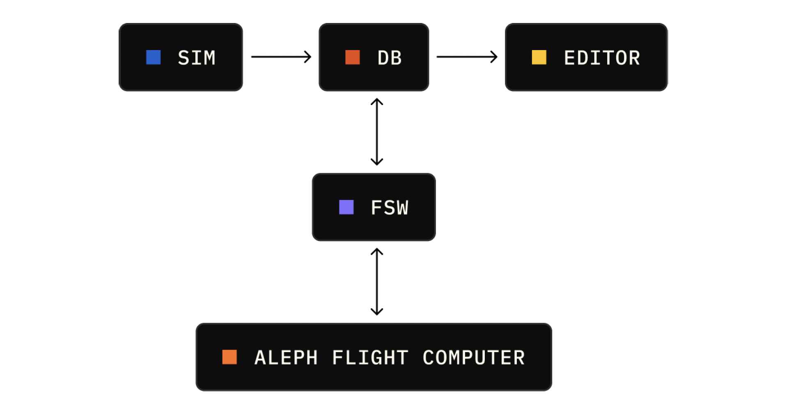

<h1 align="center">
  <a href="https://www.elodin.systems/">
    
  </a>
</h1>

This monorepo contains the source code for all Elodin simulation and flight software:

- Flight software
  - [`aleph-os`](./images/aleph): Aleph NixOS modules for composing a Linux flight software stack that runs on the Orin.
  - [`elodin-db`](./libs/db) (FSW application): A time-series database which functions as a central telemetry store and message bus.
  - [`serial-bridge`](./fsw/serial-bridge) (FSW application): Reads sensor data being streamed over the serial port and writes it to [`elodin-db`](./libs/db).
  - [`mekf`](./fsw/mekf) (FSW application): A Multiplicative Extended Kalman Filter implementation that fuses sensor data to estimate vehicle attitude.
  - [`sensor-fw`](./fsw/sensor-fw): Aleph expansion board firmware that streams sensor data (IMU, mag, baro) to the Orin over USB/UART.
- Simulation software
  - [`nox-py`](./libs/nox-py): Python version of `nox-ecs`, that works with JAX.
- [Editor](./apps/elodin): 3D viewer and graphing tool for visualizing both simulation and flight data.

<h2 align="center">
  <a href="https://www.elodin.systems/">
    
  </a>
</h2>

## Getting Started

### Prerequisites
- [Determinate Systems Nix](https://determinate.systems/nix-installer/) for a consistent development environment
- [Just](https://just.systems/man/en/): ( `brew install just` / `apt install just` )
- [git-lfs](https://docs.github.com/en/repositories/working-with-files/managing-large-files/installing-git-large-file-storage): ( `brew install git-lfs` / `apt install git-lfs` ), and make sure to activate it globally with `git lfs install` from the terminal.
- **STRONGLY** prefer an Arm-based MacOS, nix works on x86 & Ubuntu but at much slower build speeds and worse DX.

## Development Setup (Recommended: Nix)

The Elodin repository uses Nix to provide a consistent, reproducible development environment across all platforms. This is the same environment our team uses daily.

### 1. Install Nix
```sh
# Install Determinate Systems Nix (recommended)
curl --proto '=https' --tlsv1.2 -sSf -L https://install.determinate.systems/nix | sh -s -- install
```

### 2. Clone the Repository
```sh
git clone https://github.com/elodin-sys/elodin.git
cd elodin
```

### 3. Build and Install Elodin Editor and Elodin DB into your path
```sh
# this will also build and use the shell below
just install
# open elodin, we'll connect to the server we start below
elodin
```

### 4. Enter the Development Shell, run the server & example simulation
```sh
nix develop
```
> [!TIP]
> The Nix shell runs Oh My Zsh + Powerlevel 10k, and will run configuration setup on first run if not installed

#### Python SDK Development
```sh
# In the Nix shell
cd libs/nox-py
uv venv --python 3.12
source .venv/bin/activate
uvx maturin develop --uv
python3 examples/rocket.py
```

Open the Elodin editor ("elodin" in any terminal) and connect to the local server

> [!NOTE]
> Local setup instructions were validated on Arm M2 MacOS & Intel x86 Ubuntu 24.04 on 2025-10-12.
---

## Alternative Local Setup (macOS Only)

> [!WARNING]
> This setup is more complex and may lead to inconsistent environments across developers. We strongly recommend using Nix instead.

If you cannot use Nix, you can manually install dependencies on macOS:

### Prerequisites
```sh
# Install required tools via Homebrew
brew install gstreamer python gfortran openblas uv git-lfs rust

# Initialize git-lfs
git lfs install
```

### Build and Run
```sh
git clone https://github.com/elodin-sys/elodin.git
cd elodin
just install
```

### Python Development (Local Setup)
```sh
cd libs/nox-py
uv venv --python 3.12
source .venv/bin/activate
uvx maturin develop --uv
uv sync

cargo run --manifest-path=../../apps/elodin/Cargo.toml editor examples/three-body.py
```

> [!NOTE]
> Local setup instructions were validated on M1 architecture, macOS 15.1.1 on 2025-08-26.

## Additional Resources

- [Elodin App Documentation](apps/elodin/README.md)
- [Python SDK Documentation](libs/nox-py/README.md)
- [Internal Nix Documentation](docs/internal/nix.md)
