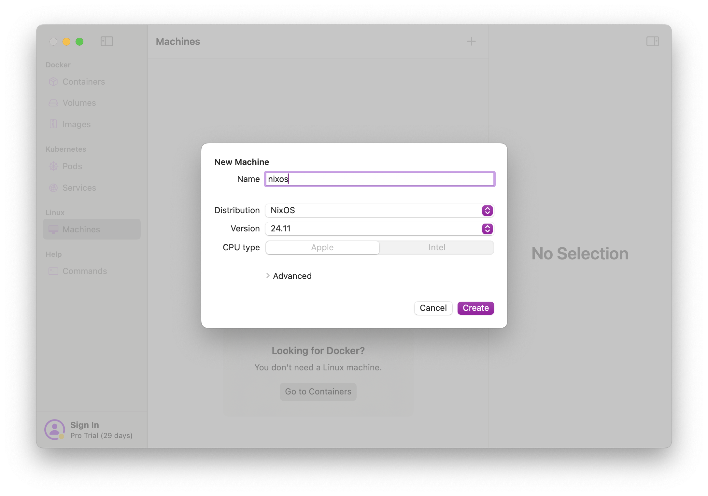

# Nix Setup

Elodin uses Nix for building docker images and for CI dependencies. We heavily use Nix flakes which requires a little more setup. The easiest way to use Nix on macOS or Linux is to use the installer located here: https://zero-to-nix.com/start/install

If you want to use the official Nix installer, you will need to follow the instructions located here: https://nixos.wiki/wiki/Flakes

# macOS VM
Often you want to build Linux binaries with Nix on your mac. This guide shows how to setup a VM using OrbStack, that supports remote builds.

1. Install OrbStack - https://orbstack.dev
2. Create new NixOS machine called nixos - use whatever the default NixOS version is

4. Add this to /var/root/.ssh/config on macOS - you may need to create the directory first and run your editor using sudo
```
Host orb
  Hostname 127.0.0.1
  Port 32222
```
5. Still in macOS - Add this to `/etc/nix/machines` - replacing `sphw` with your username. You will also need to edit the file as root
```
ssh://sphw@orb x86_64-linux,aarch64-linux /Users/sphw/.orbstack/ssh/id_ed25519 20 20 nixos-test,benchmark,big-parallel,kvm - -
```
6. Run `orb` to enter the nixos machine
7. Add this line below the `users` declaration in `/etc/nixos/configuration.nix`. You will likely need to add some sort of text-editor. This can be done temporarily with `nix-shell -p vim`
```
nix.settings.trusted-users = ["root" "@wheel"];
```
8. Run `sudo nixos-rebuild switch` to rebuild the nixos config
9. Next `sudo ssh -i ~/.orbstack/ssh/id_ed25519 sphw@orb` on macOS replacing sphw with your username. If everything work this should drop you into your vm.
14. Test your build by running `nix build --impure --expr '(with import <nixpkgs> { system = "x86_64-linux"; }; runCommand "foo" {} "uname > $out")'` in macOS
11. Profit!
