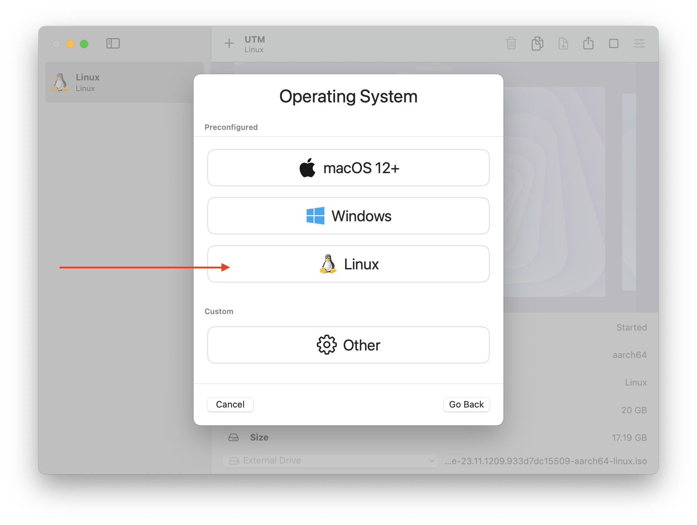
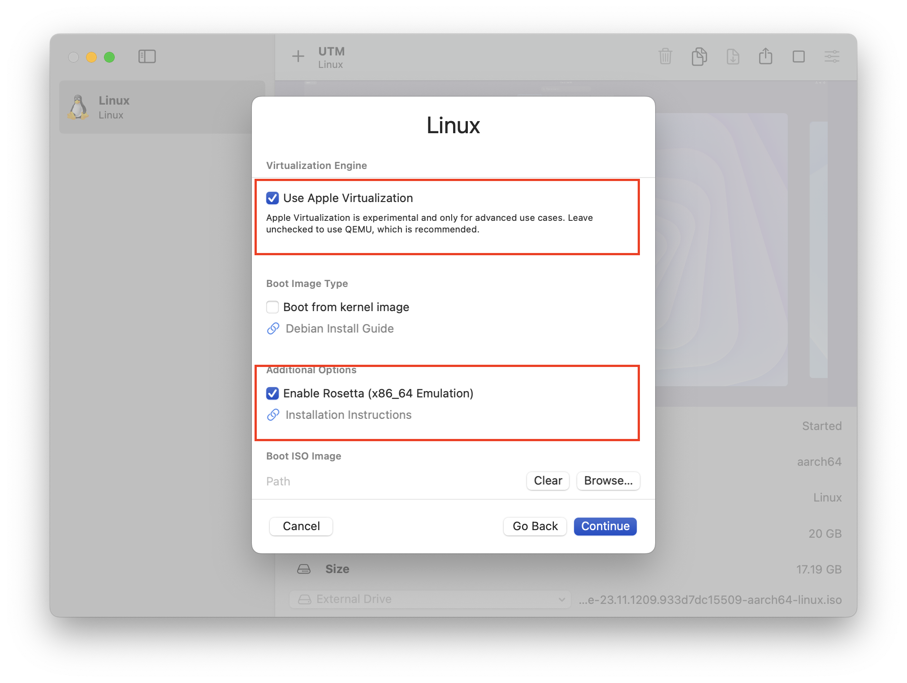

# Nix Setup

Elodin uses Nix for building docker images and for CI dependencies. We heavily use Nix flakes which requires a little more setup. The easiest way to use Nix on macOS or Linux is to use the installer located here: https://zero-to-nix.com/start/install

If you want to use the official Nix installer, you will need to follow the instructions located here: https://nixos.wiki/wiki/Flakes

# Flake Errors
If you receive an error that looks like `cannot fetch input 'path:../../.?lastModified=0&narHash=sha256-GwiMX0tMqRYHeABWRWUIB6%2BLAA2yYtQqF8l1C5QkLTo%3D' because it uses a relative path` you need to run:

```
nix flake lock --update-input elodin
```


# macOS VM
Often you want to build Linux binaries with Nix on your mac. This guide shows how to setup a VM using UTM, that supports remote builds.

1. Download and install [UTM](https://mac.getutm.app). You don't need to use the Mac App Store version if you don't want to, but I'm sure the author would appreciate the donation.
2. Download the Arm64 NixOS image from the [NixOS site](https://nixos.org/download#nixos-iso) - I usually select the "Gnome, 64 Bit ARM" version, but the Plasma Arm version would work as well

   

3. Create a new VM - when you create it make sure to the same number of cores as your computer. Make sure to use the Apple Hypervisor option, and to enable Rosetta 2
4. Follow the instructions to install NixOS normally - The installer will appear to be stuck around 46% for the majority of the install, don't worry about it. Eventually it will finish.
5. Once in NixOS, open `sudo nano /etc/nixos/configuration.nix`, and find the line referencing `openssh` and enable it.
6. Run `sudo nixos-rebuild switch`
8. Run `mkdir ~/.ssh`
7. Now you can ssh into your machine with its IP address. You can find this using `ip addr show` it will be under the interface named withing like `enp0s1`
9. Now copy your ssh public key to the vm's authorized keys file. The following command should work to do it.
```sh
scp YOUR_SSH_PUBLIC_KEY USERNAME@VM_IP:~/.ssh/authorized_keys
```
10. Add the following two lines to the end of `/etc/nixos/configuration.nix` (but before the final `}`)
```
  virtualisation.rosetta.enable = true;
  nix.settings.trusted-users = ["USERNAME"];
```
replace `USERNAME` with your username
11. Now re-run `sudo nixos-rebuild switch`
12. Next add the following line to /etc/nix/machines in macOS
```
ssh://USERNAME@IP x86_64-linux,aarch64-linux PRIVATE_KEY_PATH 20 20 nixos-test,benchmark,big-parallel,kvm - -
```
Replace `USERNAME` with your username, `IP` with your ip address, and `PUBLIC_KEY_PATH` with the path to your public key.
13. Last but not least, you need to ssh into your VM as the root user. You can do this with `sudo ssh USERNAME@IP`. This is just to enusre that
it is a known-host
14. Test your build by running `nix build --impure --expr '(with import <nixpkgs> { system = "x86_64-linux"; }; runCommand "foo" {} "uname > $out")'` in macOS
