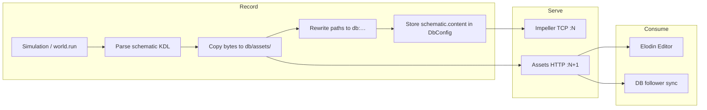

+++
title = "Database embedded assets"
description = "Persist schematic assets (GLB, icons, skyboxes) inside an Elodin DB for portable replay and follow"
draft = false
weight = 103
sort_by = "weight"

[extra]
toc = true
top = false
icon = ""
order = 4
+++

# Database embedded assets

Record a simulation once, then replay or share the database directory without shipping a separate `assets/` tree. Meshes, custom icon PNGs, and skyboxes referenced by the schematic are copied into the DB, rewritten in stored KDL as `db:…` paths, and served over HTTP while the database runs.

This feature complements [Replays](/reference/replays) and [Schematic KDL](/reference/schematic): telemetry lives in the DB layout you already use; this page covers **files** the schematic needs at visualization time.

## Architecture



### Layers

| Layer | Role |
|-------|------|
| **Blob store** | `{db_path}/assets/{relative_key}` — opaque bytes, any file type |
| **HTTP server** | `GET http://host:(tcp_port+1)/{relative_key}` while `elodin-db run` is active |
| **KDL rewrite** | Local paths at record time become `db:{relative_key}` in `schematic.content` |
| **Consumers** | Editor resolves `db:` to HTTP (or mirrors to a local cache for skyboxes) |

### Ports

- **Impeller TCP** on port `N` (default `2240`)
- **Assets HTTP** on port `N + 1` (default `2241`) — `ASSETS_HTTP_PORT_OFFSET = 1`

Do not run a follower Impeller server on `N+1`; that port is reserved for asset HTTP on the source.

### The `db:` scheme

At record time, a local schematic path such as `models/jet.glb` is stored as `db:models/jet.glb`. The file lands at `{db}/assets/models/jet.glb`.

Paths are **not** rewritten when they are already:

- `db:…`
- `http://…` or `https://…`
- `icon builtin=…` (no file; see below)

Relative keys must not contain `..` (path traversal is rejected).

## When assets are persisted

Persistence runs during simulation DB initialization (`init_db`), when the world has a schematic:

- **`db_path`** argument to `world.run(…, db_path=…)`, or
- **`ELODIN_DB_PATH`** environment variable (Python SDK)

The schematic body is stored in DB metadata as `schematic.content` (with `db:` paths). The original `schematic.path` string is informational only; replay uses embedded content when the file is missing.

## Consumption workflows

| Mode | Typical commands | Assets |
|------|------------------|--------|
| **Live** | `elodin editor examples/foo/main.py` | HTTP from embedded sim DB during the session |
| **Recorded DB** | `elodin-db run 127.0.0.1:2240 ./my-db` then `elodin editor 127.0.0.1:2240` | HTTP from `./my-db/assets/` |
| **Replay presentation** | Same DB + `elodin editor 127.0.0.1:2240 --replay` | HTTP; editor timeline reveals progressively |
| **Follow** | `elodin-db run … --follows SOURCE:2240` | Follower copies `db:` assets from source HTTP into its own `{db}/assets/` |

See [Elodin CLI](/reference/elodin-cli) for `editor --replay` and `elodin-db --follows`.

## Supported asset types

### GLB meshes (`object_3d` → `glb path=…`)

| Stage | Behavior |
|-------|----------|
| **Local path** | Resolved via schematic directory, `ELODIN_ASSETS_DIR` (default `./assets`), or cwd |
| **On disk in DB** | `assets/{key}.glb` (key preserves subdirectories, e.g. `models/rocket.glb`) |
| **Stored KDL** | `path="db:models/rocket.glb"` |
| **Editor** | `db:…` → `http://127.0.0.1:2241/…` via Bevy `AssetServer` + `WebAssetPlugin` (non-blocking) |

### PNG icons (`object_3d` → `icon path=…`)

Same pipeline as GLB: persist, rewrite, HTTP load.

**`icon builtin=…`** (Material Icons) is **not** copied into the DB. The editor rasterizes built-in glyphs locally; only custom `path=` PNGs are embedded.

### Skybox (`skybox name="…"`)

Skyboxes are **indirect**: the KDL node names a manifest entry, not a single file path.

| Stage | Behavior |
|-------|----------|
| **Local files** | `assets/skyboxes/manifest.ron` plus the active entry's `*.cubemap.ktx2` |
| **On disk in DB** | `assets/skyboxes/manifest.ron` + `assets/skyboxes/{name}.cubemap.ktx2` |
| **Stored KDL** | `skybox name="mojave_desert"` unchanged (name is logical) |
| **Editor** | Async download from DB HTTP into the local skybox cache, then `SetActiveSkybox` |
| **Clear** | Empty `skybox.active` metadata or schematic without a `skybox` node → skybox cleared in the editor |

The skybox plugin today reads from a **local cache directory**; the editor mirrors DB assets there before activation. GLB/PNG use HTTP directly through Bevy.

### Carried in the DB without extra asset files

- Full schematic KDL in `schematic.content`
- Procedural meshes (`sphere`, `box`, `cylinder`, …)
- Built-in [color scheme](/reference/color-schemes) names in `theme scheme=…`
- Telemetry components (separate from this asset pipeline)

### Not supported today

| Item | Why |
|------|-----|
| Custom `color_schemes/*.json` on disk | Only the scheme **name** is in KDL; JSON must exist locally |
| `window path="other.kdl"` | Secondary schematic path is stored, not the file contents |
| `video_stream` panels | H.264 lives in message logs, not `assets/` |
| Arbitrary external URLs in KDL | Not copied into the DB by design |

## Environment variables

| Variable | Purpose |
|----------|---------|
| `ELODIN_DB_PATH` | Directory for the simulation database (record) |
| `ELODIN_ASSETS_DIR` | Root for resolving local asset paths at record (default `./assets`) |

## Verification

With `elodin-db run` listening on `2240`:

```bash
export DB_PATH=./my-db
curl -sf -o /dev/null -w "%{http_code}\n" http://127.0.0.1:2241/f22.glb
ls -lh "$DB_PATH/assets/"
```

Expect HTTP `200` and non-empty files under `assets/` after a sim that references those assets.

## Troubleshooting

| Symptom | Check |
|---------|--------|
| Icon only, no mesh | `curl http://127.0.0.1:2241/…` → `404` means assets were not persisted; set `ELODIN_DB_PATH` / `db_path` and re-run |
| Port in use | `2240` = Impeller, `2241` = assets HTTP; do not bind follower on `2241` |
| Skybox missing on replay | `ls "$DB_PATH/assets/skyboxes/"` for `manifest.ron` and the `.ktx2` |
| Empty `assets/` after sim | `world.run` without `db_path` or `ELODIN_DB_PATH` uses a temp DB |

## Adding a new asset type

### A — Simple file referenced by `path=` in KDL

Use this when the schematic stores a **direct relative path** (like GLB or PNG).

1. **KDL** (`libs/impeller2/kdl`) — parse and serialize the path field on the relevant node.
2. **Collect & rewrite** (`libs/impeller2/kdl/src/rewrite.rs`):
   - `collect_local_asset_paths` — include new local paths
   - `collect_db_asset_names` — include `db:` keys (for [follow](/reference/elodin-cli) sync)
   - `rewrite_asset_paths` — rewrite local → `db:…` on record
3. **Persist** — no change if the path appears in collect; `persist_schematic_assets` in `libs/nox-py/src/impeller2_server.rs` is generic.
4. **Follow** — no change if the path appears in `collect_db_asset_names`; `sync_schematic_assets_from_source` copies all listed keys.
5. **Editor** — if Bevy can load the format: resolve with `resolve_db_asset_url` and `AssetServer.load(url)`. No blocking HTTP in Bevy systems.
6. **Tests** — unit tests in `impeller2-kdl` (collect/rewrite) and `nox-py` (persist).

### B — Indirect reference (name → manifest → file)

Use this when the KDL stores a **logical name** (like `skybox name=…`).

1. Add a **single resolver** in `impeller2/kdl` (manifest parse → extra storage keys).
2. **Persist** — extend collect after resolving (see `add_local_skybox_cubemap_path` in `impeller2_server.rs`).
3. **Follow** — after syncing the manifest bytes, resolve and fetch dependent files (`assets_http.rs`).
4. **Editor** — either teach the consumer to load via HTTP, or mirror into a local cache (skybox pattern, async via `IoTaskPool`).
5. **Avoid** copying manifest-resolution logic into three places; share one resolver.

## Related docs

- [Schematic KDL](/reference/schematic) — `object_3d`, `icon`, `skybox` syntax
- [Replays](/reference/replays) — legacy replay directory layout (distinct from Elodin DB with `assets/`)
- [Elodin DB overview](/home/db/overview) — database capabilities and follow mode
- [Elodin CLI](/reference/elodin-cli) — `editor`, `elodin-db run`, `--replay`, `--follows`
