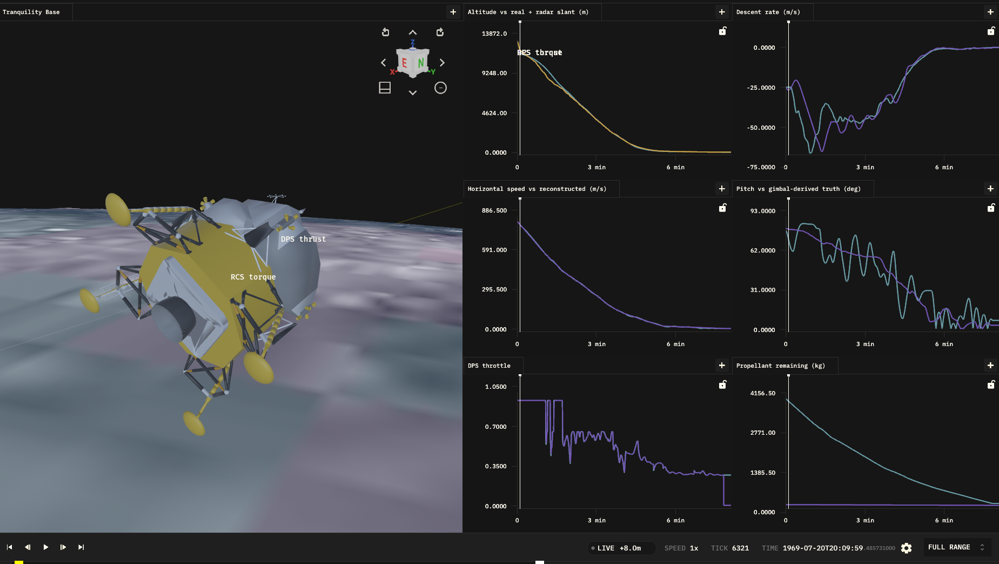

# Apollo 11 Lunar Module Monte Carlo SITL



This example turns `elodin monte-carlo` into a small but plausible Apollo 11
powered-descent problem. The simulation picks up the real mission at
landing-radar lock-on (GET 102:37:53, ~12 km up, still carrying ~800 m/s of
residual orbital velocity) and flies the braking phase (P63), the pitchover and
approach (P64), and the landing (P66) to touchdown. An external controller
process plays a minimal Lunar Guidance Computer (LGC): it receives telemetry
over UDP and sends back throttle and attitude commands.

The example also replays real Apollo 11 LM telemetry as a kinematic truth
profile. In the editor, the simulated LM flies over the landing-site asset while
graphs and the green truth trail compare it against the reconstructed descent.

> For a full educational walkthrough — the data sources, the flight-dynamics and
> guidance math, and how each piece maps to Elodin features — see
> [`WHITEPAPER.md`](WHITEPAPER.md).

## What It Demonstrates

- A full 6-DOF `el.six_dof` simulation: lunar gravity (with the centrifugal
  relief of the residual orbital velocity), a throttleable body-axis descent
  engine, RCS attitude control, and propellant burn-down updating mass. All
  physics lives in JAX systems; the `post_step` callback only reads kinematics
  and writes external-control commands (throttle + attitude setpoint).
- The full braking problem: the LM starts ~107 km uprange pitched back ~77 deg,
  brakes off ~800 m/s of horizontal velocity at the fixed throttle point,
  throttles down and pitches over near the historical times, and lands on the
  targeted site.
- An in-sim truth replay: `lander_truth` is a kinematic entity
  (no `el.Body`) driven by a JAX playback system on `el.SimulationTick` that
  interpolates the recorded descent profile every tick.
- A software-in-the-loop campaign with an external Rust FSW process
  (`controller/`) that flies the Apollo descent as a reference-trajectory
  follower, including the DPS throttle-erosion-band logic.
- A real KDL schematic: LM GLB, landing-site GLB, viewport-follow, blue/green
  trajectory trails, body-frame attitude arrows, and graphs for altitude (vs
  real + radar slant), descent rate, horizontal speed, pitch, throttle, and
  propellant.
- A real simulation epoch: `1969-07-20T20:09:53.164Z`, matching the first row of
  the Apollo descent telemetry. This uses `start_timestamp`; Elodin-DB timestamps
  native component writes from the simulation clock, so no manual time component
  is written.
- Monte Carlo robustness scoring: soft landing if vertical touchdown speed is
  `<= 3 m/s`, horizontal speed `<= 1 m/s`, the LM is near-upright, and fuel
  remains — plus a landing-dispersion (downrange miss) report.
- Monte Carlo calibration: each run reports altitude and pitch RMSE against the
  real descent profile so you can iteratively narrow parameter ranges toward
  the real landing.

## Run

From the repository root:

```sh
elodin monte-carlo run examples/apollo-lander/main.py \
  --campaign examples/apollo-lander/campaign.toml \
  --spec examples/apollo-lander/spec.toml \
  --out dbs/apollo-lander-demo
```

## Quickstart (your own sim)

This example hand-tunes its campaign, but to bootstrap a Monte Carlo campaign
for a new simulation in a couple of minutes, scaffold one from the sim's
declared params:

```sh
elodin monte-carlo quickstart path/to/main.py campaigns/my-sim
```

It writes `spec.toml` (a `uniform` variable for each `el.monte_carlo.Param`
with `min`/`max`, `fixed` otherwise), a `campaign.toml` wired to lifecycle
hooks, and minimal `hooks/score.py` (post_run pass/fail) + `hooks/gate.py`
(post_campaign CI gate). Edit the ranges and the score criterion, then run the
printed `elodin monte-carlo run` command. See the
[CLI reference](../../docs/public/content/reference/elodin-cli.md) for details.

The Apollo hooks and `calibrate.py` share their metric logic in
[`hooks/mc_metrics.py`](hooks/mc_metrics.py) (`soft_landing`, `traj_rmse`,
`run_passed`) so the soft-landing criteria live in exactly one place.

## CI test

Buildkite runs a **fast infrastructure check** (target under 5 minutes) via the
`:rocket: apollo monte-carlo` step in [`.buildkite/pipeline.py`](../../.buildkite/pipeline.py),
which calls `scripts/test-apollo-monte-carlo.sh`. It uses `campaign.ci.toml` and
`spec.ci.toml` (one fixed nominal sample), truncates the sim with
`ELODIN_APOLLO_MAX_TICKS=600` (~5 s at 120 Hz), and scores runs with
`hooks/ci_score.py` (artifact present, not soft landing). The campaign keeps the
default exit code (0 even with partial failures); CI failure is enforced only by
`hooks/ci_gate.py`, which raises when `summary.json` reports any failed runs.

```sh
scripts/test-apollo-monte-carlo.sh
```

For a full soft-landing campaign locally, use `campaign.toml` and `spec.toml`
instead of the `*.ci.toml` files.

For a single editor run:

```sh
elodin editor examples/apollo-lander/main.py
```

Single editor/headless runs launch the Rust LGC controller in
`examples/apollo-lander/controller` via an `s10` cargo recipe. Monte Carlo runs
build the controller once using the campaign `[build]` step, then each run
launches the prebuilt release binary.

The Apollo campaign demonstrates the `elodin monte-carlo` build hook:

```toml
[build]
command = "cargo"
args = ["build", "--release", "--manifest-path", "examples/apollo-lander/controller/Cargo.toml"]
```

The build step runs once before any workers start and fails the campaign if the
controller cannot be built.

`elodin editor <sim.py>` uses the default database port `2240`. Stop any other
`elodin`, `elodin-db`, Monte Carlo campaign, or FSW SITL run before launching
the editor, otherwise that process can connect to the same database and pollute
the Apollo session with unrelated telemetry. If you see components such as
`MFNAVIGATIONMESSAGE` or `MFPIMUMESSAGE`, another FSW process is connected.

The GLB assets are loaded from `assets/` by default. If you run from another
working directory, set:

```sh
ELODIN_ASSETS=/home/dan/dev/elodin/assets
```

Set `ELODIN_KDL_DIR=examples/apollo-lander` before launching the editor to
enable hot-reload of `apollo-lander.kdl`; otherwise the editor falls back to
the schematic content embedded by the simulation (no hot-reload).

## Flight Model

`sim.py` composes JAX systems into `el.six_dof` (semi-implicit):

- `lunar_gravity` applies `-(g - v_h^2 / R_moon) * mass` (world up): the
  flat-world stand-in for the orbital centrifugal relief. At the braking
  phase's ~800 m/s this is ~0.37 m/s^2 — almost a quarter of lunar gravity —
  and it is what made the real P63 fuel budget close.
- `apply_main_thrust` applies the descent-engine thrust along body `+Z`, so
  tilting the LM steers thrust to arrest horizontal as well as vertical velocity.
- `apply_rcs_torque` applies a quaternion-error PD torque (RCS) toward the
  commanded attitude.
- `mass_props` burns propellant (`m_dot = -T / (Isp * g0)`) and rewrites the
  body `el.Inertia` so gravity and integration see the live mass.

The mass model follows the LM figures in `data/lunar_module_spec_sheet.pdf`:
the full descent stack was roughly `15,065 kg` wet (`~6,853 kg` dry plus
`~8,212 kg` descent propellant). The telemetry window opens at landing-radar
lock-on, after the first ~288 s of the braking burn had consumed roughly half
of the DPS load (the mission-report fuel chart shows ~4,260 kg burned), so the
simulation defaults to `~3,950 kg` of propellant remaining at window start
(`~11,000 kg` wet). The descent engine is modeled with the published throttle
range (`4,670-45,040 N`), the fixed throttle point at `92.5%`, and
`Isp ~= 311 s`. RCS is modeled as 16 x `445 N` thrusters with a representative
moment arm and `Isp ~= 290 s`; RCS propellant is tracked separately and
included in the vehicle mass.

The external LGC flies the Apollo descent as a reference-trajectory follower:
it tracks the smoothed true-altitude / descent-rate profile and the
reconstructed horizontal-speed / downrange profile, with bounded feedback
around the feed-forward references. The thrust-vector tilt budget blends from
~82 deg (retrograde braking) down to a 30 deg cone around vertical as speed
bleeds off, which reproduces the P64-style pitchover; below ~40 m it stops
following the reference and simply nulls drift before letting down (P66
semantics). Throttle commands above 65% snap to the fixed throttle point —
the DPS could not run inside the nozzle-erosion band — with the same one-way
latch LUMINARY used, so "throttle down on time" emerges from the dynamics.
The in-sim RCS loop points the vehicle every tick.

## Real Telemetry

Three truth sources live in `data/`, all from
https://github.com/jumpjack/Apollo11LEMdata:

- `apollo11_lem_raw.csv` - the verbatim public telemetry (`data.csv`: NASA
  postflight material, IMU stable-member gimbal angles plus landing-radar
  `RANGE (FT)`).
- `apollo11_descent.csv` - the derived, SI-unit measurements (relative time,
  range in meters, gimbal angles) used by the simulation.
- `apollo11_altitude_raw.csv` - the verbatim digitized true-altitude profile
  (`004-altitude-dot.csv`, from the mission-report descent chart). The feet
  columns are used; the source's `Altitudem` column has a unit bug (x0.3405
  instead of x0.3048).

`reference.py` builds the shared truth from these: true altitude (despiked and
smoothed; the first samples predate the landing-radar delta-H state-vector
update and are replaced by the radar-corrected trend, matching Armstrong's
debrief of "39,000 or 40,000 feet" at lockup), descent rate, the gimbal-angle
pitch trend, the radar slant range as a display series, and a reconstructed
horizontal-speed / downrange profile. The horizontal reconstruction integrates
the vehicle dynamics along the documented DPS throttle history (FTP until the
102:39:31 throttle-down, then the P63/P64/P66 levels), takes the vertical
share from the recorded altitude profile, and calibrates the result through
documented anchors: ~500 ft/s at high gate, the "58/47 ft/s forward"
transcript callouts, and zero at touchdown. `sanity_check()` verifies the
derived files against the raw sources and the anchors (run
`python reference.py` to print the profile and the check).

The truth pitch is an approximate trend from the inner gimbal angle (a full
vehicle attitude needs the mission REFSMMAT, which the dataset does not
include); it matches documented values at radar lock (~77 deg) and high gate
(~56 deg) but carries a ~10 deg systematic offset mid-phase, so `pitch_rmse`
bottoms out around that level. The reconstructed horizontal profile is a
model-based estimate (~±10%), not a measurement.

## Campaign Outputs

Each run emits:

- `touchdown_speed` (vertical) and `horizontal_speed` at contact
- `fuel_remaining` and `rcs_fuel_remaining`
- `traj_rmse`, the RMS error between simulated altitude and the real descent
  profile, and `pitch_rmse` against the (approximate) truth pitch
- `downrange_miss`, the distance from the targeted landing site at touchdown
- `soft_landing`, the pass/fail condition (soft vertical + horizontal speed,
  near-upright, fuel remaining)

The post-campaign hook writes:

```text
dbs/apollo-lander-demo/post_campaign/apollo_lander_report.txt
```

It summarizes the landing success rate, touchdown speed distribution, fuel
margin distribution, the landing-dispersion (miss-distance) statistics, and
the best-fit run by minimum trajectory RMSE.

## Manual Calibration Loop

1. Run the campaign.
2. Open `post_campaign/apollo_lander_report.txt`.
3. Find the best-fit run and its parameters.
4. Narrow the corresponding ranges in `spec.toml`.
5. Run again and watch `traj_rmse` decrease.

This keeps the core Monte Carlo workflow visible: samples are generated from a
spec, runs are scored, and the next spec encodes what you learned.

## Optional Automated Calibration

`calibrate.py` performs the same narrowing loop automatically. Start with an
existing campaign output:

```sh
python examples/apollo-lander/calibrate.py \
  --initial-out dbs/apollo-lander-demo \
  --work-dir dbs/apollo-lander-calibration \
  --rounds 2 \
  --samples 30
```

Use `--dry-run` to only write the narrowed specs.

## Notes

- The sim clock starts before the Unix epoch. `start_timestamp` accepts signed
  microseconds and Elodin-DB stores pre-1970 timestamps natively.
- The world is flat over the ~107 km braking ground track (lunar curvature
  would drop ~3 km over that distance); the centrifugal-relief gravity term is
  the one orbital-mechanics effect retained. The landing site is the world
  origin.
- The truth trajectory is offset laterally in the scene so the blue simulated
  trajectory and green truth trail are easy to compare.
- GLB model scaling (derived from the NASA assets, see `sim.py` constants):
  - `apollo-lunar-module.glb` is modeled in **meters** (~6.4 m footprint, ~5.0 m
    tall, Y-up), so `LANDER_GLB_SCALE = 1.0` renders it ~life-size.
  - `apollo11-landing-site.glb` is a 256-sample heightmap of the 30 km × 30 km
    Sea of Tranquility tile: 255.5 native units span 30 km (~117.4 m/unit), it is
    Z-up, and elevation is exaggerated 60×. `TERRAIN_GLB_SCALE = 30000 / 255.5`
    gives the true horizontal extent, the `rotate="(-90,0,0)"` stands the Z-up
    tile upright, and the `surface` entity is seated at `TERRAIN_SEAT_Z` so the
    tile-center surface lands at world z = 0 (the lander's touchdown plane).
    Because the scale is uniform, the 60× elevation exaggeration cannot be undone
    here, so distant relief renders ~60× too tall; the immediate landing zone is
    near z = 0. Reduce `TERRAIN_REGION_M` for a tighter scene.
- If an object disappears at long range, tune the viewport `near`/`far` clips.
- The Moon-sphere backdrop is seated ~1.2 km below the touchdown plane so its
  LRO topography stays under the tile's exaggerated valleys (see the
  whitepaper's visualization section for the measured numbers).
- Orange (DPS thrust) and white (RCS torque) vector arrows show effector
  activity in the body frame.
- **Editor preview (experimental, native only):** GPU exhaust particles fully
  declared in KDL and driven by EQL viz channels. The DPS plume uses a vector
  `intensity` from `main_thrust_viz` (`effect="plume"`); the 16 cold-gas RCS
  jets each bind `rcs_thruster_viz[i]` with `effect="cold_gas"`. RCS jet
  activity follows the body-frame RCS torque command, not the DPS throttle.
  Nozzle geometry and presets live in `apollo-lander.kdl`; RCS emitter
  positions are tuned to the visible four-quad Apollo LM nozzle layout after
  the GLB mesh translate. Small real RCS torques are boosted only for particle
  visibility, leaving the physics torque unchanged.
