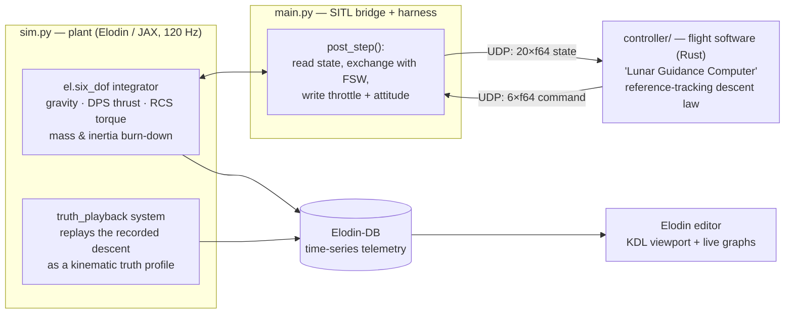

# Flying Apollo 11 in Elodin

*A from-scratch, software-in-the-loop recreation of the Apollo 11 powered descent — and a guided tour of how to build a real spacecraft simulation in [Elodin](https://www.elodin.systems/).*

---

## Who this is for

This is an educational explainer for aspiring spacecraft engineers, GNC (guidance,
navigation & control) students, and space enthusiasts. It walks through **every**
piece of the `apollo-lander` example: where the historical data came from, how we
turned noisy 1969 telemetry into a usable reference trajectory, the physics and
flight-control math we implemented, which Elodin features made it possible, and
exactly where each idea lives in the code.

You do not need a background in aerospace to follow along, but you will get the
most out of it if you are comfortable with vectors, basic calculus, and a little
linear algebra. Every formula is paired with a link to the line of code that
implements it.

> **A note on fidelity.** This is a *teaching* simulation, not a flight-certified
> reconstruction. We deliberately favor clarity over completeness and flag every
> simplification. Section 11 collects the honest caveats in one place.

## Table of contents

1. [The historical event](#1-the-historical-event)
2. [System architecture](#2-system-architecture)
3. [Data and provenance](#3-data-and-provenance)
4. [The flight dynamics model](#4-the-flight-dynamics-model)
5. [Composing the simulation with `el.six_dof`](#5-composing-the-simulation-with-elsix_dof)
6. [The guidance law (the "Lunar Guidance Computer")](#6-the-guidance-law-the-lunar-guidance-computer)
7. [Software-in-the-loop: the bridge and lockstep](#7-software-in-the-loop-the-bridge-and-lockstep)
8. [Visualization: the KDL schematic and model scaling](#8-visualization-the-kdl-schematic-and-model-scaling)
9. [Monte Carlo: robustness and calibration](#9-monte-carlo-robustness-and-calibration)
10. [Elodin features used](#10-elodin-features-used)
11. [Modeling decisions and honest caveats](#11-modeling-decisions-and-honest-caveats)
12. [Running and exploring the example](#12-running-and-exploring-the-example)
13. [Exercises for the reader](#13-exercises-for-the-reader)
14. [References](#14-references)

---

## 1. The historical event

On July 20, 1969, the Apollo 11 Lunar Module *Eagle* separated from the Command
Module and began its **powered descent** to the Moon's Sea of Tranquility. A
single throttleable rocket — the Descent Propulsion System (DPS) — slowed the
vehicle from orbital speed to a hover, while 16 small Reaction Control System
(RCS) thrusters held its attitude. Roughly twelve minutes later, Neil Armstrong
took manual control and set *Eagle* down with seconds of fuel margin.

The powered descent is a near-perfect teaching problem:

- **The physics is approachable.** Lunar gravity is a constant `1.62 m/s²`, there
  is no atmosphere (no drag, no wind), and the dominant forces are gravity and a
  single engine.
- **The control problem is real.** The vehicle must simultaneously null its
  horizontal velocity, track a descent profile, manage a shifting center of mass
  as propellant burns, and arrive nearly vertical and slow enough that the
  landing gear survives.
- **The data exists.** NASA's postflight telemetry and 3D assets are public, so
  we can fly *against the real mission* and measure how close we get.

Our simulation clock is set to the real epoch of the first telemetry sample,
`1969-07-20T20:09:53.164Z` — the moment the **landing radar locked on** (GET
102:37:51 per the mission report), 4 minutes 48 seconds into the powered
descent. At that moment the real LM was ~12 km up, ~107 km uprange of the
site, pitched back about **77 degrees** so the engine pointed against its
remaining **~800 m/s of orbital horizontal velocity**. The simulation starts
from exactly that state and flies the rest of the descent: the braking phase
(P63), throttle-down, the pitchover into the approach phase (P64), and the
manual-style landing phase (P66) — next to a green "truth" vehicle that
replays the recorded descent. The goal of the example is to land softly
**and** to match the historical trajectory.

---

## 2. System architecture

The example is split into four cooperating pieces. The **plant** (the physics)
lives in Elodin and runs in JAX; the **flight software** (the guidance law) runs
as a *separate process* — exactly as it would on a real vehicle, where the
autopilot is its own computer talking to sensors and actuators over a bus.



**The control loop, once per guidance tick:**

1. The physics integrates one or more steps and publishes the vehicle state.
2. `post_step` reads the kinematics and packs them into a UDP datagram.
3. The Rust controller receives the state, runs the guidance law, and replies
   with a throttle setting and a desired attitude quaternion.
4. `post_step` writes those commands back into the simulation as
   *external-control* components.
5. In-sim JAX systems convert the commands into forces and torques, and the
   integrator advances the state.

This is the essence of **software-in-the-loop (SITL)**: the real flight-control
code flies a simulated vehicle, with the simulator standing in for the physical
world and sensors.

### Repository layout

| File | Role |
| --- | --- |
| [`sim.py`](sim.py) | World definition: components, 6-DOF physics systems, truth replay, KDL schematic |
| [`main.py`](main.py) | Entry point: SITL bridge, scoring, `world.run` |
| [`reference.py`](reference.py) | Turns raw telemetry into the descent reference + braking-profile reconstruction (stdlib only) |
| [`controller/src/main.rs`](controller/src/main.rs) | The flight software: the guidance law, in Rust |
| [`spec.toml`](spec.toml) | Monte Carlo parameter distributions |
| [`campaign.toml`](campaign.toml) | Campaign config: ports, hooks, one-time `[build]` step |
| [`hooks/score.py`](hooks/score.py) | Per-run pass/fail scoring |
| [`hooks/report.py`](hooks/report.py) | Post-campaign aggregate report |
| [`calibrate.py`](calibrate.py) | Optional automated range-narrowing loop |
| [`data/`](data/) | Raw + derived Apollo 11 telemetry, LM spec sheet |

---

## 3. Data and provenance

Everything physical in this example traces back to a public NASA source.

### 3.1 Telemetry

The descent telemetry comes from the community-maintained digitization of NASA
postflight data at
[`jumpjack/Apollo11LEMdata`](https://github.com/jumpjack/Apollo11LEMdata).
We vendor three files under [`data/`](data/):

- **[`apollo11_lem_raw.csv`](data/apollo11_lem_raw.csv)** — the verbatim
  `data.csv` source. Each row is a timestamp (`YYMMDDHHMMSS.SSS`), the three
  IMU **stable-member gimbal angles** (inner/middle/outer, in degrees), and
  the landing-radar **slant range** (`RANGE (FT)`).
- **[`apollo11_descent.csv`](data/apollo11_descent.csv)** — a cleaned,
  SI-unit derivation with columns `timestamp_utc, time_s, range_m, inner_deg,
  middle_deg, outer_deg`. Range is converted feet → meters (`× 0.3048`) and time
  is made relative to the first sample.
- **[`apollo11_altitude_raw.csv`](data/apollo11_altitude_raw.csv)** — the
  verbatim `004-altitude-dot.csv`: the **true altitude profile** digitized
  from the mission-report descent chart, with absolute timestamps covering
  exactly the same window (43,753 ft at the first sample to 0 ft at the
  102:45:40 touchdown). We use the feet columns; the source's `Altitudem`
  column carries a unit bug (`× 0.3405` instead of `× 0.3048`).

The very first row fixes our simulation epoch: `t = 0` at
`1969-07-20T20:09:53.164Z`, the landing-radar lock-on. Having both the radar
**slant range** and the **true altitude** lets the example show their
divergence honestly: during the pitched-back braking phase the radar beam is
far from vertical, so range exceeds altitude.

### 3.2 Vehicle mass and propulsion

The mass and engine numbers come from the LM spec sheet in
[`data/lunar_module_spec_sheet.pdf`](data/lunar_module_spec_sheet.pdf):

| Quantity | Value | Used in |
| --- | --- | --- |
| Wet mass (full descent stack) | ≈ 15,065 kg | context |
| Descent-stage dry mass (modeled) | ≈ 6,853 kg | `dry_mass_kg` |
| Descent propellant (full load) | ≈ 8,212 kg | context |
| Propellant at telemetry-window start (modeled) | ≈ 3,950 kg | `propellant_kg` |
| DPS thrust range | 4,670 – 45,040 N (throttleable) | `DPS_MIN/MAX_THRUST_N` |
| DPS fixed throttle point (FTP) | 92.5% | `DPS_FTP_THROTTLE` |
| DPS specific impulse | ≈ 311 s | `isp_s` |
| RCS thrusters | 16 × 445 N | `RCS_THRUST_N` |
| RCS specific impulse | ≈ 290 s | `RCS_ISP_S` |

The telemetry window opens at landing-radar lock-on, 288 s into the braking
burn. The source repository's digitized **fuel chart** (`007-fuel-dot.csv`)
shows ≈ 9.4 klb ≈ 4,260 kg already consumed by that moment, and ≈ 16.7 klb at
touchdown — so the simulated vehicle starts at ≈ 11,000 kg wet
(`dry + DPS propellant + RCS propellant`) with ≈ 3,950 kg of usable DPS
propellant, and the real in-window burn (≈ 3,310 kg) independently
cross-checks the model's fuel budget. These constants are defined at the top
of [`sim.py`](sim.py#L20-L35).

### 3.3 3D assets

Three official NASA glTF models are rendered in the editor:

- **Lunar Module** — [science.nasa.gov/3d-resources/apollo-lunar-module](https://science.nasa.gov/3d-resources/apollo-lunar-module/)
- **Apollo 11 landing site** — [science.nasa.gov/3d-resources/apollo-11-landing-site](https://science.nasa.gov/3d-resources/apollo-11-landing-site/)
  (a 30 km × 30 km height map of the Sea of Tranquility, vertical exaggeration 60×).
- **Moon sphere** — [NASA SVS Moon 3D Models for Web, AR, and Animation](https://svs.gsfc.nasa.gov/14959/)
  (a Lunar Reconnaissance Orbiter imagery/topography model used as the surrounding
  curved lunar ground and horizon).

How we recovered their units and chose the right scale is covered in
[Section 8](#8-visualization-the-kdl-schematic-and-model-scaling).

### 3.4 From noisy telemetry to a clean reference

Digitized 1969 chart data is **noisy** — it spikes, duplicates timestamps, and
occasionally reports the vehicle *climbing*. We can't guide against that
directly, and we can't use it as "truth" without cleaning it.
[`reference.py`](reference.py) turns the raw measurements into a smooth,
physically sensible descent profile using only the Python standard library (so
it has no heavy dependencies and can be shared by both the simulation and the
controller).

The pipeline, implemented in [`build_reference`](reference.py):

1. **Altitude head correction** — the first chart samples show the pre-update
   PGNS altitude (43,753 ft) before the landing-radar **delta-H correction**
   stepped the state vector down ~1.6 km. The loader skips them and
   back-extrapolates the radar-corrected track to `t = 0`, which lands at
   ≈ 38,700 ft — matching Armstrong's debrief: *"we were probably down to
   about 39,000 or 40,000 feet at the time we had radar lockup."*
2. **Resample** onto a uniform 1-second grid by linear interpolation
   (`interp`).
3. **Despike** with a 5-sample median filter (`_median_filter`), which rejects
   isolated digitizer glitches without blurring the trend, then **smooth**
   with a moving average (`_moving_average`). No monotonic clamp — the real
   profile briefly levels off during Armstrong's final manual maneuvering, and
   that is history worth keeping.
4. **Differentiate** for descent rate using a centered difference, then smooth:

   ```text
   rate[i] = (alt[i+1] − alt[i−1]) / (t[i+1] − t[i−1])
   ```

5. **Reconstruct an attitude trend** from the dominant inner gimbal angle,
   smoothed and sign-flipped to a pitch-from-vertical proxy.
6. **Keep the radar slant range** (despiked and lightly smoothed) as a display
   series, so the altitude graph can show measured range and true altitude
   diverging during the pitched-back braking phase.

The result is exposed as a [`Reference`](reference.py) object with
`altitude(t)`, `descent_rate(t)`, `pitch(t)`, `slant_range(t)`,
`horizontal_speed(t)`, and `downrange(t)` interpolators. A built-in
[`sanity_check()`](reference.py) re-derives the range straight from the raw
file, checks the altitude endpoints against the documented values, and checks
the reconstruction anchors below — run `python reference.py` to print the
profile and the check.

> **Why share one reference module?** The same smoothed profile is the *target*
> for the guidance law **and** the *truth* drawn in green in the editor. Using one
> source of truth keeps "what we asked for" and "what really happened" directly
> comparable.

### 3.5 Reconstructing the braking profile

The dataset has no digitized horizontal-velocity table (only a chart image), so
the braking-phase horizontal-speed and downrange profiles are **reconstructed
from the dynamics** in [`_reconstruct_horizontal`](reference.py):

1. The **documented DPS throttle history** sets the total thrust acceleration:
   FTP (92.5%) until throttle-down at GET 102:39:31 (`t = 98 s` — *"Ah!
   Throttle down... better than the simulator"*), the LUMINARY post-throttle-down
   creep (~57→62%) through the end of P63, decreasing commands through P64,
   and ~32% in the near-hover P66.
2. The **recorded altitude profile** sets the vertical share of that thrust
   (Newton in the vertical axis, including the centrifugal relief
   `g − v²/R` of the residual orbital velocity). The **horizontal deceleration
   is the remainder**: `a_h = sqrt((T/m)² − a_z²)`. Because the vertical share
   depends on the speed being reconstructed, two fixed-point passes converge.
3. The profile is integrated through **documented velocity anchors**: ~500 ft/s
   at high gate (GET 102:41:32, `t = 219 s`), the transcript callouts of
   58 ft/s and 47 ft/s forward (`t = 333/353 s`), and zero at touchdown. The
   segment before high gate — the well-documented FTP burn — integrates
   unscaled, which is what *yields* the window-start velocity: **≈ 800 m/s**.
4. Downrange distance integrates backward from touchdown (`x = 0` at the
   site), putting the window start **≈ 107 km uprange**.

Building the feed-forward profile this way makes it *flyable by construction*:
a controller tracking it needs exactly the documented throttle, so it never
fights the DPS erosion band (Section 6). The reconstruction is a model-based
estimate (~±10%), and `sanity_check()` asserts the anchor residuals.

---

## 4. The flight dynamics model

All of the physics is defined in [`sim.py`](sim.py) as small JAX functions and
composed into a rigid-body integrator. This section walks through each force and
the math behind it.

### 4.1 Coordinate frame and state

The world uses an **ENU** frame (East, North, Up). Altitude is the world `+Z`
component, so the ground is the plane `z = 0`. The vehicle's body `+Z` axis is its
thrust ("up") axis; tilting the body steers the engine.

The vehicle is an [`el.Body`](sim.py#L253-L292), which carries the standard 6-DOF
state Elodin needs:

- `world_pos` — an `el.SpatialTransform` (orientation quaternion + position)
- `world_vel` — an `el.SpatialMotion` (angular + linear velocity)
- `inertia` — an `el.SpatialInertia` (mass + diagonal inertia tensor)

On top of that we attach domain components (defined at
[`sim.py#L106-L185`](sim.py#L106-L185)) such as `Altitude`, `VerticalSpeed`,
`Throttle`, `Propellant`, `RcsTorque`, and the two **external-control** inputs the
flight software writes:

```python
ThrottleCmd   # F64, metadata {"external_control": "true"}
AttitudeSetpoint  # Quaternion, metadata {"external_control": "true"}
```

Marking a component `external_control` tells Elodin its value comes from outside
the physics graph — here, from the SITL bridge.

### 4.2 Gravity and the centrifugal relief

Lunar gravity is a downward force scaled by the *current* mass, with one
orbital-mechanics term retained on our flat world
([`lunar_gravity`](sim.py)):

```text
g_eff     = max(g_moon − v_h² / R_moon, 0)     g_moon = 1.622 m/s² × gravity_scale
F_gravity = (0, 0, −g_eff · m)                 R_moon = 1,737,400 m
```

The `v_h²/R` term is the **centrifugal relief**: a vehicle moving horizontally
at orbital-ish speed needs less thrust to hold altitude, because its momentum
is carrying it around the curve of the Moon. At the window-start ~800 m/s it
is ~0.37 m/s² — almost a quarter of lunar gravity — and it is what made the
real braking-phase fuel budget close. (At PDI speed, 1,695 m/s, the relief
would cancel gravity entirely: that is just the statement that the LM started
from orbit.) Because the force reads the live `inertia.mass()`, gravity also
automatically tracks the vehicle getting lighter as it burns propellant.

### 4.3 The descent engine (throttle, lag, and thrust)

A real engine cannot change thrust instantaneously. [`engine_response`](sim.py#L322-L331)
models the throttle as a **first-order lag** toward the commanded value:

```text
T_cmd  = clip(throttle_cmd, u_min, 1)          u_min = 4670/45040 ≈ 0.104
τ      ← τ + (T_cmd − τ) · α                    α = clip(f_response · Δt, 0, 1)
thrust = τ · T_max · thrust_scale               (0 if out of fuel or landed)
```

`α` is the per-step blend factor; a `throttle_response_hz` of 3 Hz at the 120 Hz
step gives `α ≈ 0.025`, i.e. a ~⅓-second time constant. The throttle floor `u_min`
reflects the DPS's real minimum thrust — the engine cannot be commanded below it.

The thrust acts along body `+Z` and is rotated into the world by the attitude
quaternion `q` ([`apply_main_thrust`](sim.py#L379-L383)):

```text
F_thrust = q ⊗ (0, 0, thrust)
```

This single line is why **attitude is steering**: tilt the vehicle and the same
engine now has a horizontal thrust component to cancel cross-track velocity.

### 4.4 Mass and inertia burn-down

Propellant mass follows the classic rocket mass-flow relation (the differential
form of the Tsiolkovsky equation), in [`mass_props`](sim.py#L333-L353):

```text
ṁ = T / (Isp · g₀)            g₀ = 9.80665 m/s²   (standard gravity)
Δm_DPS = T / (Isp · g₀) · Δt
```

RCS propellant is tracked separately by converting commanded torque back to an
equivalent thruster force (`|τ| / moment_arm`) and burning at the RCS `Isp`. The
live mass then rescales the inertia tensor so rotational dynamics stay consistent:

```text
m = dry_mass + propellant_DPS + propellant_RCS     (remaining propellant masses)
I = I_base · (m / m₀)          (a large "locked" inertia is used once landed)
```

> **Real LM subtlety we approximate:** on the real vehicle the center of mass
> *moved* as the spherical tanks drained, and the engine gimbaled to track it. We
> keep the CoM fixed and let RCS provide control torque — see Section 11.

### 4.5 Attitude control (quaternion-error PD)

The RCS holds the vehicle on the attitude the flight software requests. The
in-sim controller ([`attitude_control`](sim.py#L355-L366)) is a
**proportional-derivative (PD) law on the quaternion error**:

```text
q_err = q⁻¹ ⊗ q_setpoint                         (rotation from current to target)
sign  = +1 if q_err.w ≥ 0 else −1                (take the shortest path)
ω_body = q⁻¹ · ω_world                           (body-frame angular rate)
τ = sign · q_err.xyz ⊙ k_p  −  ω_body ⊙ k_d      (⊙ = per-axis product)
τ = clip(τ, −τ_limit, +τ_limit)                  (RCS authority limit)
```

The intuition: for small errors the vector part of a quaternion is approximately
half the rotation-angle times the rotation axis, so `q_err.xyz` is a clean
proportional error signal. The `−ω_body · k_d` term is damping. The per-axis
torque is then clipped to the available RCS authority,
`4 × 445 N × 2 m ≈ 3,560 N·m`, and applied as a body torque rotated into the world
([`apply_rcs_torque`](sim.py#L384-L387)). The proportional gains scale with the
Monte Carlo `attitude_gain` parameter.

### 4.6 Ground contact

[`ground_contact`](sim.py#L388-L418) latches a landing the first time altitude
crosses zero. On that contact tick — *before* the velocity is zeroed — it records
the vertical impact speed `|v_z|` as `touchdown_speed` and the horizontal impact
speed `‖v_xy‖` as `touchdown_horizontal_speed`, then pins the vehicle: position
`z = 0`, linear and angular velocity zeroed. This is a simple "perfectly
inelastic" stop — enough to score the landing without modeling gear mechanics.
(Latching at contact matters: one tick later the zeroed velocity would score
every landing as a perfect `0 m/s` touchdown.)

### 4.7 Derived telemetry

[`derive_telemetry`](sim.py#L420-L431) computes the human-readable signals shown
in the graphs: altitude and vertical speed (the `z` components), horizontal speed
(`‖v_xy‖`), and pitch-from-vertical:

```text
body_up = q · (0, 0, 1)
pitch   = arccos(clip(body_up_z, −1, 1))    (angle between thrust axis and "up")
```

### 4.8 The truth replay (in-sim reference)

The `lander_truth` replay entity is **kinematic**: it is spawned without an
`el.Body` ([`sim.py`](sim.py)), so gravity, the integrator, and the
telemetry-derivation systems never touch it. A dedicated playback system,
[`truth_playback`](sim.py), reads the built-in `el.SimulationTick`,
interpolates the cleaned reference (true altitude, descent rate, pitch trend,
radar slant range, and the reconstructed downrange/horizontal-speed profile)
with `jnp.interp`, and writes the replay pose and telemetry every tick. The
editor renders this as a truth trail and graph data rather than a second Lunar
Module mesh. A `TruthMarker` component scopes the system's query to the replay
entity, so the playback never collides with the simulated lander's physics.

Because the replay runs inside the compiled simulation, the reference arrays
become JIT-time constants, the replay costs a few interpolations per tick, and
the truth telemetry lands on exactly the same 40 Hz commit clock as the
simulated vehicle — so exports line up row-for-row.

---

## 5. Composing the simulation with `el.six_dof`

Elodin builds simulations by **composing small systems** with the `|` operator.
Each `@el.map` function declares the components it reads and writes; Elodin wires
them into a dependency graph and compiles the whole thing (via JAX → StableHLO →
native code) so the per-step physics runs with no Python in the hot loop.

The assembly lives at the end of [`build`](sim.py#L485-L494):

```python
non_effectors = engine_response | attitude_control | mass_props | thrust_visualization
effectors     = lunar_gravity | apply_main_thrust | apply_rcs_torque
system = (
    truth_playback
    | non_effectors
    | el.six_dof(sys=effectors, integrator=el.Integrator.SemiImplicit)
    | ground_contact
    | derive_telemetry
)
```

Read it top to bottom as the per-tick pipeline:

1. **`truth_playback`** replays the recorded descent on the kinematic ghost
   (Section 4.8).
2. **Non-effectors** update throttle, attitude torque, mass/inertia, and the
   visualization vectors.
3. **`el.six_dof`** is the heart of the rigid-body simulation. You hand it a set
   of *effector* systems that accumulate into the `el.Force` (linear + torque)
   component; it integrates translation and rotation together, handling the
   quaternion kinematics for you. We use the **semi-implicit Euler** integrator,
   which is stable and cheap for this kind of problem.
4. **`ground_contact`** clamps the state at touchdown.
5. **`derive_telemetry`** publishes the display signals.

The key idea: **you never write an integrator.** You describe forces and torques
as pure functions of state, and `el.six_dof` does the calculus. Earlier drafts of
this example hand-rolled Euler integration and suffered jitter and stalls;
switching to `el.six_dof` made the descent smooth and let JAX compile the math.

---

## 6. The guidance law (the "Lunar Guidance Computer")

The flight software is a standalone Rust program in
[`controller/src/main.rs`](controller/src/main.rs). It never imports Elodin — it
just reads a state datagram and returns a command, like a real autopilot reading
sensors and driving actuators. Writing it in Rust keeps it fast and deterministic
in lockstep with the simulation.

Its job is **reference-trajectory tracking**: fly the recorded Apollo descent —
the true-altitude profile vertically and the reconstructed braking profile
horizontally — with bounded feedback around flyable feed-forward terms. One
law covers the whole descent; the P63/P64/P66 phase structure *emerges* from
the speed-dependent tilt budget and the terminal logic
([`command`](controller/src/main.rs)).

### 6.1 Vertical channel — altitude to descent-rate to acceleration

Track the reference altitude by nudging the commanded descent rate around the
reference rate (feed-forward + bounded proportional correction), then close a
rate loop with the *effective* gravity fed forward:

```text
ḣ_cmd = clip( ḣ_ref + clip(k_track · (h_ref − h), ±12 m/s),  −ḣ_max,  −ḣ_min )
g_eff = max( g − v_h² / R_moon,  0.05·g )
a_z   = max( g_eff + clip(k_vert · (ḣ_cmd − ḣ), ±0.8 m/s²),  a_z,min )
```

`ḣ_min = 0.5 m/s` is the terminal contact rate (the real LM touched down at
roughly 0.5 m/s), and the clamp guarantees the vehicle is always commanded to
descend, never to climb. The feedback bound matters: the reference is flyable
as-is, so corrections only need to erode *small* errors — unbounded feedback
lets the vertical and horizontal channels fight over the band-limited throttle
and ring the attitude.

### 6.2 Horizontal channel — tracking the braking profile

The reconstructed downrange profile provides feed-forward deceleration plus
velocity and position references:

```text
a_x = −a_ref(t) + clip(k_v · (v_ref(t) − v_x), ±0.8) + trim_x
a_y =            clip(k_v · (0 − v_y),        ±0.8) + trim_y
trim = clip(k_pos · (x_ref(t) − x), ±0.5 m/s²) · fade(altitude)
```

The position trim is a slow, authority-capped correction that erodes
initial-condition offsets over the long braking burn. It **fades out below
~150 m altitude**: like the real P66, the terminal phase nulls drift and lands
where it is rather than chasing a map coordinate. Below ~40 m the velocity
reference also switches to zero — touchdown timing shifts with small altitude
errors, and arriving a few seconds early must not mean arriving with the
reference's residual forward speed.

### 6.3 The tilt budget and the emergent pitchover

The desired acceleration vector `(a_x, a_y, a_z)` is constrained by a
speed-dependent tilt limit ([`cap_tilt_preserve_magnitude`](controller/src/main.rs)):

```text
θ_max = 30° + (82° − 30°) · clip((v_h − 40) / (150 − 40), 0, 1)
```

At braking speeds the budget allows a nearly horizontal thrust vector
(`θ_max = 82°`), and the cap **preserves the commanded magnitude** — if the
altitude loop asks for a steep descent while braking, the vector rotates up to
the limit instead of collapsing the braking authority. Below 150 m/s — the
historical P63→P64 handoff speed — the budget tightens toward a 30° cone
around vertical, which *is* the pitchover: as speed bleeds off, the same law
pitches the vehicle from ~77° retrograde to upright, right where LUMINARY's
P64 did. At approach speeds the cap switches to the conservative form
(shrink the horizontal command, preserve the vertical channel) so a soft
touchdown always wins.

### 6.4 Throttle and the DPS erosion band

The desired acceleration sets the required thrust; the throttle logic then
mirrors LUMINARY's ([`ThrottleLogic`](controller/src/main.rs)):

```text
T_req   = m · ‖a‖
demand  = clip( T_req / (T_max · thrust_scale),  u_min,  FTP )      FTP = 92.5%
```

The DPS could not run between ~65% and FTP (nozzle erosion), so in-band
demands snap to one side: the controller starts **latched at FTP** (the window
opens mid-braking-burn), unlatches when demand falls below 60%, and from then
on clamps in-band demands to 65% (with a re-latch above 80% kept for
off-nominal saves). Because the feed-forward profile was reconstructed at the
documented throttle history, demand naturally falls through the band right
around the historical throttle-down time — *"throttle down on time"* emerges
from the dynamics rather than from a script.

### 6.5 Desired acceleration to attitude

Finally, convert the desired acceleration *direction* into an attitude: the body
`+Z` axis should point along `a`. [`quat_from_body_z`](controller/src/main.rs)
builds the **shortest-arc quaternion** that rotates `+Z` onto the unit
acceleration vector (with a guard for the degenerate straight-down case).

The controller returns six doubles: `throttle`, the four quaternion components,
and the commanded descent rate (for logging). The bridge applies one more safety
layer — a **slew limit** of ≤ 3° per update
([`_slew_quat`](main.py)) — so the attitude target moves smoothly even
if guidance changes its mind abruptly.

> **The full law in one breath:** track the recorded altitude profile
> vertically and the reconstructed braking profile horizontally, with bounded
> feedback around flyable feed-forward; constrain the thrust vector to a
> speed-dependent tilt budget (the pitchover); convert magnitude to throttle
> through the erosion-band logic (the throttle-down); point the engine along
> what remains. Every term is a first-order loop with an interpretable gain.

---

## 7. Software-in-the-loop: the bridge and lockstep

[`main.py`](main.py) is the harness that connects the plant to the flight
software. Elodin exposes `pre_step`/`post_step` callbacks around each physics
step; the example needs only one, and keeps it deliberately thin so the physics
stays in JAX and the only Python work per tick is moving bytes:

- [`post_step`](main.py#L157-L260) — after the step, **read** the simulated
  kinematics, exchange them with the controller over UDP, and **write** the
  resulting `throttle_cmd` and `attitude_setpoint`.

(The truth replay needs no callback at all — it is driven *inside* the
compiled simulation by the `truth_playback` system, Section 4.8.)

### 7.1 The wire protocol

The [`SitlBridge`](main.py#L41-L95) speaks a fixed binary protocol — little-endian
`f64` arrays packed with Python's `struct` and Rust's `to_le_bytes`. Fixed-size
packets mean no parsing ambiguity and no allocation in the loop.

**State (sim → controller), 20 × f64:**

| # | Field | # | Field | # | Field | # | Field |
| --- | --- | --- | --- | --- | --- | --- | --- |
| 0 | `time_s` | 5 | `world_vel.z` | 10 | `max_thrust` | 15 | `pos_x` |
| 1 | `altitude` | 6 | `mass` | 11 | `thrust_scale` | 16 | `pos_y` |
| 2 | `vertical_speed` | 7 | `ref_alt` | 12 | `track_gain` | 17 | `ref_downrange` |
| 3 | `world_vel.x` | 8 | `ref_rate` | 13 | `vertical_gain` | 18 | `ref_hspeed` |
| 4 | `world_vel.y` | 9 | `gravity` | 14 | `horizontal_gain` | 19 | `ref_hdecel` |

**Command (controller → sim), 6 × f64:** `throttle`, `q_x`, `q_y`, `q_z`, `q_w`,
`rate_cmd`.

Notice the *gains* are sent in the state packet: the Monte Carlo sampler chooses
them per run, so the flight software is re-tuned by the campaign without
recompiling.

### 7.2 Rates and timing

| Clock | Rate | Notes |
| --- | --- | --- |
| Physics step | 120 Hz | `SIMULATION_RATE_HZ` |
| Guidance update | 24 Hz | every 5th tick; matches a modest autopilot rate |
| Truth replay | 120 Hz | in-sim `truth_playback` system, every tick |
| Telemetry to DB | 40 Hz | `telemetry_rate` |
| Editor playback | 30× real time | `default_playback_speed` |

Running guidance slower than the physics is realistic (autopilots run at tens of
Hz, not kHz) and keeps the SITL exchange cheap. The run is configured at
[`world.run`](main.py#L263-L274), which also sets the historical
`start_timestamp` so every telemetry sample is stamped with its 1969 wall-clock
time. Elodin-DB timestamps native writes from the simulation clock, so no manual
time component is needed.

### 7.3 One controller, two launch modes

The same Rust program is launched two ways via an `s10` recipe
([`main.py#L118-L130`](main.py#L118-L130)):

- **Single run** (editor/headless): `el.s10.PyRecipe.cargo(...)` builds and runs
  the controller straight from source — convenient while iterating.
- **Monte Carlo**: the campaign's one-time `[build]` step compiles the release
  binary once, and each worker launches the prebuilt binary with
  `el.s10.PyRecipe.process(...)`. Per-run ports are passed through the
  environment so parallel workers never collide.

---

## 8. Visualization: the KDL schematic and model scaling

Elodin describes its 3D scene and dashboards declaratively in **KDL**
([`apollo-lander.kdl`](apollo-lander.kdl), registered by the
[`world.schematic`](sim.py#L483) call). The schematic lays out:

- a **viewport** ("Tranquility Base") that follows the lander
  (`pos="lander.world_pos.translate_world(10.0, 10.0, 4.0)" look_at="lander.world_pos"`);
- six live **graphs** comparing the simulated vehicle to truth — altitude (sim
  vs real vs radar slant range), descent rate, horizontal speed (sim vs the
  reconstructed profile), pitch (sim vs the gimbal-derived trend), throttle,
  and propellant;
- three **`object_3d`** GLB models: the landing site, the simulated LM, and a
  full Moon sphere used as the curved horizon backdrop;
- **`line_3d`** trajectory trails (blue = simulated, green = truth);
- **`vector_arrow`** overlays for DPS thrust (orange) and RCS torque (white).

The whole layout uses `coordinate frame="ENU"`, so what you see matches the math.

### 8.1 Figuring out the model units

The GLB models ship with no documented units, and a wrong scale made the lander
visually sink through the terrain. We recovered the real units by reading the glTF
geometry directly (walking the node graph and reading each mesh's `POSITION`
accessor bounding box):

- **Lunar Module** — bounding box ≈ 6.4 m wide, 5.0 m tall, **Y-up**. That is
  glTF's default *meters*, and it matches the real LM (~7 m tall, ~9.4 m gear
  span) to within model fidelity. So [`LANDER_GLB_SCALE = 1.0`](sim.py#L54-L57)
  renders it ~life-size.
- **Landing site** — bounding box 255.5 × 255.5 native units (a ~256-sample
  height-map grid), **Z-up**, with relief spanning ~18.7 units. NASA documents the
  tile as 30 km × 30 km with elevation exaggerated 60×, so **255.5 units ↔
  30,000 m** (≈ 117.4 m/unit). Hence:

  ```text
  TERRAIN_GLB_SCALE = 30000 / 255.5 ≈ 117.4
  ```
- **Moon sphere** — bounding box ≈ 1.94 native units across, centered near the
  origin. We render it at lunar scale using the Moon's mean radius, `1,737.4 km`.
  Since its native radius is ≈ 0.97 units, the KDL uses `scale ≈ 1.8e6`.

### 8.2 Seating the terrain at the ground plane

The height-map's center (the landing point) sits at native elevation ≈ 10.63
units. At the old `scale = 1000` that put the rendered surface ~10,630 m above the
origin — which is exactly why the lander appeared to pass through it while still
kilometers up. The fix ([`sim.py#L58-L68`](sim.py#L58-L68)) is to scale to the
true size **and** lower the whole terrain entity so the landing-point surface sits
at world `z = 0`:

```text
TERRAIN_SEAT_Z = − TERRAIN_GLB_SCALE × TERRAIN_CENTER_NATIVE_Z ≈ −1248 m
```

The `rotate="(-90, 0, 0)"` in the schematic stands the natively Z-up tile upright
in the editor's Y-up render space. Because Elodin's GLB `scale` is a single
uniform factor, the 60× vertical exaggeration cannot be undone here — distant
relief renders too tall — but the immediate landing zone is flat and correctly
seated. (See the [README](README.md) for the knob to tighten the scene.)

> **Lesson:** never trust an asset's scale by eye. A few minutes reading the
> bounding box turns "it looks about right" into a number you can defend.

### 8.3 Adding the Moon-scale horizon

The 30 km landing-site tile provides the local surface detail, but it ends before
the horizon. To give the scene lunar curvature and distant ground, the KDL also
places NASA SVS's LRO Moon GLB around the landing area.

Seating it takes care: the mesh is *not* a perfect sphere — it carries real LRO
topography (vertex radius 0.960–0.973 native units, ±12 km at lunar scale), so
"one mean radius down" can leave the local surface kilometers high or low.
Measuring the transformed mesh directly (the triangle that the world `z` axis
pierces, with the KDL's rotation and `scale = 1,798,000`) puts the under-site
surface ≈ 1,725,022 m above the sphere center. The KDL therefore uses:

```text
moon_center_z = -1,726,250 m
→ local moon surface ≈ −1,228 m
```

i.e. about 1.2 km *below* the touchdown plane — safely beneath the landing-site
tile's 60×-exaggerated valleys (deepest ≈ −1,116 m), so the emissive Moon never
pokes through the near-field terrain. The landing-site GLB remains the precise
near-field surface; the full Moon GLB is the surrounding curved horizon and
visual backdrop.

---

## 9. Monte Carlo: robustness and calibration

The example uses `elodin monte-carlo` for two distinct purposes: proving the
design is **robust** to uncertainty, and **calibrating** it against the real
mission.

### 9.1 The parameter space

[`spec.toml`](spec.toml) declares 17 uncertain parameters sampled by **Latin
Hypercube** (`method = "lhs"`, `n_samples = 30`, `seed = 19690720`). They fall
into three groups:

- **Initial conditions** — altitude, vertical/downrange/crossrange speed,
  downrange position offset, pitch. The ranges are tight, mirroring real
  navigation dispersions: a saturated FTP braking burn has very little spare
  authority to recover large state errors, exactly as on the real mission.
- **Vehicle uncertainty** — dry mass, propellant, RCS propellant, thrust scale
  factor, `Isp`, a small gravity scale.
- **Controller gains** — `track_gain`, `vertical_gain`, `horizontal_gain`,
  `attitude_gain`, `throttle_response_hz`.

The Python side mirrors these as a typed [`params_spec`](sim.py#L70-L104) with
defaults and bounds, so the same simulation runs standalone (defaults) or under a
campaign (sampled).

### 9.2 Scoring a run

Each run emits a result via `el.monte_carlo.result(...)`
([`main.py#L228-L260`](main.py#L228-L260)). A landing counts as **soft** when:

```text
landed AND
touchdown_speed ≤ 3 m/s             (vertical, latched at contact)  AND
touchdown_horizontal_speed ≤ 1 m/s  (latched at contact)            AND
upright_dot ≥ 0.94                  (tilt ≲ 20°)                    AND
propellant remaining > 0
```

The 3 m/s vertical limit is a nod to the real LM's landing-gear design (the
real touchdown was 1.7 ft/s vertical with ~2 ft/s of lateral drift — our soft
criteria bracket it). The per-run [`hooks/score.py`](hooks/score.py) turns this
into a `pass`, and each run also reports `traj_rmse` (RMS altitude error vs.
the real profile), `pitch_rmse` against the gimbal trend, and
`downrange_miss` — the distance from the targeted site at touchdown, which the
report aggregates into a **landing-dispersion (ellipse) statistic**.

### 9.3 The campaign and its build step

[`campaign.toml`](campaign.toml) wires up ports, a per-run timeout, the scoring
and report hooks, and a **one-time build step**:

```toml
[build]
command = "cargo"
args = ["build", "--release", "--manifest-path", "examples/apollo-lander/controller/Cargo.toml"]
```

This compiles the Rust controller **once**, before any workers start, and fails
the campaign immediately if it cannot build — so the parallel runs all share one
prebuilt binary instead of each rebuilding (or racing) it.

[`hooks/report.py`](hooks/report.py) aggregates the campaign into
`post_campaign/apollo_lander_report.txt`: landing success rate, touchdown-speed,
fuel-margin and landing-dispersion distributions, and the **best-fit run** by
minimum trajectory RMSE, including its parameters. A healthy campaign lands
with a mean vertical touchdown speed of ~0.5 m/s (the real LM: 0.52 m/s), a
few hundred kg of propellant remaining (the real LM: ~290 kg usable), and a
sub-kilometer landing ellipse.

### 9.4 Closing the loop: calibration

This is where Monte Carlo becomes more than a stress test. The best-fit run tells
you *which parameters best reproduce the real Apollo trajectory*. You then narrow
`spec.toml` around those values and run again, watching `traj_rmse` shrink — a
search for the parameter set that matches history.

[`calibrate.py`](calibrate.py) automates exactly that narrowing loop: it reads a
finished campaign, finds the best-fit parameters, writes a tightened spec
(keeping a configurable fraction of each range, centered on the best value), and
launches the next round.

```sh
python examples/apollo-lander/calibrate.py \
  --initial-out dbs/apollo-lander-demo \
  --work-dir dbs/apollo-lander-calibration \
  --rounds 2 --samples 30
```

---

## 10. Elodin features used

| Feature | What it does here | Where |
| --- | --- | --- |
| `el.World` / `el.Body` | The simulated entity and its 6-DOF state | [`sim.py#L253-L292`](sim.py#L253-L292) |
| `el.Component` (+ metadata) | Custom telemetry & `external_control` inputs | [`sim.py#L106-L185`](sim.py#L106-L185) |
| `el.Archetype` | Kinematic, non-integrated entities (truth ghost, terrain) | [`sim.py#L187-L190`](sim.py#L187-L190) |
| `@el.map` + `\|` composition | Pure-function physics systems wired into a graph | [`sim.py#L322-L440`](sim.py#L322-L440) |
| `el.system` + `el.SimulationTick` | The in-sim truth replay (`truth_playback`) | [`sim.py#L450-L481`](sim.py#L450-L481) |
| `el.six_dof` | Rigid-body translational + rotational integration | [`sim.py#L485-L494`](sim.py#L485-L494) |
| `el.Spatial*` / `el.Force` / `el.Inertia` | Spatial-vector state, force/torque, live inertia | throughout `sim.py` |
| `el.monte_carlo` | Typed parameter spec, sampling, per-run results | [`sim.py#L70-L104`](sim.py#L70-L104), [`main.py#L228-L260`](main.py#L228-L260) |
| `world.schematic` (KDL) | Viewport, graphs, GLB models, arrows, trails | [`apollo-lander.kdl`](apollo-lander.kdl), [`sim.py#L483`](sim.py#L483) |
| `world.run` (`post_step`) | The harness + SITL callback | [`main.py#L263-L274`](main.py#L263-L274) |
| `ctx.component_batch_operation` | Batched component reads/writes per tick | [`main.py#L161-L231`](main.py#L161-L231) |
| `el.s10.PyRecipe` | Launching the external FSW process | [`main.py#L118-L130`](main.py#L118-L130) |
| `start_timestamp` | Pins the sim clock to the 1969 mission epoch | [`main.py#L263-L274`](main.py#L263-L274) |
| `elodin monte-carlo` `[build]` | One-time controller build before workers | [`campaign.toml`](campaign.toml) |

---

## 11. Modeling decisions and honest caveats

Good engineering is explicit about its assumptions. This example trades some
realism for clarity, and here is exactly where:

- **The world is flat (plus one orbital term).** The ~107 km braking ground
  track is flown over a plane; real lunar curvature would drop ~3 km across
  it. The one orbital-mechanics effect retained is the centrifugal-relief
  gravity term (`g − v²/R`), without which the braking-phase fuel budget does
  not close. The landing site is the world origin.
- **The horizontal truth is reconstructed, not measured.** The dataset has no
  digitized velocity table, so the braking profile is integrated from the
  documented throttle history and the recorded altitude, calibrated through
  documented anchors (Section 3.5). Treat it as a ~±10% estimate; the
  window-start ~800 m/s and ~107 km uprange follow from it.
- **Pitch truth is an illustrative trend, not a reconstruction.** A rigorous
  vehicle attitude from the IMU gimbal angles requires the mission
  **REFSMMAT** (the reference stable-member alignment) we don't have. The
  gimbal trend matches documented values at radar lock (~77°) and high gate
  (~56°), but carries a ~10° systematic offset mid-phase against the
  dynamically consistent attitude — which is why `pitch_rmse` bottoms out
  around 10° rather than 0.
- **Window-start propellant is an estimate**, anchored by the digitized fuel
  chart (~4,260 kg consumed by radar lock): we default to ~3,950 kg remaining
  and let the campaign sample around it.
- **Fixed center of mass.** The real LM's CoM shifted as spherical tanks drained,
  and the DPS gimbaled to follow it. We hold the CoM fixed and let RCS provide
  control torque. We do scale the inertia tensor with mass.
- **No terrain collision.** Touchdown is detected at the flat plane `z = 0`; the
  rendered terrain relief is cosmetic (and 60× vertically exaggerated by the
  source asset).
- **Idealized sensing.** The controller receives clean state with no sensor noise,
  bias, or latency beyond the guidance-rate quantization. Adding a noisy IMU or a
  radar model is a natural next step (see below).
- **Single rigid body.** We model the descent stack as one rigid body — no
  slosh, no flex, no staging.

None of these affect the *pedagogical* goals: a full braking-to-touchdown
6-DOF descent, a real SITL control loop, and a Monte Carlo workflow that
scores robustness and calibrates against history.

---

## 12. Running and exploring the example

All commands run from the repository root inside the `nix develop` shell.

**Watch a single descent in the editor:**

```sh
elodin editor examples/apollo-lander/main.py
```

Look for the simulated LM pitched ~77° back at the start, braking beside the
green truth trail; watch the throttle-down land near the historical t = 98 s, the
pitchover as horizontal speed falls through ~150 m/s, and the six graphs
converge to touchdown.

**Run the Monte Carlo campaign:**

```sh
elodin monte-carlo run examples/apollo-lander/main.py \
  --campaign examples/apollo-lander/campaign.toml \
  --spec examples/apollo-lander/spec.toml \
  --out dbs/apollo-lander-demo
```

Then read `dbs/apollo-lander-demo/post_campaign/apollo_lander_report.txt`.

**Inspect the reference profile and data sanity check:**

```sh
python examples/apollo-lander/reference.py
```

> **Tip:** the editor uses database port `2240` by default. Stop any other
> `elodin`, `elodin-db`, Monte Carlo, or FSW process first, or it may connect to
> the same database and mix in unrelated telemetry.

---

## 13. Exercises for the reader

Want to go deeper? Each of these is a self-contained extension:

1. **Add sensor noise.** Corrupt the altitude/velocity in the state packet and
   add a simple filter in the controller. How much noise breaks the soft-landing
   rate?
2. **Model the moving CoM.** Shift the inertia/CoM as propellant burns and add a
   thrust offset torque. Does the RCS keep up?
3. **Implement real P63 guidance.** Replace the profile follower with the
   quadratic (E-) guidance law LUMINARY actually flew — solve for the
   acceleration polynomial that meets the high-gate target state — and compare
   fuel use and landing dispersion.
4. **Tighten the calibration.** Run several `calibrate.py` rounds and see how low
   you can drive `traj_rmse` against the real Apollo profile.
5. **Abort modes.** Add a "low-gate / high-gate" check and a powered abort if the
   descent rate or attitude leaves a safe envelope.
6. **Digitize the horizontal-velocity chart.** The source repository has the
   mission-report horizontal-velocity plot as an image (`002-horiz-vel-01.png`);
   digitize it and replace the reconstructed profile with measured truth.

---

## 14. References

- **Apollo 11 LM telemetry & digitized charts** —
  [`jumpjack/Apollo11LEMdata`](https://github.com/jumpjack/Apollo11LEMdata)
  (transcribed NASA postflight data: gimbal angles, landing-radar range, and
  the digitized altitude, throttle, and fuel charts from the mission report).
- **Apollo Lunar Surface Journal, "The First Lunar Landing"** —
  [nasa.gov/history/alsj/a11/a11.landing.html](https://www.nasa.gov/history/alsj/a11/a11.landing.html)
  (annotated transcript: radar lock-on time and pitch, throttle-down, the
  forward-velocity callouts, and the touchdown state used as anchors here).
- **"A User's Guide to the LUMINARY 1A Lunar Landing Programs"** (Cherry/Eyles) —
  P63/P64/P66 program structure, high-gate targets, and the throttle logic
  this example's controller imitates.
- **NASA 3D Resources** — [Apollo Lunar Module](https://science.nasa.gov/3d-resources/apollo-lunar-module/)
  and [Apollo 11 Landing Site](https://science.nasa.gov/3d-resources/apollo-11-landing-site/).
- **NASA SVS Moon model** — [Moon 3D Models for Web, AR, and Animation](https://svs.gsfc.nasa.gov/14959/),
  built from Lunar Reconnaissance Orbiter imagery and topographic data.
- **LM vehicle data** — [`data/lunar_module_spec_sheet.pdf`](data/lunar_module_spec_sheet.pdf).
- **Elodin** — [elodin.systems](https://www.elodin.systems/); see the repository
  skills under `.cursor/skills/` for the simulation SDK, editor, and database.
- **This example's companion doc** — [`README.md`](README.md) for the quick-start
  and operational notes.

---

*Built with Elodin — aerospace's open-source answer to ROS. Ad astra.*
