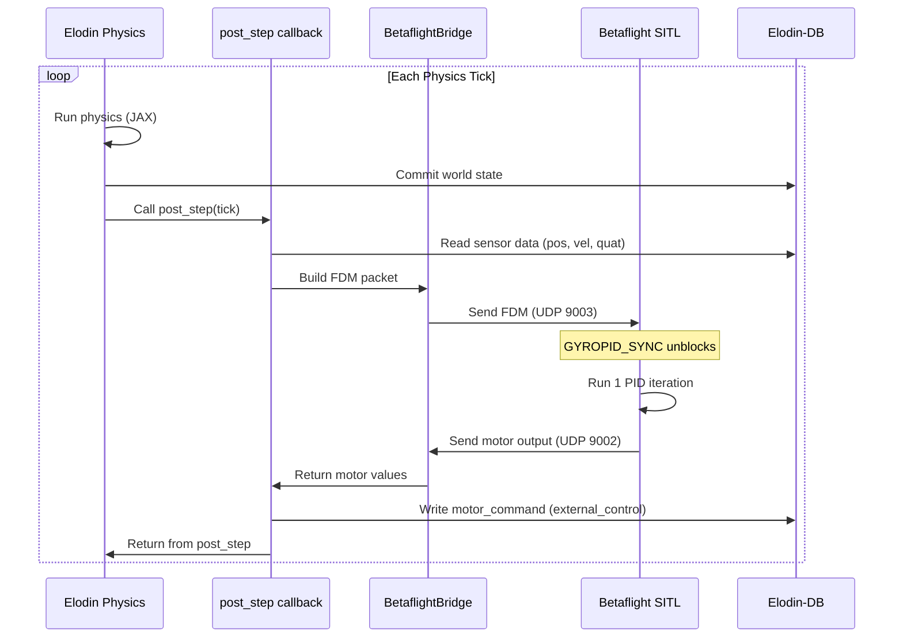
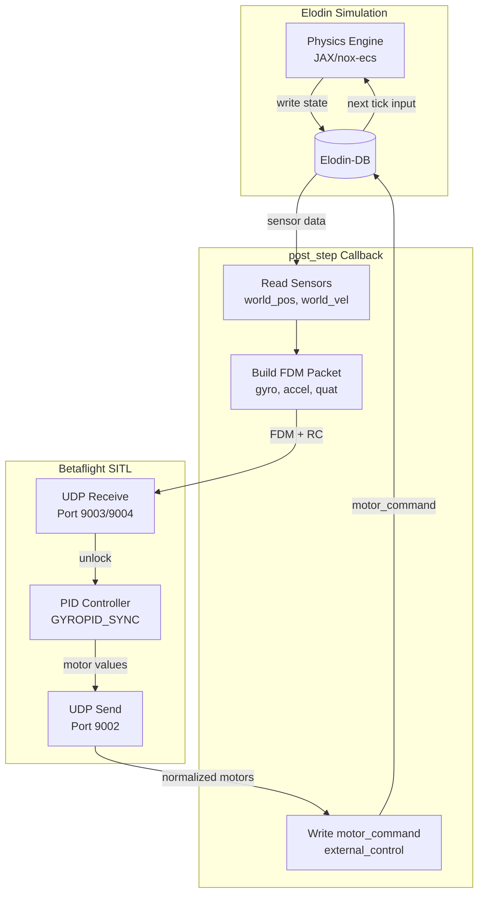

# Betaflight SITL Drone Simulation

This example demonstrates how to run a Software-In-The-Loop (SITL) drone simulation
using Elodin's physics engine with Betaflight's flight controller software.

## Overview

The simulation provides:
- **6-DOF Physics**: Rigid body dynamics with motor thrust, drag, and gravity
- **Betaflight Integration**: Real Betaflight flight controller running as SITL
- **UDP Communication**: Bidirectional sensor/motor data exchange
- **1kHz+ Update Rate**: High-frequency control loop support

```
┌─────────────────────┐        UDP        ┌─────────────────────┐
│   Elodin Physics    │◄─────────────────►│   Betaflight SITL   │
│                     │                   │                     │
│  • Rigid Body Sim   │   Port 9003: FDM  │  • Flight Control   │
│  • Motor Thrust     │   Port 9004: RC   │  • PID Loops        │
│  • Sensor Output    │   Port 9002: PWM  │  • Attitude Est.    │
│  • 3D Visualization │   Port 9001: RAW  │  • Motor Mixing     │
└─────────────────────┘                   └─────────────────────┘
```

## Quick Start

### Prerequisites (*from repo root*)

1. Nix development environment:
   ```bash
   nix develop
   ```

2. Python virtual environment with Elodin:
   ```bash
   uv venv --python 3.12
   source .venv/bin/activate
   uvx maturin develop --uv --manifest-path=libs/nox-py/Cargo.toml
   ```

### Build Betaflight SITL

```bash
cd examples/betaflight-sitl
./build.sh
```

This compiles the Betaflight firmware for SITL mode. The binary will be at:
`betaflight/obj/main/betaflight_SITL.elf`

### First-Time Setup: Configure Arming

**IMPORTANT**: Before running the simulation, you must configure an ARM switch in Betaflight.
This only needs to be done once - the config is saved to `eeprom.bin`.

1. **Start SITL** (in terminal 1):
   ```bash
   ./betaflight/obj/main/betaflight_SITL.elf
   ```
   Wait for `bind port 5761 for UART1` to appear.

2. **Connect to CLI** (in terminal 2):
   ```bash
   # Create virtual serial port
   socat -d -d pty,raw,echo=0,link=/tmp/bf tcp:localhost:5761 &
   sleep 2
   
   # Connect with screen
   screen /tmp/bf
   ```

3. **Configure ARM switch** (in screen session):
   ```
   #
   status
   aux 0 0 0 1700 2100 0 0
   save
   ```
   
   This sets ARM mode on AUX1 channel (activated when AUX1 > 1700).

4. **Exit screen**: Press `Ctrl+A` then `K` then `Y`

### Run the Simulation

**With 3D Editor (s10 manages Betaflight):**
```bash
elodin editor examples/betaflight-sitl/main.py
```

**Headless with s10:**
```bash
elodin run examples/betaflight-sitl/main.py
```

**Direct Python (subprocess starts Betaflight):**
```bash
python3 examples/betaflight-sitl/main.py run
```

### Quick Arming Test

Test that arming works correctly:
```bash
# Start SITL in one terminal
./examples/betaflight-sitl/betaflight/obj/main/betaflight_SITL.elf

# In another terminal, run the test
source .venv/bin/activate
python3 examples/betaflight-sitl/test_comms.py
```

Expected output when working:
```
Phase 2: Setting AUX1=1800 to ARM (2 seconds)...
  t=5.5s motors=[0.055 0.055 0.055 0.055]  # Motors at idle!
Phase 3: Raising throttle...
  t=7.2s motors=[0.402 0.402 0.402 0.402]  # Motors responding!
```

## Project Structure

```
examples/betaflight-sitl/
├── build.sh           # Build script for Betaflight SITL
├── main.py            # Main simulation entry point
├── config.py          # Drone physical parameters
├── sim.py             # Physics simulation systems
├── sensors.py         # IMU sensor simulation
├── comms.py           # UDP communication bridge
├── test_comms.py      # Standalone communication test
├── eeprom.bin         # Betaflight saved config (created on first run)
├── betaflight/        # Betaflight submodule
│   └── obj/main/
│       └── betaflight_SITL.elf  # Built binary
└── README.md          # This file
```

## Communication Protocol

### Simulator → Betaflight

**FDM Packet (Port 9003)**: Flight Dynamics Model data
- Timestamp (seconds)
- IMU angular velocity (rad/s, body frame)
- IMU linear acceleration (m/s², NED body frame)
- Orientation quaternion (w, x, y, z)
- Velocity (m/s, ENU world frame)
- Position (m, ENU world frame)
- Barometric pressure (Pa)

**RC Packet (Port 9004)**: Remote Control channels
- Timestamp
- 16 RC channels (PWM microseconds, 1000-2000)
- Channel mapping: [0]=Roll, [1]=Pitch, [2]=Throttle, [3]=Yaw, [4-15]=AUX1-12

### Betaflight → Simulator

**Servo Packet (Port 9002)**: Normalized motor outputs
- 4 motor values [0.0, 1.0]

**Servo Raw Packet (Port 9001)**: Raw PWM outputs
- Motor count
- 16 PWM values (1000-2000 microseconds)

## Arming Requirements

For the drone to ARM, Betaflight requires:

1. **BOOTGRACE period expired** (~5 seconds after boot)
2. **Not in CLI mode** (don't have screen/nc connected)
3. **ARM switch configured** (AUX1 in range 1700-2100)
4. **Throttle low** (< 1050)
5. **Gyro calibrated** (automatic after stable sensor data)

Check arming status via CLI:
```
# status
...
Arming disable flags: BOOTGRACE CLI  # These must clear before arming
```

## Coordinate Systems

The simulation handles complex coordinate frame conversions:

- **Elodin Physics**: ENU world frame with FLU (Forward-Left-Up) body frame
- **Betaflight Sensors**: FRD (Forward-Right-Down) body frame
- **Betaflight GPS**: ENU for position/velocity

### Body Frame Conversion (FLU → FRD)

Betaflight's SITL (sitl.c) applies internal sign conversions to incoming sensor data:
- **Accelerometer**: Negates all axes (-X, -Y, -Z)
- **Gyroscope**: Keeps X, negates Y and Z (X, -Y, -Z)

The simulation pre-compensates for these conversions so that the correct FRD values
result after Betaflight's processing. Additionally, Elodin's pitch axis convention
is inverted relative to Betaflight's expectation, requiring explicit negation.

### Motor Mapping (Betaflight Quad-X with SITL Gazebo Remapping)

Betaflight SITL remaps motor indices for Gazebo ArduCopterPlugin compatibility:

```
Standard Betaflight Quad-X Layout (looking down):
         FRONT
    4 (FL, CW)    2 (FR, CCW)
           \\    /
            \\  /
             \\/
             /\\
            /  \\
           /    \\
    3 (BL, CCW)    1 (BR, CW)
         BACK

SITL Gazebo Remapping (what we receive):
  motor[0] = FR (Front Right, CCW)  - originally BF Motor 1
  motor[1] = BL (Back Left, CCW)    - originally BF Motor 2
  motor[2] = FL (Front Left, CW)    - originally BF Motor 3
  motor[3] = BR (Back Right, CW)    - originally BF Motor 0
```

See `config.py` for motor positions and spin directions matching this mapping.

## Configuration

Edit `config.py` to modify drone parameters:

```python
DroneConfig(
    mass=0.8,                    # kg
    arm_length=0.12,             # meters
    motor_max_thrust=15.0,       # Newtons per motor
    motor_time_constant=0.02,    # seconds
    sim_time_step=0.001,         # 1kHz physics
    sensor_noise=True,           # Enable realistic sensor noise
)
```

Pre-configured drone types:
- `create_5inch_racing_quad()` - 5" racing quadcopter
- `create_3inch_cinewhoop()` - 3" cinewhoop
- `create_7inch_long_range()` - 7" long range quad

### Sensor Noise

The simulation includes a realistic sensor noise model based on the proven drone example:
- **Gyroscope**: Gaussian noise + bias drift (random walk)
- **Accelerometer**: Gaussian noise
- **Barometer**: Gaussian noise (~0.03m std dev)

Noise levels are tuned for SITL stability (1e-7 covariance). Higher noise levels
can cause Betaflight's attitude estimator to drift during the bootgrace period,
leading to motor imbalance at liftoff.

### Ground Physics

The ground constraint includes angular damping to simulate landing gear friction:
- At ground level: 95% angular velocity damping prevents tipping
- Smooth transition: Damping gradually decreases from 0.01m to 0.5m altitude
- Above 0.5m: No artificial damping, normal flight physics    


## Betaflight SITL Elodin Integration Strategy

### Architecture Overview

The wrapper leverages Betaflight's native `SIMULATOR_GYROPID_SYNC` mechanism.




### Key Components

#### 1. Betaflight Build with GYROPID_SYNC

Modify [build.sh](examples/betaflight-sitl/build.sh) to enable lockstep mode:

```c
// In target.h - uncomment this line:
#define SIMULATOR_GYROPID_SYNC
```

When enabled, Betaflight's main loop blocks on a mutex that is only released when a new FDM packet arrives. This provides synchronization without needing custom semaphores.

#### 2. External Control Component for Motor Commands

Update [sim.py](examples/betaflight-sitl/sim.py) to mark `MotorCommand` as `external_control`:

```python
MotorCommand = ty.Annotated[
    jax.Array,
    el.Component(
        "motor_command",
        el.ComponentType(el.PrimitiveType.F64, (4,)),
        metadata={
            "element_names": "m0,m1,m2,m3",
            "external_control": "true",  # NEW: allows external writes
        },
    ),
]
```


#### 3. Synchronous Bridge Class

Create a new `BetaflightSyncBridge` class in [comms.py](examples/betaflight-sitl/comms.py) that:

- Sends FDM packet
- Blocks waiting for motor response (with timeout)
- Returns motor values for DB write
```python
class BetaflightSyncBridge:
    def step(self, fdm: FDMPacket, rc: RCPacket, timeout_ms: int = 100) -> np.ndarray:
        """
        Perform one synchronized SITL step.
        
        1. Send FDM + RC packets to Betaflight
        2. Wait for motor response (blocking)
        3. Return motor values
        
        This works because SIMULATOR_GYROPID_SYNC makes Betaflight
        block until FDM arrives, then immediately send motor output.
        """
```


#### 4. Post-Step Integration

Update [main.py](examples/betaflight-sitl/main.py) to use the `post_step` pattern from the SITL example:

```python
def create_sitl_step_callback(bridge: BetaflightSyncBridge, client: Impeller2):
    """Create the post_step callback for SITL synchronization."""
    
    def sitl_step(tick: int):
        # 1. Read current sensor state from DB
        sensor_data = read_sensor_state_from_db(client)
        
        # 2. Build and send packets, wait for response
        fdm = build_fdm_packet(sensor_data, tick)
        rc = build_rc_packet(rc_state)
        motors = bridge.step(fdm, rc)
        
        # 3. Write motor commands back to DB
        write_motor_command_to_db(client, motors)
    
    return sitl_step
```


#### 5. Sensor Data Extraction

Create helper to extract sensor data from Elodin components:

```python
def extract_sensor_data(world_pos, world_vel, inertia) -> FDMPacket:
    """
    Extract sensor readings from physics state.
    
    - Gyro: world_vel.angular (body frame angular velocity)
    - Accel: specific_force = (forces/mass) - gravity_rotated_to_body
    - Quaternion: world_pos.angular
    - Position/Velocity: world_pos.linear, world_vel.linear (ENU)
    """
```


### Data Flow Diagram




## Troubleshooting

### Build Failures

**`-fuse-linker-plugin not supported`**: The build script automatically handles
this macOS compatibility issue.

**Missing symbols**: The build includes stub implementations for SITL-specific
functions not available on macOS.

### SITL Crashes

**`malloc: pointer being freed was not allocated`**: Delete `eeprom.bin` and restart:
```bash
rm -f examples/betaflight-sitl/eeprom.bin
pkill -f betaflight_SITL
./betaflight/obj/main/betaflight_SITL.elf
```

**`bind port 5761 failed`**: Another SITL instance is running:
```bash
pkill -f betaflight_SITL
lsof -i :5761  # Should show nothing
```

### Motors Always Zero (Not Arming)

1. **Check SITL is receiving data**: Look for `[SITL] new fdm` and `[SITL] new rc` in output
2. **Verify AUX1 value**: Should show `AUX1-4: 1800 ...` when arming
3. **Wait for BOOTGRACE**: First 5 seconds after boot, arming is blocked
4. **Check CLI status**: Connect with socat/screen and run `status` to see disable flags
5. **Re-configure ARM switch**:
   ```
   aux 0 0 0 1700 2100 0 0
   save
   ```

### Connection Issues

**Betaflight not receiving data**: Check that ports 9001-9004 are not in use:
```bash
lsof -i :9003
```

**CLI won't connect**: Make sure SITL is running and port 5761 is bound:
```bash
lsof -i :5761
```

### Performance

**Simulation too slow**: The simulation runs faster than real-time by default.
For 10kHz control loops, ensure:
- `sim_time_step = 0.0001` (10kHz)
- Sufficient CPU for both Elodin and Betaflight

## Development

### Adding New Sensors

1. Define component type in `sensors.py`
2. Create computation system
3. Add to `create_sensor_system()`
4. Update `comms.py` to send sensor data

### Modifying Physics

1. Edit systems in `sim.py`
2. Adjust parameters in `config.py`
3. Test with `sim.py` standalone

### Betaflight Configuration

For custom Betaflight setups:
1. Connect via CLI (socat + screen method above)
2. Use CLI commands for settings
3. Save configuration (persists to eeprom.bin)

**Note**: The Betaflight Configurator GUI (10.10.0+) doesn't support direct TCP
connections on macOS. Use the CLI method described above.

## References

- [Betaflight Documentation](https://www.betaflight.com/docs)
- [Elodin Documentation](../../docs)
- [Betaflight SITL Wiki](https://betaflight.com/docs/wiki/guides/SITL)
