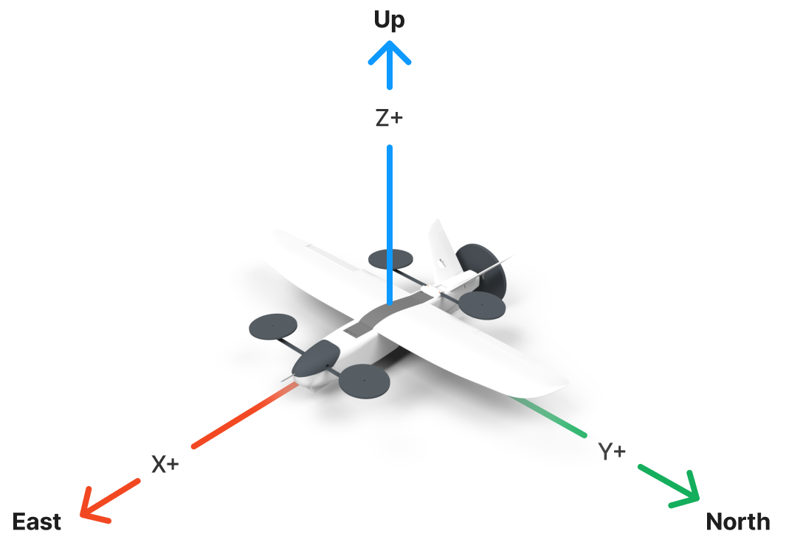

# Quadcopter / Quadplane Simulation

## Simulation Coordinate System

This simulation uses a local geodetic world frame and the "default" Elodin coordinate systems for both the body frame and the world frame:
- In body frame, (+X, +Y, +Z) axes correspond to (forward, left, up) respectively
- In world frame, (+X, +Y, +Z) axes correspond to (East, North, Up) respectively

## Elodin Coordinate Systems

The default coordinate systems used in Elodin align with the editor's representation of the (X, Y, Z) axes as (red, green, blue) respectively. Also, all coordinate systems are right-handed.

### Local Geodetic World Frame

A local geodetic world frame is commonly used for terrestrial vehicles and is represented using the [East, North, Up (ENU)](https://en.wikipedia.org/wiki/Local_tangent_plane_coordinates#Local_east,_north,_up_(ENU)_coordinates) coordinate system where:
- +X: East
- +Y: North
- +Z: Up

### Geocentric World Frame

A geodetic world frame is represented using either the [Earth-Centered, Earth-Fixed (ECEF)](https://en.wikipedia.org/wiki/Earth-centered,_Earth-fixed_coordinate_system) or the [Earth-Centered Inertial (ECI)](https://en.wikipedia.org/wiki/Earth-centered_inertial) coordinate system. ECEF is useful for Earth-relative positioning (e.g. GPS, mapping) while ECI is useful for Earth-orbiting space vehicles. The main difference between ECEF and ECI is in how they handle the rotation of the Earth. In ECEF, the Earth is fixed and the coordinate system rotates with the Earth. In ECI, the coordinate system is fixed with respect to the stars and does not rotate with the Earth.

#### ECEF

ECEF is loosely defined as:
- +X: along the equatorial plane towards the prime meridian (0° longitude)
- +Y: along the equatorial plane towards 90°E longitude
- +Z: perpendicular to the equatorial plane towards the North Pole

However, the terms "equatorial plane", "prime meridian", "North Pole", and "origin" are not precisely defined in the ECEF coordinate system. The World Geodetic System 1984 (WGS 84) provides a more precise definition of the ECEF coordinate system:
- Origin: center of mass for the whole Earth (including oceans and atmosphere)
- +Z: direction of the IERS Reference Pole (IRP)
- +X: intersection of the IERS Reference Meridian (IRM) and the plane passing through the origin and normal to the IRP
- +Y: completes the right-handed coordinate system

#### ECI

ECI is loosely defined as:
- +X: along the equatorial plane and permanently fixed in a direction relative to the celestial sphere
- +Y: along the equatorial plane pointing 90° East about the celestial equator
- +Z: perpendicular to the equatorial plane towards the North Pole

Similar to ECEF, ECI itself is not a precise coordinate system. J2000 is a specific realization of the ECI coordinate system where:
- Origin: center of mass for the whole Earth (including oceans and atmosphere)
- +Z: points towards the Earth's north celestial pole as it was at noon on January 1, 2000
- +X: points towards the vernal equinox (also called the first point of Aries) as it was at noon on January 1, 2000, in the Terrestrial Time scale
- +Y: completes the right-handed coordinate system

### Body Frame

For vehicles, the body frame is represented as a right-handed coordinate system with:
- +X: along the body centerline towards the nose
- +Y: left when looking forward
- +Z: up when looking forward

This is because vehicle attitude is typically defined in terms of roll, pitch, and yaw angles in that order. A consequence of this is that a positive yaw angle corresponds to a counterclockwise rotation and a positive pitch angle corresponds to a nose-down rotation.

NOTE: The world frame can be aligned with the body frame by considering the (+X, +Y) axes in the world frame as (forward, left) respectively with the (+Z) axis pointing up.
