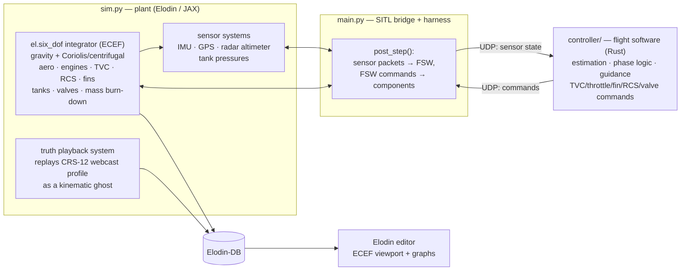

# Flying a Falcon 9 Booster in Elodin

*The math and physics foundation for a software-in-the-loop recreation of a
real Falcon 9 return-to-launch-site mission — launch to booster landing, in
the rotating Earth-fixed frame, calibrated against recorded flight data with
[Elodin](https://www.elodin.systems/).*

---

## Who this is for

This is an educational explainer for aspiring rocket engineers, GNC (guidance,
navigation & control) students, and space enthusiasts. It derives **every**
piece of math and physics the `falcon9` example is built on: the rotating-frame
equations of motion, WGS84 geodesy, the atmosphere and aerodynamic models, the
engine, tank, TVC, RCS, and grid-fin effector models, the guidance laws for
each mission phase, the sensor and observation models, and the Monte Carlo
machinery that calibrates all of it against a real flight.

You do not need an aerospace background, but you will get the most out of it
if you are comfortable with vectors, basic calculus, and a little linear
algebra. Every formula is paired with its source and, where possible, a
worked number pulled from the mission data vendored in [`data/`](data/).

> **A note on status and fidelity.** This whitepaper was written
> *design-first* and the implementation now follows it: the plant lives in
> [`sim.py`](sim.py) with the pure physics in
> [`frames.py`](frames.py)/[`atmosphere.py`](atmosphere.py)/[`propulsion.py`](propulsion.py)/[`aero.py`](aero.py)/[`rcs.py`](rcs.py),
> the flight software in [`controller/`](controller/src/main.rs), and the
> verification ladder in [`test_ladder.py`](test_ladder.py). Achieved
> calibration numbers live in the [README](README.md#calibration-results).
> Like the [apollo-lander whitepaper](../apollo-lander/WHITEPAPER.md), this is
> a *teaching* simulation — we favor clarity, flag every simplification, and
> collect the honest caveats in one place (Section 15).

## Table of contents

1. [The mission](#1-the-mission)
2. [System architecture](#2-system-architecture)
3. [Truth data and provenance](#3-truth-data-and-provenance)
4. [Frames, geodesy, and time](#4-frames-geodesy-and-time)
5. [Rigid-body dynamics in rotating ECEF](#5-rigid-body-dynamics-in-rotating-ecef)
6. [Gravity](#6-gravity)
7. [Atmosphere and winds](#7-atmosphere-and-winds)
8. [Aerodynamics: ascent, entry, and grid fins](#8-aerodynamics-ascent-entry-and-grid-fins)
9. [Propulsion: engines, propellant, tanks, and valves](#9-propulsion-engines-propellant-tanks-and-valves)
10. [Effectors: TVC and RCS](#10-effectors-tvc-and-rcs)
11. [The flight software: guidance and control by phase](#11-the-flight-software-guidance-and-control-by-phase)
12. [Sensors and the observation model](#12-sensors-and-the-observation-model)
13. [Scoring and Monte Carlo calibration](#13-scoring-and-monte-carlo-calibration)
14. [Numerics, timing, and verification](#14-numerics-timing-and-verification)
15. [Modeling decisions and honest caveats](#15-modeling-decisions-and-honest-caveats)
16. [Exercises for the reader](#16-exercises-for-the-reader)
17. [References](#17-references)

---

## 1. The mission

On August 14, 2017 at 16:31:37 UTC, Falcon 9 booster **B1039** lifted off from
Kennedy Space Center LC-39A carrying the CRS-12 Dragon toward the ISS. Two and
a half minutes later the nine Merlin engines shut down, the stages separated,
and — while the second stage continued to orbit — the booster flipped around,
burned three engines to reverse its course, fell back through the atmosphere,
and landed on a single engine at Landing Zone 1, about 15 km south of where it
started. Eight minutes, pad to pad.

The webcast telemetry we vendored records the whole arc
([`data/crs12/`](data/crs12/)):

| Event (webcast-observed) | t (s) | speed (m/s) | altitude (km) |
| --- | ---: | ---: | ---: |
| Liftoff | 0 | 0 | 0 |
| Max-Q (throttle bucket 51–90 s) | 64 | 301 | 8.7 |
| MECO | 147 | 1,656 | 60.9 |
| Boostback burn | 166–212 | 1,524 → 577 | 80.9 → 112.0 |
| Apogee | 250 | 461 | 118.0 |
| Entry burn | 370–384 | 1,229 → 863 | 49.8 → 35.9 |
| Landing burn start | 433 | 318 | 4.6 |
| Touchdown | 466 | ~0 | 0.0 |

This is a near-perfect *hard* teaching problem — the complement of the
apollo-lander's gentle one:

- **The physics is rich.** A rotating planet, an atmosphere crossed four
  times (up, coast, supersonic retropropulsion, terminal descent), thrust
  spanning ~6.8 MN at liftoff to a single engine near minimum throttle, and
  vehicle mass falling from ~544 t on the pad to ~27 t at touchdown — a
  factor of 20.
- **The control problem is real.** Nine mission phases, three in-flight
  relights, a 180° flip on cold-gas thrusters, aerodynamic steering with grid
  fins, and a landing burn that *cannot hover* — the engine must hit zero
  velocity exactly at zero altitude.
- **The data exists.** Public webcast telemetry covers the booster from
  liftoff to touchdown, so we can fly *against the real mission* and measure
  how close we get — and hold out a second flight (CRS-11) to prove we
  calibrated physics, not coincidence.

The goal of the example is to land softly at LZ-1 **and** to reproduce the
recorded CRS-12 profile within the truth data's uncertainty.

---

## 2. System architecture

Four cooperating pieces, mirroring
[apollo-lander](../apollo-lander/WHITEPAPER.md#2-system-architecture): the
**plant** (physics) lives in Elodin and runs in JAX; the **flight software**
runs as a separate Rust process; a thin **bridge** ferries bytes between them;
and the **campaign layer** scores runs against the recorded flight.



The **closed-loop boundary** is the project's core requirement: the flight
software sees only simulated sensor interfaces and commands only simulated
actuators and valves. It is never handed truth state, and the plant never
executes control logic on its behalf.

| Piece | Home | Role |
| --- | --- | --- |
| Plant systems | [`sim.py`](sim.py) | All physics in this document, as `@el.map` JAX systems |
| Pure physics | [`frames.py`](frames.py), [`atmosphere.py`](atmosphere.py), [`propulsion.py`](propulsion.py), [`aero.py`](aero.py), [`rcs.py`](rcs.py) | Geodesy, US76, engines/tanks, aero/fins, cold-gas RCS |
| World + bridge | [`main.py`](main.py) | Entities, `post_step` UDP exchange, result emission |
| Truth profiles | [`reference.py`](reference.py) | Cleaned CRS-12/CRS-11 profiles from `data/` |
| Flight software | [`controller/`](controller/src/main.rs) | Rust process: estimation, guidance, sequencing |
| Scene + graphs | [`falcon9.kdl`](falcon9.kdl) | `coordinate frame="ECEF"`, Earth GLB, trails |
| Campaign | [`campaign.toml`](campaign.toml), [`spec.toml`](spec.toml), [`hooks/`](hooks/) | Monte Carlo calibration loop |

---

## 3. Truth data and provenance

Everything physical traces to a public source; the full inventory, quality
audit, and selection rationale live in [`data/README.md`](data/README.md).
The short version:

- **Telemetry** — stage-1 webcast telemetry for CRS-12 (primary) and CRS-11
  (held-out validation) from
  [`shahar603/Telemetry-Data`](https://github.com/shahar603/Telemetry-Data)
  (Unlicense, pinned commit): `time` (s), `velocity` (m/s), `altitude` (km)
  at ~30 Hz, from liftoff through touchdown, plus webcast-observed event
  times. Extracted from official webcast overlays by OCR
  ([SpaceXtract](https://github.com/shahar603/SpaceXtract)).
- **Mission facts** — launch epoch, pad and landing-zone geodetic
  coordinates, booster serials, payload masses, compiled with per-field
  citations in `mission.json` (NASA mission overviews, press kit, mission
  coverage).
- **Vehicle configuration** — the
  [Falcon 9 Full Thrust block tables](https://en.wikipedia.org/wiki/Falcon_9_Full_Thrust)
  and the official
  [Falcon Payload User's Guide](https://www.spacex.com/assets/media/falcon-users-guide-2025-05-09.pdf):
  nine Merlin 1D engines, heated-helium tank pressurization, TEA-TEB
  ignition with three relight-capable engines, four grid fins, four landing
  legs. The 2017 flights are Block 3/4: per-engine sea-level thrust ~760 kN
  and stage propellant ~395–400 t (*not* the Block 5 845 kN / 411 t most
  spec sheets quote).
- **Entry-burn priors** — the NASA–SpaceX supersonic-retropropulsion papers
  ([program overview](https://ntrs.nasa.gov/citations/20170008535),
  [Sforzo & Braun](https://repository.gatech.edu/bitstreams/9205d1bc-2225-4249-9f61-4e768f55d89c/download)),
  the only public material based on actual onboard Falcon 9 data.

**Critical honesty about the truth:** the telemetry is *displayed* telemetry
— OCR'd from a webcast overlay with 1 km/h velocity quantization, 0.1 km
altitude quantization, undocumented display filtering, and ~1–2 s of latency.
Section 12 builds the observation model that lets us compare against it
fairly; Section 13 turns its uncertainty into scoring thresholds.

### 3.1 From raw telemetry to reference profiles

`reference.py` (planned) turns `stage1_raw.json` into calibration-grade
profiles, following the apollo-lander recipe: resample to a uniform grid,
median-despike, light smoothing, and centered-difference rates — plus two
Falcon-specific reconstructions:

- **Vertical/horizontal split.** The webcast gives scalar speed only. With
  altitude h(t) recorded, vertical speed is `ḣ` and the horizontal share is
  `√(v² − ḣ²)` — valid when `v ≥ |ḣ|`, with quality flags where quantization
  makes the difference ill-conditioned (upstream `analysed.json` is kept only
  as a cross-check; we re-derive with stated assumptions).
- **Downrange profile.** Integrating the horizontal share, signed by phase
  (out on ascent, back after boostback), anchored at 0 (pad) and ~14.8 km
  south (LZ-1, Section 4.3).

---

## 4. Frames, geodesy, and time

### 4.1 The frame set

| Symbol | Frame | Definition | Used for |
| --- | --- | --- | --- |
| `E` | **ECEF** (WGS84) | Origin at Earth's center of mass; +X through the prime meridian in the equatorial plane, +Z through the North pole, +Y completes right-handed | **The world frame.** All integration, all state, the editor scene |
| `I` | ECI | Same origin/axes at t = 0, non-rotating | Derivations and checks only — never integrated in |
| `N` | Local NED at a geodetic point | +X North, +Y East, +Z Down along the ellipsoid normal | FSW guidance errors, landing targeting, close-up viewports |
| `B` | Body | +X nose, +Y left, +Z up (Elodin convention) | Forces, moments, inertia, sensors |

The **primary frame decision** (per the [README](README.md)): the simulation
world *is* rotating ECEF. The truth data forces an Earth-fixed frame — webcast
speed starts at 0 on a pad that is itself moving ~408 m/s eastward in inertial
space, the landing target is Earth-fixed, and the atmosphere co-rotates — and
the trajectory is too large for a flat tangent plane (Section 4.4). The KDL
schematic declares `coordinate frame="ECEF"`, matching
[Elodin's coordinate conventions](../../docs/public/content/reference/coords.md)
and the [`geo-frames`](../geo-frames/main.py) example.

Earth's rotation vector, in ECEF (and constant — Elodin's +Z is the pole):

```text
ω_E = (0, 0, ω_e),   ω_e = 7.292115e-5 rad/s        (one sidereal day: 86,164.1 s)
```

### 4.2 WGS84 geodesy

The reference ellipsoid [WGS84 / NGA TR8350.2]:

```text
a  = 6,378,137.0 m                 (semi-major axis, equatorial)
f  = 1 / 298.257223563             (flattening)
b  = a(1 − f) = 6,356,752.314 m    (semi-minor axis, polar)
e² = f(2 − f) = 6.69437999014e-3   (first eccentricity squared)
```

**Geodetic → ECEF** (latitude φ, longitude λ, ellipsoid height h):

```text
N(φ) = a / √(1 − e² sin²φ)                       (prime-vertical radius)
x = (N + h) cosφ cosλ
y = (N + h) cosφ sinλ
z = (N(1 − e²) + h) sinφ
```

**ECEF → geodetic** uses Bowring's iteration (or an equivalent closed form)
for φ and h; longitude is `atan2(y, x)`. This conversion *is* the altitude
observable (Section 12).

**The local NED basis at (φ, λ)**, expressed in ECEF — the rows of the
rotation matrix `R_NE`:

```text
n̂ = (−sinφ cosλ, −sinφ sinλ, cosφ)      (north)
ê = (−sinλ,       cosλ,       0   )      (east)
d̂ = (−cosφ cosλ, −cosφ sinλ, −sinφ)     (down = −ellipsoid normal)
```

Note φ is *geodetic* latitude — the ellipsoid-normal direction — which at the
Cape differs from geocentric latitude by ~0.16°. "Vertical" in this project
always means the ellipsoid normal.

### 4.3 Worked example: the two pads

From [`data/crs12/mission.json`](data/crs12/mission.json), with the formulas
above:

```text
LC-39A  (28.60839°N, −80.60433°E, h ≈ 3 m):   r_E ≈ ( 914.8, −5528.6, 3035.9) km
LZ-1    (28.48580°N, −80.54440°E, h ≈ 5 m):   r_E ≈ ( 921.7, −5534.0, 3023.9) km
‖Δ‖ ≈ 14.8 km   (the whole mission, pad to pad)
```

Surface rotation speed at the pad — the "free" eastward velocity every launch
inherits, and the reason ECI and Earth-fixed speeds differ so much:

```text
v_rot = ω_e (N + h) cosφ ≈ 7.292115e-5 × 6.383e6 × 0.8779 ≈ 408.6 m/s
```

### 4.4 Why not a flat tangent frame

The booster reaches 118 km altitude with a horizontal extent of order 100 km.
Over a downrange distance d, a flat plane misstates the surface by
`d²/(2R_e)` — at d = 100 km that is **~785 m**, a systematic error in the
altitude channel far larger than its 0.1 km quantization. Gravity at apogee is
~3.6% weaker than at the pad (Section 6), and the gravity *direction* rotates
~0.9° per 100 km. ECEF carries all of this exactly.

### 4.5 Quaternion conventions

Following the [Elodin coordinate docs](../../docs/public/content/reference/coords.md)
and [Solà's quaternion primer](https://arxiv.org/abs/1711.02508):

- **Hamilton** quaternions, right-handed composition.
- `q ≡ q_EB` maps body-frame vectors into the world (ECEF) frame:
  `v_E = q ⊗ v_B ⊗ q⁻¹`.
- Storage order follows the SDK (`el.Quaternion`; the UDP bridge packs
  `x, y, z, w` scalar-last like apollo-lander).
- Kinematics with body-frame angular rate ω_B:

```text
q̇ = ½ q ⊗ (0, ω_B)
```

`el.six_dof` owns this equation and the normalization; the FSW keeps its own
copy for propagation between sensor updates. Both are validated by the same
single-axis test: integrate `ω_B = (0, 0, 1°/s)` for 90 s and demand a 90°
yaw, sign included (Section 14.3).

### 4.6 Time

- **Simulation epoch:** `2017-08-14T16:31:37Z` (liftoff), passed as
  `start_timestamp` so Elodin-DB stamps every sample with real mission time.
- **Mission time** `t` (s since liftoff) is the abscissa of every truth
  channel.
- Earth orientation: we fix the ECEF↔ECI relationship at the epoch and treat
  ω_E as constant — polar motion, precession, and UT1 corrections are
  microseconds-per-day effects, irrelevant over 8 minutes.

---

## 5. Rigid-body dynamics in rotating ECEF

### 5.1 Translational dynamics — deriving the fictitious forces

Newton's second law holds in an inertial frame. For a frame rotating at
constant ω, the transport theorem applied twice to the position vector gives
the classic result [MIT 16.07, lecture on rotating frames]:

```text
a_I = a_E + 2 ω × v_E + ω × (ω × r)
```

Rearranged for the ECEF-frame acceleration we integrate, with F the sum of
*non-gravitational* contact forces (thrust, aero, ground) and g the
gravitational attraction (Section 6):

```text
v̇_E = g(r) + F/m − 2 ω × v_E − ω × (ω × r)
       └─┬──┘  └┬┘   └───┬────┘   └────┬─────┘
       gravity thrust  Coriolis    centrifugal
               aero
               contact
```

Magnitudes for this mission, to build intuition:

```text
centrifugal at the pad:  ω_e² (N+h) cosφ ≈ 0.030 m/s²  (~0.3% of g, points off the spin axis)
Coriolis at MECO speed:  2 ω_e v = 2 × 7.292115e-5 × 1656 ≈ 0.242 m/s²
```

The Coriolis term looks small until you integrate it: acting sideways on a
~300 s ballistic arc it displaces the trajectory by kilometers — on a mission
whose entire pad-to-pad extent is 14.8 km. This is why the boostback targeting
(Section 11.4) cannot ignore it, and why our verification suite includes a
falling-object Coriolis check (Section 14.3).

A satisfying identity worth internalizing: on the WGS84 ellipsoid,
`g(r) − ω×(ω×r)` — gravitation plus centrifugal — is (by the ellipsoid's
*definition* as an equipotential of that combined field) very nearly normal to
the surface, with magnitude ≈ 9.79 m/s² at the Cape's latitude. A plumb line
in our simulation hangs along the geodetic vertical without any special
handling. That is the pad-statics check in Section 14.3.

### 5.2 Rotational dynamics

Euler's equation in the body frame, with inertia tensor `I_B` and total body
moment `M_B` [MIT 16.07; Featherstone's spatial-vector notes]:

```text
I_B ω̇_B + ω_B × (I_B ω_B) = M_B
```

Two Falcon-specific notes:

- **Time-varying inertia.** `I_B` changes by an order of magnitude during
  ascent. We use the staged approach from the research literature: rigid body
  with quasi-static mass properties — `m(t)`, `r_CG(t)`, `I_B(t)` updated
  each tick from propellant state (Section 9.4) — neglecting the
  `İ_B ω_B` and propellant-momentum terms of the full variable-mass equation,
  which are small for axial flow at our rates.
- **Earth's rotation and the gyroscopic term.** ω_B in the equation above is
  the body rate relative to the *inertial* frame. Since our attitude state is
  ECEF-referenced, the exact body inertial rate is
  `ω_B = ω_B/E + R_BE ω_E`; the ω_E contribution (7.3e-5 rad/s) is three
  orders below flight rates (~0.1–0.5 rad/s in the flip) and is neglected in
  the plant — but the *IMU model* adds it back (gyros measure inertial rate;
  Section 12.1), because that is exactly the Earth-rate bias a real navigator
  must handle.

### 5.3 Force and moment accumulation

Every effector contributes a force applied at a point, in the body frame; the
plant sums wrenches about the current center of gravity:

```text
F_B = Σᵢ F_i,B
M_B = Σᵢ (r_i,B − r_CG,B) × F_i,B  +  Σᵢ M_i,B(direct)
```

with the world-frame force `F_E = q ⊗ F_B ⊗ q⁻¹` handed to the integrator.
Each effector (engine cluster, TVC, RCS jets, grid fins, aero, contact)
exposes its commanded and realized state as components, so every term in the
sum is visible in Elodin-DB — a debugging habit the research baseline calls
out, and the KDL graphs exploit.

---

## 6. Gravity

Point-mass (two-body) gravitation, in ECEF coordinates:

```text
g(r) = −μ r / ‖r‖³,       μ = 3.986004418e14 m³/s²   (WGS84 GM)
```

Worked numbers — why altitude-dependent gravity is not optional here:

```text
pad      (‖r‖ ≈ 6,373 km):  ‖g‖ ≈ 9.813 m/s²
apogee   (+118 km):         ‖g‖ ≈ 9.460 m/s²    (−3.6%)
```

A constant-g model integrated over the ~280 s between MECO and entry would
misplace the apogee by kilometers — larger than the truth channel's
resolution — so the sim would fail calibration before the aero model even
mattered.

**What we deliberately omit:** the J2 oblateness perturbation, the largest
gravity-field correction, has magnitude
`(3/2) J2 (a/r)² μ/r² ≈ 1.6e-2 m/s²` (~0.16% of g) with J2 = 1.08263e-3
[NGA TR8350.2]. Over 8 minutes its integrated effect is meters — far below
truth uncertainty — so the plant uses the point-mass field. (The *shape* of
the ellipsoid still matters and is fully retained in the geodesy; only the
gravity-field harmonic is truncated.)

---

## 7. Atmosphere and winds

### 7.1 U.S. Standard Atmosphere 1976

The baseline atmosphere is the
[U.S. Standard Atmosphere 1976](https://ntrs.nasa.gov/archive/nasa/casi.ntrs.nasa.gov/19770009539.pdf):
a piecewise-linear temperature profile in **geopotential altitude** H, with
pressure integrated hydrostatically per layer and density from the ideal gas
law:

```text
H = r₀ h / (r₀ + h),           r₀ = 6,356,766 m         (geometric → geopotential)

layer b:  T = T_b + L_b (H − H_b)
          L_b ≠ 0:  p = p_b [T_b / T]^(g₀ M / (R* L_b))
          L_b = 0:  p = p_b exp(−g₀ M (H − H_b) / (R* T_b))

ρ = p M / (R* T) = p / (R_air T),        R_air = 287.053 J/(kg·K)
a = √(γ R_air T),                        γ = 1.4          (speed of sound)
```

with `g₀ = 9.80665 m/s²`, `R* = 8.31432 J/(mol·K)`, `M = 28.9644 g/mol`, and
the standard layer table (0 km: 288.15 K, −6.5 K/km; 11 km: 216.65 K,
isothermal; 20 km: +1.0 K/km; 32 km: +2.8; 47 km: isothermal; 51 km: −2.8;
71 km: −2.0). Spot checks the implementation must reproduce
(Section 14.3): `ρ(0) = 1.2250 kg/m³`, `p(11 km) = 22,632 Pa`,
`ρ(11 km) = 0.3639 kg/m³`. Above ~86 km density is < 1e-5 kg/m³ and the
booster's brief 86–118 km apogee arc is effectively in vacuum.

In the plant, the altitude input is the geodetic height from Section 4.2 —
one more place the ECEF choice pays off, since h is exact everywhere on the
trajectory.

### 7.2 Wind and air-relative velocity

The atmosphere co-rotates with the Earth, so in rotating ECEF the air-relative
velocity is simply:

```text
v_air = v_E − v_wind(h)
```

with **zero extra terms** — a key simplification the frame choice buys us (in
ECI you would first subtract `ω × r`). `v_wind` is a horizontal profile
(NED components vs. altitude, rotated into ECEF), defaulting to zero and
dispersed by the Monte Carlo campaign; a measured Cape Canaveral sounding for
2017-08-14 can replace it later
([NOAA IGRA](https://www.ncei.noaa.gov/products/weather-balloon/integrated-global-radiosonde-archive))
if wind dominates the calibration residual.

Derived flow quantities used everywhere downstream:

```text
q̄ = ½ ρ ‖v_air‖²          (dynamic pressure)
M = ‖v_air‖ / a            (Mach number)
α = angle between body +X and v_air    (total angle of attack)
```

---

## 8. Aerodynamics: ascent, entry, and grid fins

### 8.1 The force model

Body-frame aerodynamic force and moment, coefficient-based
[NASA Rocket Aerodynamics; Barrowman for the slender-body baseline]:

```text
F_aero,B = q̄ S_ref · C_F(M, α, config)
M_aero,B = q̄ S_ref L_ref · C_M(M, α, config)  +  Σ fins
```

with `S_ref = π D²/4 ≈ 10.5 m²` (D = 3.66 m) and `L_ref = D`. We decompose
`C_F` into an axial coefficient `C_A(M)` along −X (drag at α = 0) and a
normal-force slope `C_Nα(M)` perpendicular to the body axis, the standard
slender-body split. The static moment follows from the center-of-pressure
location: `C_M = C_N (x_CP − x_CG)/L_ref`.

Three configurations, because the vehicle's shape effectively changes:

| Config | Phases | Character |
| --- | --- | --- |
| Ascent (full stack) | 1–3 | Slender body, α ≈ 0, transonic drag rise around M ≈ 1 |
| Booster, engines-first | 7–11 | Blunt-base-first body at α near 180° by ascent convention — we re-zero α to the *engines-first* axis for descent tables; grid fins deployed |
| Retropropulsion | 8, 10 | Plume-dominated (below) |

The coefficient tables are **explicit calibration parameters** with priors
from public estimates (ascent `C_A ≈ 0.3–0.5` subsonic, peaking near M ≈ 1.1;
descent `C_A ≈ 1.0–1.5` blunt-first). No public source pins them; the Monte
Carlo campaign does (Section 13). The webcast data constrains them well in
two windows where thrust is zero: the 166–370 s coast (upper atmosphere) and
the 384–433 s unpowered descent — during which the recorded speed/altitude
slopes are pure gravity-plus-drag signatures.

### 8.2 The booster's real Max-Q is on the way down

A worked number that surprises most readers. Ascent Max-Q, from the recorded
event (t = 64 s, v = 301 m/s, h = 8.7 km) and US76:

```text
ρ(8.7 km) ≈ 0.483 kg/m³   →   q̄ = ½ · 0.483 · 301² ≈ 22 kPa
```

But during entry descent the vendored `analysed.json` q̄ channel peaks near
t ≈ 412 s at h ≈ 13.1 km, v ≈ 674 m/s; re-deriving from US76:

```text
ρ(13.1 km) ≈ 0.261 kg/m³  →   q̄ = ½ · 0.261 · 674² ≈ 59 kPa
```

Nearly **three times the ascent load** — which is exactly *why* the entry
burn exists: it meters out kinetic energy so the descent q̄ peak stays
survivable. Our scoring uses this reconstructed q̄ peak as a physics-
plausibility metric (Section 13.2).

### 8.3 Supersonic retropropulsion

During the entry burn the booster flies engines-first at Mach ~4–5 *into* its
own exhaust. The NASA–SpaceX SRP research
([overview](https://ntrs.nasa.gov/citations/20170008535);
[Sforzo & Braun](https://repository.gatech.edu/bitstreams/9205d1bc-2225-4249-9f61-4e768f55d89c/download))
— built on actual Falcon 9 onboard data — established the qualitative
picture: the plume pushes the bow shock far upstream, the base region is
plume-dominated, and net aerodynamic drag on the vehicle largely collapses
while engines run.

Our model captures that leading-order effect without CFD: while the entry or
landing burn is firing, aerodynamic force is blended down by a
plume-dominance factor

```text
F_aero → (1 − κ(C_T)) F_aero,      C_T = T / (q̄ S_ref)
```

with κ → 1 for thrust coefficient `C_T ≫ 1` (our burns have C_T of order
5–50, deep in plume-dominated territory). κ's shape is a calibration
parameter; the SRP papers' reconstructed deceleration profiles are its
plausibility prior. The measured mean deceleration in the CRS-12 entry burn —
`(1229 − 863) m/s / 14 s ≈ 26 m/s² ≈ 2.7 g` — is the number the calibrated
thrust-plus-drag stack must reproduce.

### 8.4 Grid fins

Four lattice fins near the interstage, deployed after boostback, each rotating
about a radial hinge. Modeled as incremental normal-force surfaces at lever
arm `ℓ_fin ≈ 20 m` (interstage to CG, calibration parameter):

```text
per fin:  ΔF_i = q̄ S_fin C_Nδ(M) δ_i · n̂_i        (force ⊥ body axis at the fin station)
torque:   ΔM_i = r_fin,i × ΔF_i
```

Pitch and yaw come from deflecting opposite fin pairs together; roll from
differential deflection — an X-configuration allocation exactly like fin
mixing on an airplane:

```text
[δ₁ δ₂ δ₃ δ₄]ᵀ = A · [δ_pitch, δ_yaw, δ_roll]ᵀ,   A = fin mixing matrix (±1 entries / 2)
```

Grid fins are notably effective supersonic (the lattice cells act as many
small wings) with a transonic effectiveness dip — `C_Nδ(M)` is table-driven
with that shape, and the actuator obeys the rate-limited model of
Section 10.1. No public command history exists (the source inventory is
explicit on this), so fins are calibrated only through their closed-loop
trajectory signature, never scored directly.

---

## 9. Propulsion: engines, propellant, tanks, and valves

### 9.1 The thrust equation and altitude dependence

The rocket thrust equation [NASA Rocket Thrust Equation]:

```text
T = ṁ v_e + (p_e − p_a) A_e
```

Group the vacuum terms: `T_vac = ṁ v_e + p_e A_e`, so thrust at ambient
pressure p_a is simply

```text
T(h) = T_vac − p_a(h) A_e
```

We can *derive* the effective exit area from the published Block 5 thrust
pair — a nice self-consistency trick:

```text
A_e = (T_vac − T_SL) / p_SL = (914 − 845) kN / 101.325 kPa ≈ 0.68 m²
```

(≈ 0.93 m exit diameter — consistent with photos of the Merlin 1D bell.)
Nozzle geometry didn't change between blocks, so the Block 3/4 engines our
missions flew (T_SL ≈ 760 kN *est.*) give `T_vac ≈ 760 + 101.325 × 0.68 ≈
829 kN`. Per-engine thrust is then `T_i(h, u) = u · T_vac − p_a(h) A_e` with
throttle `u ∈ [u_min, 1]`, `u_min ≈ 0.57` (*est.*).

### 9.2 Specific impulse and mass flow

Specific impulse ties thrust to propellant consumption
[NASA Specific Impulse]:

```text
ṁ = T / (Isp g₀)         per engine, at its current thrust
```

With Isp_SL ≈ 282 s (calibration prior; vacuum ≈ 311 s follows from the
thrust ratio), a full-throttle sea-level engine burns
`760e3 / (282 × 9.80665) ≈ 275 kg/s`. Cross-check against the recorded
mission — the whole propellant budget, in four lines:

```text
ascent:     9 × 275 kg/s × 147 s ≈ 364 t, less ~29 t credit for the
            recorded throttle bucket (51–90 s at reduced power)  ≈ 335 t
boostback:  3 × 275 × 46 s                                       ≈  38 t
entry:      3 × 275 × 14 s                                       ≈  12 t
landing:    1 × ~190 × 33 s (partial throttle)                   ≈   6 t
                                                            total ≈ 391 t
```

against a ~395–400 t load: the budget closes with single-digit-ton margin,
consistent with RTLS being the propellant-hungriest recovery mode. This is
the kind of order-of-magnitude audit every model constant here must pass
before calibration fine-tunes it.

### 9.3 Ignition, shutdown, and relight

Each engine carries a state machine: `off → chill → ignition ramp → running →
shutdown ramp → off`, with TEA-TEB pyrophoric ignition consuming one relight
charge per start [Falcon User's Guide; Wikipedia F9FT]. Only three engines
(the center and two ignition-capable neighbors) carry relight charges — the
hard constraint that shapes the mission: 9 lift off, 3 boostback, 3 entry, 1
lands. Thrust transients are first-order ramps with time constants sized from
the SRP papers' observation that chamber pressure reached steady state ~5 s
after the entry-burn ignition command (startup) and faster for shutdown; both
are calibration parameters with those priors.

The throttle channel obeys the same rate-limited first-order model as every
actuator (Section 10.1).

### 9.4 Mass properties: burn-down, CG travel, inertia

Propellant states (LOX and RP-1 tracked separately, mixture ratio ~2.33:1
O/F by mass, *est.*) integrate the summed engine flows. Total mass, CG, and
inertia follow from geometry: the booster is modeled as a stack of
cylinders — dry structure (fixed), RP-1 column (lower tank), LOX column
(upper tank) — each propellant column draining top-down:

```text
m(t)     = m_dry + m_LOX(t) + m_RP1(t) + m_N2/He(t)
r_CG(t)  = Σ mᵢ rᵢ / Σ mᵢ                     (axial stations of each slug)
I_axial  = Σ ½ mᵢ Rᵢ²
I_trans  = Σ [ ¼ mᵢ Rᵢ² + (1/12) mᵢ Lᵢ² + mᵢ dᵢ² ]     (parallel-axis)
```

with `L ≈ 41.2 m` stage length, `D = 3.66 m`, and tank stations as
calibration parameters. Two consequences the sim must exhibit: liftoff
`T/W = 6,840 kN / (544 t × g) ≈ 1.3` (2017-block thrust and stack mass)
growing to ~3.6 g just before MECO as mass burns off (the recorded peak
acceleration in `analysed.json` is ≈ 3.6 g — a free validation point), and a
CG that walks *down* the stage as tanks drain, moving the aero static margin
(Section 8.1) and every effector's moment arm.

### 9.5 Tanks, pressurization, and the valve set

Pump-fed engines need only modest tank pressure (net positive suction head),
maintained by heated helium [Falcon User's Guide]:

```text
p V = m_gas R_gas T        (isothermal ideal-gas ullage, per tank)
```

Level-1 model per the research baseline: each tank's ullage pressure is a
first-order state driven by helium infill (valve-controlled), vent
(valve-controlled), and ullage growth as propellant drains; nominal ~3.5 bar
(*est.*, calibration prior). The flight software monitors both tank pressures
plus derived engine-inlet pressures

```text
p_inlet = p_tank + ρ_prop a_axial h_column − Δp_line
```

— note the `ρ a h` acceleration head: at 3.6 g near MECO the LOX column adds
several bar at the inlet, and during coast (a ≈ 0) it vanishes; propellant
settling before relight is exactly why the RCS performs an ullage-settling
role in phase 7–8 sequencing.

The valve set the FSW sequences (helium infill ×2, vent ×2, main propellant
valves ×2, TEA-TEB isolation, N₂ purge), each with the first-order + rate
limit model of Section 10.1 and ~15 ms *est.* open/close response. After
**every** engine cutoff the purge valve opens for a fixed ~5 s (*est.*),
four times per flight — MECO, boostback cutoff, entry cutoff, landing
shutdown.

---

## 10. Effectors: TVC and RCS

### 10.1 The universal actuator model

Every physical actuator in the sim (gimbal axes, grid-fin hinges, valves,
throttle) follows one rate-limited first-order law [research baseline §8.7]:

```text
ẋ_raw = (x_cmd − x) / τ
ẋ     = clip(ẋ_raw, −ẋ_max, +ẋ_max)
x     = clip(x, x_min, x_max)
```

discretized *exactly* per step as `x ← x + (1 − e^(−Δt/τ))(x_cmd − x)` before
rate/position clipping, so 7–15 ms valve time constants remain well-behaved
at any integration step (Section 14.1). Commanded vs. realized values are
separate components — the FSW sees only what a real vehicle's feedback would
show.

### 10.2 Thrust vector control

Each engine's thrust direction is deflected by two gimbal angles (pitch δ_p,
yaw δ_y), small (≤ ~5°, *est.*), applied at the engine station `r_eng` ≈ the
stage base:

```text
d_B(δ_p, δ_y) = normalize( tan δ_y, −tan δ_p, 1 )ᴮ-axis-up ≈ (δ_y, −δ_p, 1)/‖·‖
F_eng,B = T · d_B
M_eng,B = (r_eng − r_CG) × F_eng,B
```

With the CG ~15–20 m above the base, a single engine at full thrust and 1° of
gimbal produces `760 kN × sin 1° × 17 m ≈ 2.3e5 N·m` of control moment —
enormous authority, which is why powered phases barely need the RCS. During
the landing burn the *single* center engine provides pitch/yaw; roll needs
the RCS (a single on-axis engine has no roll arm) — a real Falcon 9
constraint our allocation reproduces. The linear-actuator linkage kinematics
(two actuators per engine, stroke → angles) is deferred; we command angles
directly (see caveats).

### 10.3 Cold-gas RCS

Nitrogen thrusters in two interstage pods handle the flip, coast attitude,
roll during burns, and ullage settling. Thruster i at position `r_i`, fixed
direction `d̂_i`, on/off valve state `u_i ∈ {0,1}` filtered by the ~7 ms
(*est.*) valve model:

```text
F_i,B = u_i T_rcs d̂_i
M_i,B = (r_i − r_CG) × F_i,B
w = Σ [F; M]  = B u          (stacked 6×N control-effectiveness matrix)
```

The FSW allocates desired torque to thrusters with a deadband + minimum-
impulse scheme (on-time quantized by valve response — the minimum impulse bit
is `T_rcs · t_min`), the practical version of NASA's RCS allocation guidance.

**Sizing the thrusters from the flip** — no public thrust figure exists, so
we derive the class requirement. The 180° flip happens between MECO (147 s)
and boostback start (166 s): budget `t_flip ≈ 15–20 s`. Bang-bang rotation
through θ = π with accelerate-half/brake-half gives `α = 4θ/t²`; with the
post-MECO booster at m ≈ 60 t (dry + recovery propellant) modeled as a rod:

```text
I_trans ≈ m L²/12 ≈ 60e3 × 47²/12 ≈ 1.1e7 kg·m²
α = 4π/18² ≈ 0.039 rad/s²
τ = I α ≈ 4.3e5 N·m  →  F ≈ τ / ℓ ≈ 4.3e5 / 20 m ≈ 21 kN total
```

so the pod class is **tens of kilonewtons**, not the tens of newtons a small
hopper would use — the single largest "faithfulness" deviation from generic
SITL templates, and a Monte Carlo prior spanning 10–40 kN.

---

## 11. The flight software: guidance and control by phase

The Rust process owns estimation (Section 12), phase management, guidance,
and allocation. Its state machine follows the recorded mission; each phase's
guidance law is deliberately the simplest thing that can fly it, with the
Monte Carlo campaign tuning gains and trigger parameters against the recorded
timeline.

| # | Phase | Trigger (from FSW estimate) | Guidance law |
| --- | --- | --- | --- |
| 1 | Vertical rise | liftoff detect (accel + release) | attitude hold, full throttle |
| 2 | Pitch kick | t or altitude gate | open-loop pitch program start |
| 3 | Gravity turn | — | α ≈ 0 tracking + throttle bucket |
| 4 | MECO + separation | target speed/energy gate | commanded cutoff, purge, sep event |
| 5 | Flip | post-sep timer | RCS bang-bang + PD capture to retrograde |
| 6 | Boostback | attitude captured | 3-engine burn, cutoff on IIP-at-LZ-1 |
| 7 | Coast | boostback cutoff | RCS attitude hold, engines-first trim |
| 8 | Entry burn | velocity/altitude gate | 3-engine burn, cutoff on Δv or q̄ predictor |
| 9 | Aero descent | entry cutoff | grid-fin α steering toward LZ-1 |
| 10 | Landing burn | hoverslam ignition solve | 1 engine, vertical-channel hoverslam + lateral nulling |
| 11 | Touchdown | contact detect | shutdown, purge, safe |

### 11.1 Ascent: pitch program and gravity turn

After a short vertical rise and a small open-loop **pitch kick** (a few
degrees downrange), the vehicle flies a **gravity turn** — thrust along the
velocity vector so aerodynamic angle of attack stays near zero while gravity
curves the trajectory. The planar flight-path equations that motivate it
[MIT 16.07; NASA Guide to Rockets]:

```text
v̇   = T/m − D/m − g sinγ
v γ̇ = −(g − v²/(R+h)) cosγ           (γ = flight-path angle from horizontal)
```

The FSW implements this as attitude commands tracking the estimated velocity
direction (plus a small programmed bias), with the **throttle bucket**
(recorded: 51–90 s) capping q̄ near Max-Q. The pitch-kick magnitude/timing and
bucket depth are calibration parameters scored directly against the recorded
speed/altitude profile; **MECO is commanded on a state gate** (speed ≈
1.66 km/s at ≈ 61 km for CRS-12) chosen so the remaining propellant closes
the boostback budget — the recorded RTLS staging is deliberately earlier and
more lofted than droneship missions.

### 11.2 The flip: time-optimal-ish rotation

Phase 5 commands the retrograde attitude; the RCS allocation executes a
bang-bang rotation with a PD capture at the end (same quaternion-error PD as
apollo-lander, Section 11.6), sized by the Section 10.3 budget.

### 11.3 Boostback: instantaneous-impact-point targeting

Boostback burns roughly horizontal, retrograde, until the predicted ballistic
landing point crosses the target. The FSW propagates the **instantaneous
impact point (IIP)**: from current `(r, v)`, coast under gravity (vacuum
first pass) to ground and read the impact position. In the LZ-1 local NED
frame with flat-ground fall time:

```text
t_f  = (−v_D + √(v_D² + 2 g h)) / g         (v_D = down component, +down)
IIP  = p_horiz + v_horiz t_f  + Coriolis correction (numerical)
cutoff when (IIP − LZ1)·(along-track) crosses 0, biased slightly long
```

The production predictor integrates the same rotating-frame EOM as the plant
(no atmosphere) for a few hundred steps — cheap, exact with respect to
Coriolis, and testable. The deliberate overshoot bias covers the drag the
vacuum predictor ignores; grid fins erase the remainder during descent. The
recorded signature this must reproduce: scalar speed dipping to ~500 m/s at
t ≈ 203 s as the horizontal component reverses through zero.

### 11.4 Entry burn: energy metering

Ignition on a velocity gate (~1.23 km/s at ~50 km for CRS-12), cutoff on
burned Δv (~370 m/s recorded). Its *purpose* is the Section 8.2 result: cap
the downstream q̄ peak (~60 kPa reconstructed) and heating. A predictor-based
cutoff — integrate the no-thrust descent forward, cut when predicted peak q̄
drops below the limit — is the stretch goal; the Δv gate is the baseline.

### 11.5 Landing burn: the hoverslam

The booster cannot hover: at landing mass `m ≈ 27 t` (*est.*), even minimum
single-engine throttle gives

```text
T_min/W ≈ 0.57 × 760 kN / (27e3 × 9.81) ≈ 1.6  > 1
```

so the burn must be timed to reach v = 0 exactly at h = 0 — the *hoverslam*
(suicide burn). Constant-deceleration kinematics give the ignition condition
and the in-burn guidance:

```text
ignite when   h ≤ v² / (2 a_net) + h_margin,       a_net = T/m − g_eff
in-burn:      a_cmd = v² / (2 (h − h_target))       (deceleration to a stop at h_target)
```

Recorded CRS-12 numbers make the worked example: ignition at h = 4.6 km,
v = 318 m/s ⇒ required `a_net = 318²/(2×4600) ≈ 11.0 m/s²`, i.e.
`T/m ≈ 11.0 + 9.8 ≈ 20.8 m/s² ≈ 2.1 g`; the recorded mean `dv/dt` during the
33 s burn is ≈ 9.6 m/s² ⇒ `T/m ≈ 19.4 m/s²` — a single engine at ~65–75%
throttle on a ~27 t stage. Model and data agree before we have tuned
anything, which is what a faithful parameter set looks like. The vertical
channel tracks `a_cmd` through throttle; lateral velocity is nulled by small
TVC tilts (the same tilt-budget idea as apollo-lander's terminal phase); legs
deploy on an altitude gate; touchdown targets ≤ 2 m/s vertical.

### 11.6 Attitude control: quaternion-error PD

All phases share one attitude loop (apollo-lander's, unchanged in form):

```text
q_err = q⁻¹ ⊗ q_setpoint,   sign = +1 if q_err.w ≥ 0 else −1
τ_cmd = sign · k_p ⊙ q_err.xyz − k_d ⊙ ω_B
```

allocated to TVC when engines run (pitch/yaw) and to RCS otherwise (always
roll). Gains are per-phase (the plant's inertia changes by 10× and authority
changes by 100× between phases) and are Monte Carlo parameters.

---

## 12. Sensors and the observation model

The FSW never reads truth. Two distinct "observation" layers exist:
**sensors** (what the FSW flies on) and the **webcast display model** (what
scoring compares against).

### 12.1 IMU

An accelerometer measures **specific force** — everything *except* gravity
[research baseline §8.10]. In our rotating-frame formulation this collapses
to a beautiful identity: since the plant integrates
`v̇_E = g + F/m − 2ω×v − ω×(ω×r)`, the ideal body-frame accelerometer reads

```text
f_B = R_BE (v̇_E − g + 2ω×v + ω×(ω×r)) = R_BE (F/m)
```

— exactly the summed non-gravitational force per unit mass (thrust + aero +
contact), already available as a component. The gyro measures the inertial
body rate:

```text
ω_meas = ω_B/E + R_BE ω_E          (Earth rate: 7.3e-5 rad/s, a real bias term)
```

Both channels then get the standard error model `y = S x + b + n` (scale
factor, constant-per-run bias sampled by the campaign, white noise,
quantization, sample-and-hold at the IMU rate).

### 12.2 GPS and radar altimeter

- **GPS** emits ECEF position/velocity directly (its native frame — another
  ECEF convenience), at 25 Hz with meter-class position noise, plus an
  outage window during the high-plasma entry burn (flagged, dispersable).
- **Radar altimeter** measures the boresight ray to terrain, not CG
  altitude: `range = (h − h_terrain)/cosθ_tilt` within FOV and a max-range
  gate of a few hundred meters (Ainstein-class device
  [product family docs](https://ainstein.ai/us-d1-all-weather-radar-altimeter/)),
  at 40 Hz with latency and dropout. It matters only in the last
  seconds — which is honest: that is also true on the real vehicle.
- **Tank/inlet pressures** per Section 9.5, with transducer noise.

The FSW fuses IMU (propagation) with GPS (position/velocity updates) and the
altimeter (terminal height) in a simple complementary/EKF-lite filter — the
estimation problem is deliberately conventional; the [PX4 EKF docs](https://docs.px4.io/main/en/advanced_config/tuning_the_ecl_ekf)
are a good practical reference for the architecture.

### 12.3 The webcast display model (scoring observables)

To compare against `stage1_raw.json` fairly we transform sim truth into
*display* space [data quality audit in `data/README.md`]:

```text
speed_disp(t)    = round_to(‖v_E‖, 0.278 m/s)        (integer km/h, as broadcast)
altitude_disp(t) = round_to(h_geodetic, 100 m)        (0.1 km display step)
both delayed by t_lag (~1–2 s, dispersed) and held at display update rate
```

`‖v_E‖` needs **no frame conversion** — the rotating-frame state velocity is
the ground-relative speed the overlay shows, one more consequence of the
frame decision. Never compare raw truth to the display: below 1 km altitude
the 0.1 km quantization *is* the signal, and pretending otherwise would let
the calibrator chase display artifacts.

---

## 13. Scoring and Monte Carlo calibration

### 13.1 The parameter space

`spec.toml` declares every *est.*-flagged quantity in this document as a
sampled parameter with its prior: propellant load and dry mass, per-engine
thrust and Isp, throttle floor, transient time constants, aero coefficient
scales, plume-dominance shape, grid-fin effectiveness, RCS pod thrust, TVC
limits, wind profile, sensor noise/bias scales, guidance gains, and phase
trigger gates. Latin-hypercube sampling, seeded, exactly as apollo-lander.

### 13.2 Per-run scoring

Each run emits, via `el.monte_carlo.result`:

```text
traj_rmse_speed     RMSE of speed_disp(sim) vs recorded, over valid samples
traj_rmse_alt       RMSE of altitude_disp(sim) vs recorded
event_err[e]        t_sim(e) − t_obs(e) for the 9 webcast events (±1–2 s floor)
touchdown_pos_err   ‖r_touchdown − r_LZ1‖ (m)
touchdown_speed     vertical & horizontal at contact (latched at contact tick)
prop_remaining      landing propellant margin (must be > 0)
qbar_peak_descent   reconstructed vs ~60 kPa prior (plausibility band)
entry_decel_mean    vs 26 m/s² recorded (plausibility band)
purge_sequence_ok   purge observed after all four cutoffs
```

A run **passes** when touchdown is soft (≤ 2 m/s vertical, ≤ 1 m/s lateral,
near-upright), inside the LZ-1 envelope, with propellant remaining and all
event errors within thresholds derived from the data-quality audit (±3 s,
covering display latency + event rounding).

### 13.3 The calibration loop and the held-out flight

Identical in spirit to apollo-lander's Section 9: run a campaign, read the
report, narrow priors around the best-fit run, repeat until `traj_rmse_*`
approaches the quantization floor. Then the acid test: **fly CRS-11 with the
calibrated parameter set frozen** — only the mission profile (payload mass,
event gates) changes. If the RMSEs hold, we calibrated the vehicle, not the
flight. If they blow up, we overfit — and the campaign report tells us which
parameter families to re-open.

*Measured outcome (17 rounds; details in the
[README](README.md#calibration-results)):* ascent reaches ~8 m/s RMSE against
the recorded profile and all four scored events land within seconds
(MECO +0.2 s, touchdown −0.4 s); the recovery segments plateau at
~45–75 m/s RMSE, and the CRS-11 holdout preserves mission structure and
touchdown quality but degrades trajectory RMSE ~4× — the diagnosed overfit is
the parametric recovery guidance shape, exactly the failure mode this section
was designed to expose.

---

## 14. Numerics, timing, and verification

### 14.1 Integration and rates

`el.six_dof` with the **semi-implicit (symplectic) Euler** integrator at a
**1000 Hz** physics rate (Δt = 1 ms). Elodin also offers RK4, and the choice
is deliberate: Elodin's RK4 re-evaluates the *entire* effector pipeline at
all four stages — 4× the per-tick cost, with stateful effector updates
(valve timers, ignition ramps) executing four times per step — while at
Δt = 1 ms the semi-implicit integrator's error is already far below
truth-data uncertainty, and its symplectic energy behavior is exactly what
the long ballistic coast wants. The verification ladder (Section 14.3) runs
the ballistic-arc and orbit checks under *both* integrators; measured
(`test_ladder.py`): a 20 s MECO-state coast at 1000 Hz lands **0.095 m** from
an independent inertial-frame RK4 oracle (semi-implicit), the deliberately
coarse 100 Hz / 200 s stress case shows the order gap (9.7 m semi-implicit
vs. 0.0003 m RK4), and one full 200 km orbit at dt = 1 s shows the symplectic
signature — bounded ~8×10⁻⁴ relative energy oscillation for semi-implicit
vs. 1.4×10⁻⁹ secular-free drift for RK4. At the mission Δt every difference
is orders of magnitude below the 0.1 km truth quantization. The stiff states (7–15 ms valves, actuator lags) are
updated by the exact exponential discretization (Section 10.1) rather than
the integrator, so they impose no step-size constraint — the research
baseline's warning about coarse steps vs. valve response, resolved by
construction:

| Clock | Rate | Notes |
| --- | --- | --- |
| Physics step | 1000 Hz | Δt = 1 ms; proven Elodin production rate |
| Actuator/valve states | exact per-step | `e^(−Δt/τ)` discretization |
| FSW guidance | 100 Hz | UDP lockstep exchange every 10th tick |
| IMU | 1000 Hz | every physics tick |
| GPS | 25 Hz | timer-accumulator + hold, validity flag |
| Radar altimeter | 40 Hz | timer-accumulator + hold, validity flag |
| Telemetry commit | = simulation rate | every tick; no separate telemetry clock |

**f64 conditioning in ECEF:** position magnitudes ~6.4e6 m against double
precision (~2.2e-16 relative) leave ~1 nm of representable resolution —
integration is unaffected. Rendering is f32; close-up viewports anchor to
local frames (README note) and the first implementation milestone includes
the jitter spot-check.

### 14.2 Determinism

Same discipline as apollo-lander: fixed-step physics, lockstep UDP exchange
(the bridge blocks on the FSW reply each guidance tick), seeded dispersions,
and one-time `[[build]]` of the controller per campaign. A run is a pure
function of (parameters, seed).

### 14.3 Verification ladder

Before calibration means anything, the plant must pass independent checks
(NASA's 6-DoF check-case program
[[Vol I](https://ntrs.nasa.gov/citations/20150001263),
[Vol II](https://ntrs.nasa.gov/citations/20150001264),
[2024 update](https://ntrs.nasa.gov/citations/20240013031)] is the model for
this ladder):

1. **Atmosphere table** — reproduce US76 anchor values
   (`ρ(0) = 1.2250`, `p(11 km) = 22,632 Pa`, `ρ(11 km) = 0.3639`).
2. **Pad statics** — vehicle at rest on the pad: net acceleration ≈ 0; the
   apparent vertical (gravity + centrifugal) aligns with the ellipsoid
   normal to < 0.01°.
3. **Coriolis drop** — release from 100 m: eastward deflection
   `d = ⅓ ω g t³ cosφ ≈ 1.9 cm`, matching the classic analytic result.
4. **Quaternion single-axis** — 1°/s for 90 s ⇒ 90° about the same axis,
   correct sign.
5. **Orbit check** — with aero off, a circular-orbit initial state at 200 km
   (`v_I = √(μ/r) ≈ 7.79 km/s`, expressed in ECEF) holds altitude for one
   period; total inertial energy drift bounds the integrator error.
6. **Vacuum ballistic arc** — MECO-state coast reproduces the closed-form
   two-body arc from the same initial conditions.
7. **Effector wrench audit** — every effector's force/moment logged; the
   integrator's net wrench equals the sum (catches sign and frame slips).

Only after the ladder passes do we let Monte Carlo touch the recorded flight.

---

## 15. Modeling decisions and honest caveats

- **Unpublished parameters are calibrated, not known.** Aero tables, RCS
  thrust/layout, TVC limits, transient time constants, dry mass, and the
  plume-dominance shape are *fit to the recorded observables*. Different
  parameter sets can reproduce the same scalar speed/altitude profile
  (the source inventory is blunt about this); the held-out CRS-11 flight and
  the physics-plausibility bands are our overfitting defenses, not proof of
  uniqueness.
- **The truth is a TV overlay.** OCR'd displayed telemetry with quantization,
  undocumented filtering, and ~1–2 s latency. We model the display rather
  than pretending the data is an onboard measurement, and we treat ±1 s event
  times as exactly that.
- **One rigid body.** No slosh, no bending, no stage-2 dynamics after
  separation (the upper stage becomes a mass event; its partial telemetry in
  `data/crs12/stage2_raw.json` is unused by scoring).
- **Quasi-static mass properties.** `İω` and internal-flow momentum terms
  neglected; CG/inertia from a cylinder-stack model.
- **Retropropulsion is a blend factor, not CFD.** κ(C_T) captures the
  leading-order drag collapse the SRP papers describe; base heating,
  asymmetric plume moments, and buffet are out of scope.
- **TVC linkage geometry deferred.** We command gimbal angles with limits and
  rates; the two-linear-actuator kinematics (stroke → angle coupling) is an
  exercise, pending real linkage data.
- **Legs and contact are minimal.** Touchdown is scored at the contact tick
  (apollo-style latch), with a simple spring-damper vertical contact and no
  leg mechanism dynamics.
- **Atmosphere is US76 + parametric wind** until a mission-day sounding
  proves necessary. Density error at altitude is absorbed by (and confounded
  with) the aero coefficient calibration — stated openly.
- **Grid-fin and RCS command histories have no public truth.** They are
  validated only through the closed-loop trajectory, never scored directly.

None of this compromises the goals: an end-to-end autonomous RTLS mission in
a faithful rotating-Earth world, a real SITL boundary, and a calibration
workflow that is honest about what public data can and cannot pin down.

---

## 16. Exercises for the reader

1. **Prove the frame choice matters.** Disable the Coriolis term and re-run
   the calibrated boostback. How far does the booster miss LZ-1, and in which
   direction? Compare against the Section 5.1 estimate.
2. **Find Max-Q yourself.** From `data/crs12/stage1_raw.json` and the US76
   model, compute q̄(t) for the full flight and confirm the descent peak
   exceeds the ascent peak. How sensitive is the descent peak to entry-burn
   cutoff time?
3. **Derive the hoverslam margin.** With `T_min/W ≈ 1.6`, compute the
   ignition-altitude error budget that still lands at ≤ 2 m/s. How much does
   a ±5% thrust dispersion move it?
4. **Add the J2 harmonic** to the gravity model and measure the touchdown
   position shift. Was neglecting it justified?
5. **Fly the droneship profile.** Move the landing target ~300 km downrange
   (no boostback), re-gate the entry burn, and compare entry q̄ and propellant
   margins against the RTLS profile.
6. **Break the estimator.** Add a 30 s GPS outage during entry. Does the
   IMU-only drift stay inside the landing envelope, and what does that say
   about the real vehicle's sensor redundancy?
7. **Implement convex landing guidance.** Replace the hoverslam law with the
   successive-convexification formulation
   ([Szmuk & Açıkmeşe](https://arxiv.org/abs/1802.03827)) and compare
   propellant use and dispersion.

---

## 17. References

**Truth data and mission facts**

- [`shahar603/Telemetry-Data`](https://github.com/shahar603/Telemetry-Data) —
  webcast-derived stage-1 telemetry (Unlicense); pinned provenance in
  [`data/README.md`](data/README.md).
- [`shahar603/SpaceXtract`](https://github.com/shahar603/SpaceXtract) — the
  OCR extraction pipeline behind the dataset.
- NASA CRS-12 / CRS-11 mission overviews and the CRS-12 press kit — payload
  masses and planned timelines (URLs per-field in
  [`data/crs12/mission.json`](data/crs12/mission.json)).
- [SpaceX CRS-12 launch coverage, NASASpaceflight](https://www.nasaspaceflight.com/2017/08/spacex-falcon-9-launch-crs-12-dragon-mission-iss/) —
  flight narrative and recovery confirmation.

**Vehicle configuration**

- [Falcon Payload User's Guide (May 2025)](https://www.spacex.com/assets/media/falcon-users-guide-2025-05-09.pdf) —
  architecture, propulsion, TVC hydraulics, attitude-control modes, HIL
  practice. Cited, not redistributed.
- [Falcon 9 Full Thrust — Wikipedia](https://en.wikipedia.org/wiki/Falcon_9_Full_Thrust)
  and [Falcon 9 Block 5 — Wikipedia](https://en.wikipedia.org/wiki/Falcon_9_Block_5) —
  block-by-block thrust/propellant tables (Block 3/4 vs 5 distinction).
- [SpaceX Falcon 9 vehicle page](https://www.spacex.com/vehicles/falcon-9/) —
  current headline figures.

**Actual-flight-data research (entry burn)**

- [Advancing Supersonic Retropropulsion Using Mars-Relevant Flight Data: An Overview — NTRS 20170008535](https://ntrs.nasa.gov/citations/20170008535)
- [Sforzo & Braun, Feasibility of Supersonic Retropropulsion Based on Assessment of Mars-Relevant Flight Data — Georgia Tech](https://repository.gatech.edu/bitstreams/9205d1bc-2225-4249-9f61-4e768f55d89c/download)

**Math and physics foundations**

- [U.S. Standard Atmosphere 1976 — NASA TM-X-74335](https://ntrs.nasa.gov/archive/nasa/casi.ntrs.nasa.gov/19770009539.pdf)
- [MIT OCW 16.07 Dynamics](https://ocw.mit.edu/courses/16-07-dynamics-fall-2009/) —
  rotating frames, Newton–Euler rigid-body dynamics.
- [Solà, *Quaternion kinematics for the error-state Kalman filter*](https://arxiv.org/abs/1711.02508) —
  quaternion conventions and error states.
- [Featherstone, spatial vector algebra](https://royfeatherstone.org/spatial/) —
  the 6-D spatial-vector model underlying `el.Spatial*`.
- [NGA TR8350.2 / WGS84 definition](https://en.wikipedia.org/wiki/World_Geodetic_System) —
  ellipsoid constants and gravity model context.
- [NASA Beginner's Guide: Rocket Thrust Equation](https://www1.grc.nasa.gov/beginners-guide-to-aeronautics/rocket-thrust-equation/)
  and [Specific Impulse](https://www1.grc.nasa.gov/beginners-guide-to-aeronautics/specific-impulse/).
- [Barrowman, *The Practical Calculation of the Aerodynamic Characteristics of Slender Finned Vehicles* — NTRS 20010047838](https://ntrs.nasa.gov/citations/20010047838) —
  slender-body aero baseline (ascent regime).
- [NASA 6-DoF equation-of-motion check cases — Vol I](https://ntrs.nasa.gov/citations/20150001263),
  [Vol II](https://ntrs.nasa.gov/citations/20150001264),
  [2024 expansion](https://ntrs.nasa.gov/citations/20240013031) — the
  verification-ladder model.

**Guidance and control**

- [MIT OCW 16.30 Feedback Control Systems](https://ocw.mit.edu/courses/16-30-feedback-control-systems-fall-2010/)
- [NASA RCS attitude-control reference — NTRS 20160001840](https://ntrs.nasa.gov/archive/nasa/casi.ntrs.nasa.gov/20160001840.pdf)
- [Szmuk & Açıkmeşe, *Successive Convexification for 6-DoF Mars Rocket Powered Landing*](https://arxiv.org/abs/1802.03827)
  and [real-time extensions](https://arxiv.org/abs/1811.10803) — the modern
  landing-guidance literature (exercise 7).

**Sensors**

- [Ainstein radar altimeter product family](https://ainstein.ai/us-d1-all-weather-radar-altimeter/) —
  device-class parameters for the altimeter model.
- [PX4 ECL EKF documentation](https://docs.px4.io/main/en/advanced_config/tuning_the_ecl_ekf) —
  practical sensor-fusion architecture reference.

**Elodin**

- [Elodin coordinate systems](../../docs/public/content/reference/coords.md) —
  ENU/NED/ECEF world frames and the body convention.
- [`examples/geo-frames`](../geo-frames/main.py) — the ECEF + geodetic frame
  machinery demonstrated live.
- [`examples/apollo-lander`](../apollo-lander/WHITEPAPER.md) — the SITL,
  truth-replay, and Monte Carlo patterns this example inherits.
- [Elodin docs](https://docs.elodin.systems/) — Python API, data flow,
  Monte Carlo, and DB references.

---

*Built with Elodin — aerospace's open-source answer to ROS. Ad astra, and
stick the landing.*
