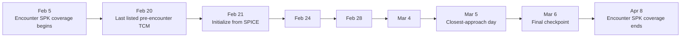
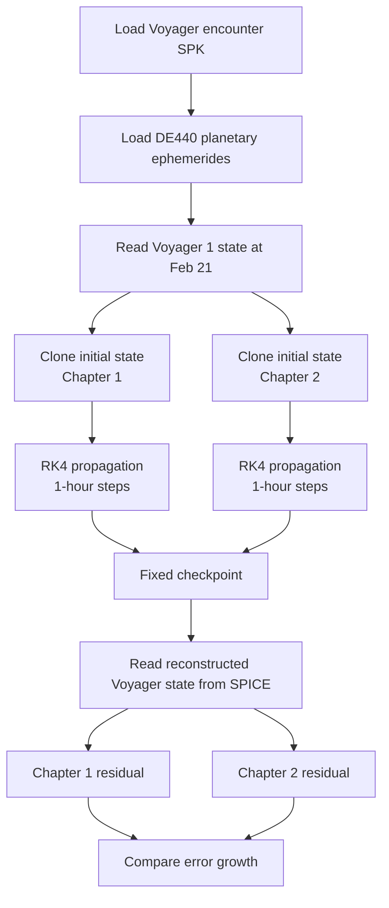

# Voyager 1 Jupiter Validation Report

## Purpose

This report documents the first reconstructed Voyager validation case from issue #794. The goal is intentionally narrow: initialize Voyager 1 from a reconstructed SPICE state, propagate two versions of the heliocentric gravity model through the same Jupiter-encounter window, and compare both against the same SPICE reference trajectory.

The case is useful for two reasons:

1. it gives us a reproducible way to measure whether a dynamics change actually improves agreement with a historical trajectory;
2. it isolates one concrete encounter so simulation/model errors are easier to diagnose than in a long campaign propagation.

This is **not** a claim that SPICE is wrong when Elodin diverges. The current propagation is still gravity-only, so residuals may include historical spacecraft thrust or other effects that are not yet modeled.

---

## 1. Validation case at a glance

| Item | Value |
| --- | --- |
| Spacecraft | Voyager 1 |
| Encounter | Jupiter, 1979 |
| Reconstructed spacecraft SPK | `vgr1_jup230.bsp` |
| Reference frame | `ECLIPJ2000` |
| Observer / origin | Sun |
| Initialization | 1979-02-21 00:00:00 UTC |
| Final checkpoint | 1979-03-06 00:00:00 UTC |
| Integrator | RK4 |
| Fixed step | 3,600 s |
| Compared models | Chapter 1 and Chapter 2 |
| Reference trajectory | Voyager 1 state from encounter SPK |
| Planet ephemerides | DE440 |

### Fixed checkpoints

| Checkpoint | UTC | Elapsed from initialization |
| --- | --- | ---: |
| Initialization | 1979-02-21 | 0 days |
| Check 1 | 1979-02-24 | 3 days |
| Check 2 | 1979-02-28 | 7 days |
| Check 3 | 1979-03-04 | 11 days |
| Closest-approach day | 1979-03-05 | 12 days |
| End | 1979-03-06 | 13 days |

---

## 2. Why this window was chosen

The first exploratory version used a shorter February 6-8 interval. After reviewing the historical maneuver discussion, the case was moved to a window where the published encounter timeline does not list a trajectory-correction maneuver inside the propagation interval.



This does not eliminate every possible non-gravitational effect. It does make the first comparison easier to interpret because a known trajectory-correction maneuver is not sitting in the middle of the selected window.

---

## 3. What Chapter 1 and Chapter 2 are testing

Both models include the Sun and the same planetary sources. The important difference is how planetary gravity is expressed in a **Sun-centered frame**.

Let:

- **r** be the spacecraft position relative to the Sun;
- **rᵢ** be planet *i* relative to the Sun;
- **μᵢ** be the planet's gravitational parameter.

### Chapter 1: direct planetary attraction

The direct acceleration from planet *i* is

\[
\mathbf{a}_{i,\mathrm{direct}} =
\mu_i \frac{\mathbf{r}_i-\mathbf{r}}{\lVert\mathbf{r}_i-\mathbf{r}\rVert^3}.
\]

That correctly describes the planet pulling on the spacecraft, but in heliocentric coordinates there is another piece: the same planet is also accelerating the Sun, which is the origin of the coordinate system.

### Chapter 2: heliocentric relative acceleration

Chapter 2 subtracts the acceleration of the Sun caused by that planet:

\[
\mathbf{a}_{i,\mathrm{relative}} =
\mu_i \frac{\mathbf{r}_i-\mathbf{r}}{\lVert\mathbf{r}_i-\mathbf{r}\rVert^3}
-
\mu_i \frac{\mathbf{r}_i}{\lVert\mathbf{r}_i\rVert^3}.
\]

The second term is sometimes called the **indirect** term. It is not an extra physical force on Voyager. It is the correction required because the Sun-centered origin is itself accelerating under planetary gravity.

| Model | Planet pulls spacecraft | Accounts for planet accelerating Sun | Expected heliocentric behavior |
| --- | :---: | :---: | --- |
| Chapter 1 | Yes | No | Can accumulate frame-related drift |
| Chapter 2 | Yes | Yes | Correct relative acceleration in the heliocentric frame |

---

## 4. Validation process

The two chapters are deliberately given the same starting state, timestep, ephemerides, masses, checkpoints, and reference. The force-model difference is therefore isolated as much as possible.



At each fixed checkpoint the runner calculates two norms:

\[
E_r = \lVert \mathbf{r}_{propagated} - \mathbf{r}_{SPICE} \rVert
\]

and

\[
E_v = \lVert \mathbf{v}_{propagated} - \mathbf{v}_{SPICE} \rVert.
\]

The implementation reports position error in kilometers and velocity error in meters per second.

---

## 5. What the comparison can tell us

A useful result is not simply "one number is smaller." We want to look at the **shape and growth of the residuals**.

| Observation | Likely interpretation |
| --- | --- |
| Chapter 2 stays below Chapter 1 across checkpoints | Evidence that the indirect heliocentric term fixes a real model deficiency |
| Both models jump at the same epoch | Possible unmodeled maneuver, ephemeris/reference transition, or shared integration/model issue |
| Error grows smoothly with time | Likely accumulated dynamics/integration mismatch |
| Error grows sharply near Jupiter | Jupiter encounter fidelity, body modeling, timestep, or missing perturbations become stronger candidates |
| Velocity residual changes before position residual grows | Useful early indicator of a force-model mismatch |

The first exploratory February 6-8 run showed Chapter 2 with roughly **78% lower position error** than Chapter 1 at the one- and two-day checkpoints. That result is encouraging, but it came from the earlier short window and should be treated as preliminary rather than the final result of this maneuver-screened case.

---

## 6. Current model limits

The current validation is intentionally incomplete in several ways.

### Gravity-only spacecraft dynamics

Historical Voyager navigation includes spacecraft maneuvers and small non-gravitational effects. Those are not currently reproduced by this runner. If the reconstructed SPICE trajectory reflects a real burn that the propagation does not model, the difference will appear as an Elodin residual even when the gravity equations are correct.

### Reconstructed SPICE is a reference, not a perfect physical oracle

The encounter SPK is the best common reference for this test because it represents the reconstructed mission trajectory. The correct workflow is to improve the simulation against known historical data first, then investigate any residual that remains unexplained.

### Focused case, not a campaign benchmark

This PR intentionally freezes one encounter, one start time, one kernel, and a small number of checkpoints. That makes failures debuggable and gives later Voyager cases a pattern to follow without turning the first test into a large validation campaign.

---

## 7. Reproducibility contract

The validation case freezes details that could otherwise quietly change the result.

| Contract item | Why it is fixed |
| --- | --- |
| Encounter kernel filename | Ensures everyone uses the same reconstructed arc |
| Kernel SHA-256 | Detects a changed/replaced kernel |
| Initialization UTC | Gives Chapter 1 and 2 an identical starting point |
| Checkpoint UTCs | Makes comparisons stable across runs |
| Frame and observer | Prevents coordinate-system drift in the test definition |
| 1-hour timestep | Keeps numerical integration settings comparable |
| Shared Chapter 2 helper contract test | Prevents the validation script from silently testing a different equation than the main dynamics code |

The focused tests also verify that the selected checkpoints remain inside the encounter SPK's published coverage and that the validation implementation of the Chapter 2 term agrees with the shared dynamics helper.

---

## 8. How to run it

From `examples/voyager`:

```bash
./download_spice_data.sh
python validate_jupiter.py
pytest test_validation_case.py
```

`validate_jupiter.py` prints structured JSON rather than checking generated result files into the repository. That keeps the validation case reproducible while avoiding committed campaign artifacts.

For each checkpoint, the useful review table is:

| UTC | Ch. 1 position error (km) | Ch. 2 position error (km) | Ch. 2 reduction | Ch. 1 velocity error (m/s) | Ch. 2 velocity error (m/s) |
| --- | ---: | ---: | ---: | ---: | ---: |
| Feb 21 | 0 | 0 | — | 0 | 0 |
| Feb 24 | generated by runner | generated by runner | compare | generated by runner | generated by runner |
| Feb 28 | generated by runner | generated by runner | compare | generated by runner | generated by runner |
| Mar 4 | generated by runner | generated by runner | compare | generated by runner | generated by runner |
| Mar 5 | generated by runner | generated by runner | compare | generated by runner | generated by runner |
| Mar 6 | generated by runner | generated by runner | compare | generated by runner | generated by runner |

---

## 9. Next validation steps

1. Run the maneuver-screened Feb 21-Mar 6 case from a clean kernel download and capture the checkpoint residuals.
2. Plot Chapter 1 and Chapter 2 position/velocity residual versus elapsed time to expose when the models begin to separate.
3. Build a sourced Voyager 1/2 maneuver timeline and explicitly mark which validation intervals are maneuver-free.
4. Add historical thrust events to the model where a useful validation interval cannot avoid them.
5. Only after the V1 Jupiter case is understood, reuse the same contract for later encounters or Voyager 2.

---

## Sources

- NASA/JPL Voyager encounter documentation: https://ntrs.nasa.gov/api/citations/19790009614/downloads/19790009614.pdf
- PDS Voyager 1 Jupiter SPICE data set: https://pds.nasa.gov/ds-view/pds/viewProfile.jsp?dsid=VG1-J-SPICE-6-SPK-V2.0
- Elodin issue #794: https://github.com/elodin-sys/elodin/issues/794
