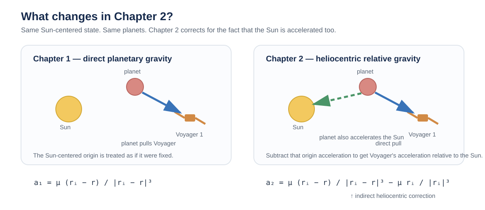

# Voyager 1 Jupiter validation

quick writeup for #801. I wanted to check whether Chapter 2 actually improves agreement with the reconstructed V1 Jupiter SPICE arc while keeping everything else the same.

## idea

Chapter 1 uses the direct planet-on-Voyager pull. Since the state is Sun-relative, the planet is also accelerating the Sun. Chapter 2 subtracts that part out.



```text
mu_i * ((r_i - r) / |r_i - r|^3 - r_i / |r_i|^3)
```

basically: **planet-on-Voyager gravity - planet-on-Sun gravity**.

## setup

- Voyager 1 Jupiter kernel: `vgr1_jup230.bsp`
- start: Feb 6, 1979
- checkpoints: 0, 1, and 2 days
- `ECLIPJ2000`, Sun-relative
- RK4, 1 hour step
- DE440 for planet states

Both chapters start from the same SPICE state and use the same masses, ephemerides, timestep, integrator, and reference trajectory.

I kept Feb 6-8 because that's the window used in #801. The Feb 5 / Feb 9 maneuver labels come from the PR context, so I'm not treating those dates as independently verified maneuver history here.

## results

fresh rerun:

| checkpoint | ch1 position error | ch2 position error | reduction |
| --- | ---: | ---: | ---: |
| day 1 | 0.766 km | 0.166 km | **78.29%** |
| day 2 | 3.060 km | 0.668 km | **78.16%** |

velocity error moved the same way:

- day 1: `0.0177 -> 0.0039 m/s`
- day 2: `0.0354 -> 0.0078 m/s`

so in this case Chapter 2 is about **78% lower** at both checkpoints.

## limits

this doesn't mean the whole Voyager trajectory is solved. the model is still gravity-only, so historical thrust and other missing effects can still show up in the residual.

what I like about this case is that it's small and repeatable: change one piece of the dynamics, keep the rest fixed, and see if the reconstructed-reference error actually gets better.

## sources

- PR #801
- issue #794
- NAIF `vgr1_jup230.bsp`
- NASA/JPL Voyager encounter material linked from #794
