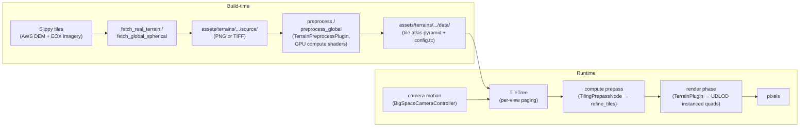

# Architecture

This document walks through how World Mesh renders large-scale terrain —
from raw slippy-map tiles on the internet to lit pixels on screen. It
covers the data pipeline, the core rendering algorithms, the shader
structure, and the `big_space` integration that makes Earth-radius
coordinates work.

## High-level data flow



The pipeline has four stages:

1. **Fetch** — download real elevation + imagery tiles from the internet
   (or generate synthetic ones offline).
2. **Preprocess** — build a GPU-friendly tile atlas pyramid from the
   source images using a compute-shader pipeline (split, stitch,
   downsample).
3. **Page** — at runtime, the `TileTree` decides which atlas tiles to
   keep resident based on the camera's position and the LOD distances.
4. **Render** — a compute prepass refines the tile tree into a flat draw
   list of geometry tiles; the vertex shader displaces those tiles with
   heights sampled from the atlas, producing the final terrain mesh each
   frame.

---

## Core algorithms

### UDLOD (Uniform Distance-Dependent Level of Detail)

The terrain geometry is *not* a fixed mesh. Each frame the renderer
emits a set of instanced quad-strips ("geometry tiles") whose screen-space
triangle size is approximately constant — triangles near the camera are
small in world units, triangles far away are large, but all cover roughly
the same pixel area. This is the UDLOD property.

The key idea: the terrain is divided into a hierarchy of tiles (a
quadtree per cube face for spherical, a single-face quadtree for planar).
A compute prepass walks the tree from root to leaves, subdividing any tile
whose projected screen-space size exceeds the configured threshold.
Subdivision continues until either (a) the screen-space budget is met or
(b) the deepest LOD is reached. The surviving tiles are emitted as
indirect-draw commands that the vertex shader picks up.

The vertex shader
([`src/terrain/shaders/render/vertex.wgsl`](src/terrain/shaders/render/vertex.wgsl))
takes a `vertex_index`, derives the tile + UV from it, samples the
height atlas, and displaces the vertex along the surface normal.

### Chunked Clipmap / Tile Atlas

The tile atlas is a 2D texture array. Each layer stores one fixed-size
tile (e.g. 512x512 px with a 2 px border for filtering). The total
number of layers (`atlas_size`, up to 2048 on Metal) determines how many
tiles can be resident simultaneously.

At runtime the `TileTree`
([`src/terrain/terrain_data/tile_tree.rs`](src/terrain/terrain_data/tile_tree.rs))
maintains a wrapping quadtree of tile requests: it marks tiles near the
camera as "requested" and tiles that have scrolled out of range as
"released". The `TileAtlas`
([`src/terrain/terrain_data/tile_atlas.rs`](src/terrain/terrain_data/tile_atlas.rs))
services those requests asynchronously, loading tile data from disk into
free atlas slots.

The result is a view-dependent clipmap: the camera always sees the
highest-detail tiles the atlas budget can afford nearby, with
progressively coarser tiles filling the horizon. Tile transitions are
smoothed by the vertex shader's `compute_morph` (geometry morphing) and
the fragment shader's `compute_blend` (texture blending across LOD
boundaries).

---

## Terrain shapes

The renderer supports three terrain models, defined in
[`src/terrain/math/terrain_model.rs`](src/terrain/math/terrain_model.rs):

| Variant        | Use case                        | Coordinate mapping            |
| -------------- | ------------------------------- | ----------------------------- |
| `Planar`       | km-scale regional patches       | flat XZ plane, Y = up        |
| `Spherical`    | abstract spheres                | unit-sphere direction         |
| `Ellipsoidal`  | real Earth (WGS84)              | ellipsoid with major/minor axes |

The choice propagates into the shaders via the `SPHERICAL` shader_def.
When set, `compute_local_position` in
[`src/terrain/shaders/functions.wgsl`](src/terrain/shaders/functions.wgsl)
(lines 76-95) maps the tile UV to a unit-sphere direction using the
project's cube-sphere warp (a `C_SQR = 0.87² ≈ 0.7569` correction that
evens out triangle density at face edges) — the same warp the data
fetchers use to sample `face{0..5}` source TIFFs. When unset, it maps
to a flat `(x, 0, z)` position.

`normal_local_to_world` similarly returns the sphere normal (= the
position itself, normalised) in spherical mode, or a constant `(0,1,0)`
in planar mode.

---

## Data pipeline

### Real-world planar regions

**Entry point**: [`src/bin/fetch_real_terrain.rs`](src/bin/fetch_real_terrain.rs)

The binary takes a `--region` name (defined in
[`src/regions.rs`](src/regions.rs)), computes a lat/lon bounding box, and
fetches two sets of slippy-map tiles:

- **Elevation**: AWS Terrain Tiles (terrarium-encoded PNG, public S3).
  URL pattern: `https://s3.amazonaws.com/elevation-tiles-prod/terrarium/{z}/{x}/{y}.png`.
  Decoded via `R * 256 + G + B/256 - 32768` → metres above sea level.
- **Imagery**: EOX Sentinel-2 Cloudless (annual composite, 10 m native,
  public WMTS). URL pattern:
  `https://tiles.maps.eox.at/wmts/1.0.0/.../g/{z}/{y}/{x}.jpg`.

Both are fetched through `TileFetcher`
([`src/tile_source.rs`](src/tile_source.rs)), which caches every HTTP
response on disk at `target/tile_cache/<host>/<z>/<x>/<y>.<ext>`. Re-runs
hit the cache and skip the network entirely.

The fetcher stitches the tiles into two full-resolution images
(`assets/terrains/planar/source/height.png` and `albedo.png`) plus a
`region.toml` manifest that records centre coordinates, elevation range,
and normalised camera framing. The app plugin reads the manifest at
startup to set terrain scale and camera position.

### Real-world spherical Earth

**Entry point**: [`src/bin/fetch_global_spherical.rs`](src/bin/fetch_global_spherical.rs)

Instead of bbox-stitching, this binary fills six cube-face images (one per
face of the `bevy_terrain` cube-sphere projection). For each output pixel
it:

1. Projects the pixel `(u, v)` to a unit-sphere direction via
   `cube_face_to_dir`, using the same cube-sphere warp (`C_SQR = 0.87²`)
   as the runtime shader's `compute_local_position`.
2. Converts the direction to `(lon, lat)` via `dir_to_lonlat`.
3. Bilinearly samples the terrarium DEM and EOX imagery at that
   geographic coordinate using `TileFetcher::sample_terrain_at_lonlat` /
   `sample_imagery_at_lonlat`.

This produces `face{0..5}.tif` (16-bit R16 height) and `face{0..5}.png`
(8-bit RGB albedo) under `assets/terrains/spherical/source/`, plus a
`globe.toml` manifest.

### Tile cache

Both fetchers share the same `TileFetcher` and the same on-disk cache
directory. Tiles downloaded for the planar scene are reusable by the
globe fetcher (and vice versa) because they key on the same
`<host>/<z>/<x>/<y>` path.

---

## Atlas preprocessing

**Entry points**: [`src/bin/preprocess.rs`](src/bin/preprocess.rs) (planar),
[`src/bin/preprocess_global.rs`](src/bin/preprocess_global.rs) (spherical)

These binaries launch a headless Bevy app that runs the GPU preprocessor
defined in
[`src/terrain/preprocess/`](src/terrain/preprocess/).
The preprocessor:

1. **Splits** the source image into individual tiles at the deepest LOD.
2. **Stitches** border pixels between adjacent tiles so bilinear sampling
   at tile edges is seamless.
3. **Downsamples** each LOD level from the one below via a 2x2 box
   filter.

All three steps run as compute shaders (WGSL sources under
[`src/terrain/shaders/preprocess/`](src/terrain/shaders/preprocess/):
`split.wgsl`, `stitch.wgsl`, `downsample.wgsl`). The output is a tree of
tile files on disk under `assets/terrains/.../data/` plus a `config.tc`
manifest that records which tiles exist.

Each attachment (height, albedo) is preprocessed independently. For the
planar path this produces ~512 MB of atlas tiles per region; for the
globe path at `LOD_COUNT=5` / `atlas_size=2048` it produces ~3 GB.

---

## Render pipeline

### Compute prepass

Before rasterization, a render-graph node (`TilingPrepassNode`) runs two
compute shaders per (terrain, view) pair:

1. **prepare_indirect** — seeds the root tiles and prepares the indirect
   dispatch buffer.
2. **refine_tiles** — iteratively subdivides tiles that exceed the
   screen-space size budget, outputting a flat list of "geometry tiles"
   (tile coordinate + LOD) into a storage buffer. This is the UDLOD
   selection step.

These pipelines are specialised per-frame by `TilingPrepassPipelineKey`
(spherical flag, debug flags) via Bevy's `SpecializedComputePipelines`
cache.

Implementation:
[`src/terrain/render/tiling_prepass.rs`](src/terrain/render/tiling_prepass.rs)

### Terrain render pipeline

The terrain participates in Bevy's `Opaque3d` render phase but does *not*
go through the standard `Mesh3d` → `MeshPipeline` path (terrain has no
`Mesh3d` component). Instead:

- `TerrainRenderPipeline<M>` wraps a `Variants<RenderPipeline,
  TerrainSpecializer<M>>` (Bevy 0.17's Composable Specialization API).
- `TerrainSpecializer<M>` mutates a base `RenderPipelineDescriptor`
  per-key (shader_defs for wireframe, spherical, morph, blend, debug
  overlays, lighting, sample-grad, high-precision; MSAA-dependent view
  layout selection).
- `queue_terrain` bins terrain entities into `Opaque3d` with a custom
  `Opaque3dBinKey` that routes to our draw function rather than
  bevy_pbr's mesh draw.

The draw function chains four render commands:

1. `SetItemPipeline` — bind the specialised pipeline.
2. `SetMeshViewBindGroup<0>` — Bevy's view uniforms at `@group(0)`.
3. `SetTerrainBindGroup<1>` — terrain config + atlas textures at
   `@group(1)`.
4. `SetTerrainViewBindGroup<2>` — per-view tile tree + culling + geometry
   tile buffer at `@group(2)`.
5. `SetTerrainMaterialBindGroup<M, 3>` — the user material's bind group
   at `@group(3)`.

`SetTerrainMaterialBindGroup<M, 3>` is the key divergence from upstream
Bevy: it reads from `ErasedRenderAssets<PreparedMaterial>` and
`MaterialBindGroupAllocators` by `TypeId::of::<M>()`, then calls
`DrawTerrainCommand` which issues the actual instanced draw.

Implementation:
[`src/terrain/render/terrain_material.rs`](src/terrain/render/terrain_material.rs)

### Shader defs flipped by the specializer

`TerrainSpecializer<M>::specialize` mutates `shader_defs` per pipeline key.
The full set in use today:

| shader_def            | Source                                    | Effect                                                                 |
| --------------------- | ----------------------------------------- | ---------------------------------------------------------------------- |
| `SPHERICAL`           | `TerrainPipelineFlags::SPHERICAL`         | switches `compute_local_position` to the cube-sphere warp              |
| `HIGH_PRECISION`      | `TerrainPipelineFlags::HIGH_PRECISION`    | enables the relative-position path for sub-metre precision near camera |
| `WIREFRAME`           | `TerrainPipelineFlags::WIREFRAME`         | turns polygon fill mode to line                                        |
| `MORPH`               | `TerrainPipelineFlags::MORPH`             | enables geometry morphing at LOD boundaries (vertex shader)            |
| `BLEND`               | `TerrainPipelineFlags::BLEND`             | enables texture blending at LOD boundaries (fragment shader)           |
| `LIGHTING`            | `TerrainPipelineFlags::LIGHTING`          | enables the Lambertian lighting path in `fragment.wgsl`                |
| `SAMPLE_GRAD`         | `TerrainPipelineFlags::SAMPLE_GRAD`       | uses `textureSampleGrad` (explicit derivatives) instead of `textureSample` |
| `SHOW_DATA_LOD`       | `TerrainPipelineFlags::SHOW_DATA_LOD`     | debug overlay: colour by tile LOD                                      |
| `SHOW_GEOMETRY_LOD`   | `TerrainPipelineFlags::SHOW_GEOMETRY_LOD` | debug overlay: colour by geometry subdivision                          |
| `SHOW_TILE_TREE`      | `TerrainPipelineFlags::SHOW_TILE_TREE`    | debug overlay: colour by TileTree entry                                |
| `SHOW_PIXELS`         | `TerrainPipelineFlags::SHOW_PIXELS`       | debug overlay: texel grid                                              |
| `SHOW_UV`             | `TerrainPipelineFlags::SHOW_UV`           | debug overlay: tile UV                                                 |
| `SHOW_NORMALS`        | `TerrainPipelineFlags::SHOW_NORMALS`      | debug overlay: world normal                                            |
| `MULTISAMPLED`        | `MSAA > 1`                                | selects the multisampled view bind group                               |
| `TEST1` / `TEST2` / `TEST3` | debug flags 1/2/3                  | scratch toggles for local experiments                                  |

The runtime debug hotkeys (`R` wireframe, `T` lighting, `V` tile-tree,
etc.) are wired up in [`TerrainDebugPlugin`](src/terrain/debug/mod.rs)
which mutates `DebugTerrain` resource fields; those fields get read at
pipeline-queueing time and mapped into the flags above. The full hotkey
table lives in the [README interactive-controls section](README.md#fly-camera-big_space-defaults).

### Bind group layout (Bevy 0.18)

Bevy 0.18 changed `RenderPipelineDescriptor::layout` from
`Vec<BindGroupLayout>` to `Vec<BindGroupLayoutDescriptor>`. Our pipeline
stores descriptors and `PipelineCache` materialises concrete
`BindGroupLayout` objects lazily. The nine `create_*_layout()` helpers
across `render/` and `preprocess/` all return `BindGroupLayoutDescriptor`
now; call sites that need a concrete layout for `create_bind_group` use
the helper `instantiate_layout(device, &desc)` in
[`src/terrain/render/mod.rs`](src/terrain/render/mod.rs).

---

## Materials and shaders

### WorldMeshMaterial

Defined in [`src/scenes/planar.rs`](src/scenes/planar.rs).
An `AsBindGroup` + `Material` with zero bindings of its own — it simply
declares a custom fragment shader:

[`assets/shaders/world_mesh.wgsl`](assets/shaders/world_mesh.wgsl)

That shader imports `bevy_terrain::attachments::sample_attachment1` (the
albedo atlas layer) and routes the sampled colour through
`bevy_terrain::fragment::fragment_output` for lighting and
`fragment_debug` for debug overlays. The same shader handles both planar
and spherical terrain because `bevy_terrain` injects the `SPHERICAL`
shader_def automatically when the tile atlas was built from an ellipsoidal
model.

### DebugTerrainMaterial

The default material shipped with `bevy_terrain`. Has no custom bindings
and renders a flat gray height visualisation. Used by the `minimal`
example.

### Lambertian lighting

The fragment shader in
[`src/terrain/shaders/render/fragment.wgsl`](src/terrain/shaders/render/fragment.wgsl)
implements a custom `terrain_lighting` function (diffuse Lambertian +
ambient floor) instead of calling Bevy's `apply_pbr_lighting`. This is
intentional: Bevy's PBR path imports `bevy_pbr::pbr_bindings` which
declares `@group(2)` bindings that collide with our terrain view bind
group at the same slot. The custom lighting avoids the collision entirely
while being visually sufficient for matte terrain surfaces.

---

## `big_space` for planetary precision

32-bit floats lose sub-metre precision beyond ~16 km from the origin. For
an Earth-radius scene that's unacceptable. The
[`big_space`](https://crates.io/crates/big_space) crate solves this by
decomposing position into:

- A **`CellCoord`** (integer cell index in a grid — i64 per axis).
- A **`Transform`** (f32 offset *within* the cell, always small).
- A **`FloatingOrigin`** marker on the camera entity, which tells
  `big_space` to recentre the rendering origin on that entity each frame.

The grid's `cell_edge_length` (default 2000 m) determines when an entity
is "recentred" into a neighbouring cell.

### Camera controller

`BigSpaceCameraController` (from `big_space::camera`) is attached to the
camera entity. It provides:

- Smoothed fly-cam physics (translation + rotation lerp).
- `slow_near_objects`: queries entities with `Aabb` and scales effective
  speed by distance to the nearest one — smooth orbit-to-surface zoom.
- Default WASD/Space/Ctrl/QE/mouse/Shift input via the auto-registered
  `default_camera_inputs` system.

The globe binary uses `slow_near_objects = true` (the sun-sphere
placeholder carries an `Aabb`); the planar binary uses a fixed `speed = 30`
with `slow_near_objects = false` because `TerrainBundle` has no `Aabb`
component (its geometry is procedural, not mesh-based).

**Footgun**: `BigSpaceCameraController::speed` is a *multiplier on
distance* when `slow_near_objects = true`, not a velocity in m/s. The
effective speed at a given moment is `controller.speed * distance_to_nearest_aabb`.
Seeding `with_speed(RADIUS)` on the globe looks reasonable but produces
camera motion at ~10⁷ m/s once the controller finds the sun AABB, which
reads as "the camera teleports off screen". Prefer a unit-ish scalar
(e.g. `0.1`) for `slow_near_objects = true` paths, and a real velocity
(e.g. `30`) for the fixed-speed paths where `slow_near_objects = false`.

Configuration lives in:
- [`src/scenes/planar.rs`](src/scenes/planar.rs) (planar)
- [`src/scenes/globe.rs`](src/scenes/globe.rs) (globe)

---

## Testing and screenshots

`EnvScreenshotPlugin`
([`src/terrain/debug/screenshot.rs`](src/terrain/debug/screenshot.rs))
gives every binary a headless screenshot path controlled by environment
variables:

| Variable                      | Effect                                    |
| ----------------------------- | ----------------------------------------- |
| `WORLD_MESH_SCREENSHOT`       | output PNG path (enables the harness)     |
| `WORLD_MESH_SCREENSHOT_DELAY` | seconds to wait before capture (default 8)|
| `WORLD_MESH_SCREENSHOT_EXIT`  | if `1`, exit after writing the PNG         |

The shell scripts under `scripts/` (`render_region.sh`, `render_globe.sh`,
`run_examples.sh`, `phase_screenshot.sh`) all drive this harness to
produce verification artifacts without needing macOS Screen Recording
permissions or an interactive window.

---

## Optional offline path (synthetic data)

If you have no network or want a deterministic baseline:

```bash
cargo run --release --bin synthesize_height          # planar FBM heightmap + biome albedo
cargo run --release --bin synthesize_spherical_faces # six cube-face TIFFs (height-only)
```

Then run the upstream `bevy_terrain` examples via:

```bash
./scripts/run_examples.sh
```

This exercises the full preprocess → render pipeline on synthetic noise
and screenshots each example. The five upstream examples are:

| Example                | What it demonstrates                         |
| ---------------------- | -------------------------------------------- |
| `preprocess_planar`    | builds the planar atlas from source images   |
| `minimal`             | UDLOD + DebugTerrainMaterial (gray height)   |
| `planar`              | UDLOD + custom gradient-LUT material         |
| `preprocess_spherical` | builds the spherical atlas from cube TIFFs   |
| `spherical`           | UDLOD on an ellipsoid + gradient material    |

These are defined in
[`examples/`](examples/).

---

## Repository layout

```
.
├── README.md                  quickstart guide
├── ARCHITECTURE.md            this file
├── CHANGELOG.md               keep-a-changelog history
├── Cargo.toml                 single-crate manifest (Bevy 0.18)
├── flake.nix                  Nix devShell (nixpkgs 25.11, Rust 1.91)
├── .envrc                     direnv hook (`use flake`)
├── LICENSE                    Apache-2.0
├── NOTICE                     third-party attribution (incl. upstream bevy_terrain MIT)
├── src/
│   ├── lib.rs                 feature-gated crate root + prelude
│   ├── main.rs                App::new().add_plugins(PlanarScenePlugin).run()
│   ├── terrain/               renderer internals (TileAtlas, TileTree, pipelines, shaders, …)
│   ├── scenes/                PlanarScenePlugin + GlobeScenePlugin (feature `scenes`)
│   ├── fetch.rs               slippy-tile HTTP fetcher + decoders (feature `fetch`)
│   ├── regions.rs             region presets + RegionManifest (feature `regions`)
│   └── bin/                   seven helper binaries (fetch, preprocess, synth, globe);
│                              `world_mesh` itself lives in src/main.rs (eight total)
├── examples/                  upstream-style demos: minimal, planar, spherical,
│                              preprocess_planar, preprocess_spherical
├── assets/
│   ├── shaders/               world_mesh.wgsl + example shaders (planar, spherical)
│   ├── textures/              gradient LUTs for the example materials
│   └── terrains/              tile atlases (gitignored, built by preprocess)
├── scripts/                   render_region.sh, render_globe.sh, run_examples.sh, …
├── screenshots/               hero shots (tracked in git)
└── .github/workflows/         CI: feature-matrix clippy + cargo doc + cargo test
```

---

## External references

- [Bevy Engine](https://bevy.org) — the ECS game engine this builds on.
- [`kurtkuehnert/bevy_terrain`](https://github.com/kurtkuehnert/bevy_terrain) — upstream terrain plugin (modernised + integrated into `src/terrain/`; see `NOTICE` for attribution).
- [Kurt Kühnert's thesis](https://github.com/kurtkuehnert/terrain_renderer) — the bachelor thesis describing UDLOD + Chunked Clipmap in detail.
- [`big_space`](https://crates.io/crates/big_space) — double-precision floating-origin plugin for Bevy.
- [AWS Terrain Tiles](https://registry.opendata.aws/terrain-tiles/) — public bare-earth DEM (terrarium encoding).
- [EOX Sentinel-2 Cloudless](https://s2maps.eu/) — annual cloud-free 10 m global mosaic (WMTS).

---

## Opportunities for improvement or enhancement

This is the project's working backlog: ideas that are interesting,
non-blocking, and could become the next plan's scope. It is **not** a
commitment or roadmap — each bullet is a speculation. When one of these
matures into something actionable, it becomes its own plan and moves out
of this section.

### Multi-scale scene presets

- **Multi-region planar refactor**. Move `assets/terrains/planar/` from
  a flat layout (one region slot, overwritten per fetch) to
  `assets/terrains/planar/<region_name>/` so `death_valley/`,
  `mojave_desert/`, etc. coexist. The active region is selected via a
  `WORLD_MESH_REGION` env var (default `death_valley`); the fetch,
  preprocess, and render binaries all thread the region name through
  their paths. Was attempted in an earlier session and reverted; redoing
  it on the single-crate layout is simpler because the path-resolution
  function can live next to `regions.rs`.
- **Horizon-scale preset (Mojave Desert, 500 km)**. A deliberately huge
  planar patch centred on the Mojave basin-and-range province,
  targeted at aircraft-altitude (~3 km) cruising. Exercises the UDLOD
  pipeline at the far end of the scale spectrum: 500 km box at
  `OUTPUT_SIZE=4096` means ~61 m/px display at the deepest LOD — fine
  from altitude but useless for ground detail. The cold fetch pulls
  ~12 000 HTTP requests per tile provider (z=14 over 500 km) and takes
  ~30-60 min; a good overnight-run case. Camera speed needs to be
  ~300 m/unit (vs the 30 m/unit that suits Death Valley).
- **Sub-metre-LOD preset (racing-drone, opposite extreme)**. A tiny
  (~500 m side) region at the highest available source resolution
  (z=15 or z=16 where EOX publishes it), targeted at a camera 1-10 m
  above the ground flying at 20-40 m/s. Exercises the deepest LOD
  (~6 cm/px display at z=16 over 500 m) where the atlas's deepest mip
  is actually visible on screen. Would validate: (a) the
  `precision_threshold_distance` / `HIGH_PRECISION` shader path that
  kicks in at close range, (b) `slow_near_objects` behaviour on a
  planar scene that *does* carry an `Aabb`, and (c) whether the
  morph/blend-distance defaults still look right at this scale.
  Candidate locations: Reno Air Races course, Black Rock playa, or a
  motocross course where the terrain is both open and textured. Stretch
  extension: pair with an actual drone physics controller.

### Renderer simplifications surfaced during refactor

- Give `TerrainBundle` an `Aabb` derived from `TerrainModel::kind` so
  `slow_near_objects` unifies the planar and spherical camera configs.
  This would replace the scene-specific footgun documented in
  `scenes/planar.rs` (`with_slowing(false)` because the bundle has no
  Aabb) with a single code path.
- Evaluate whether the `HIGH_PRECISION` shader path is still needed now
  that `big_space` 0.12's `CellTransform` handles close-to-camera
  precision correctly. If not, deleting the relative-position fallback
  would trim ~50 lines from `vertex.wgsl` and `functions.wgsl`.
- Merge `SetTerrainBindGroup<1>` + `SetTerrainViewBindGroup<2>` into a
  single `SetTerrainBindGroups<1, 2>` render command to reduce
  boilerplate. Worth it only if we plan to add more bind groups.
- Reconsider Bevy's PBR lighting. The `@group(2)` collision that
  originally forced the custom Lambertian path is well-understood now;
  we could opt back into `apply_pbr_lighting` under a feature flag and
  get shadows + normal maps for free. Downside: pulls in a lot of
  bevy_pbr surface area for a matte terrain.

### Data-pipeline enhancements

- **Incremental preprocess**. Today any change triggers a full
  atlas-pyramid rebuild. If `source/height.png` hasn't changed and only
  `source/albedo.png` has, only the albedo attachment needs to be
  rebuilt.
- **JIT streaming mode**. Instead of building the full atlas on disk up
  front, fetch + preprocess tiles as the camera moves. Dramatically
  cheaper cold-start at the cost of occasional visible pop-in.
- **Alternative tile sources**. IGN Géoportail (France), swisstopo
  (Switzerland), JAXA ALOS World 3D (global 30 m DEM), Mapbox
  Satellite (worldwide imagery). All have public free tiers. Would
  live behind `fetch::sources::*` modules.
- **Seasonal / false-colour imagery**. EOX publishes a single annual
  composite; supporting a winter composite or a false-colour NIR band
  would be useful for simulation-of-record scenarios.

### Engineering polish

- [`cargo semver-checks`](https://github.com/obi1kenobi/cargo-semver-checks)
  in CI once 0.1.0 is published, so accidental breaking changes land a
  PR-blocker instead of a crates.io yank.
- [`bevy-inspector-egui`](https://crates.io/crates/bevy-inspector-egui)
  integration behind an `inspector` feature, for runtime tweaking of
  `DebugTerrain` flags and `TileTree` parameters.
- Property tests for `lonlat_to_tile` + `cube_face_to_dir` via
  `proptest`.
- WASM build: the non-fetch path (renderer + preprocessed atlas served
  over HTTP) should compile for `wasm32-unknown-unknown`. Worth a smoke
  test per Bevy release.

### Explicitly out of scope (so they don't accidentally enter a plan)

- Bevy 0.19 upgrade. Wait for Bevy to branch.
- Globe atmosphere + sun. Cosmetic; could be a separate companion crate.
- Physics simulation for aircraft / drone presets. Separate concern;
  lives outside this crate.
- Multi-view / split-screen rendering. Bevy supports it but the current
  `TerrainDebugPlugin` and `EnvScreenshotPlugin` assume a single
  primary window.
