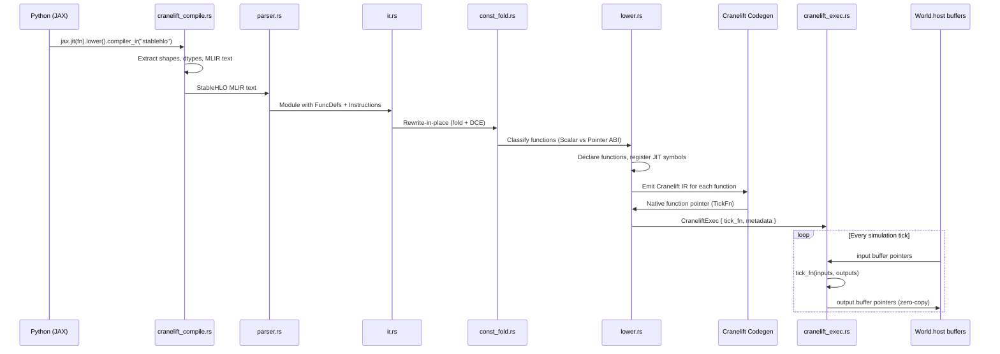
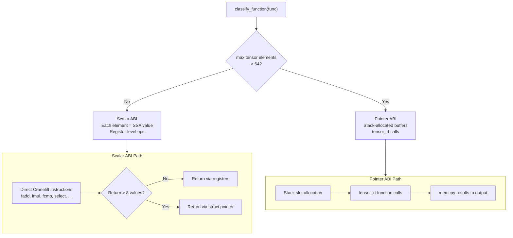
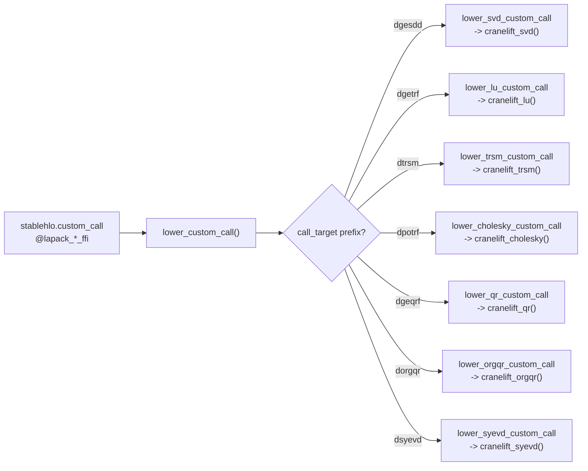
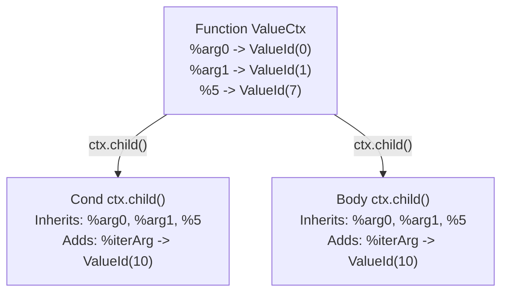

# cranelift-mlir Architecture

A Rust-native JIT compiler that transforms StableHLO MLIR into native machine code via
Cranelift, replacing IREE as the CPU execution backend for Elodin simulations.

## Table of Contents

1. [Motivation](#motivation)
2. [End-to-End Compilation Pipeline](#end-to-end-compilation-pipeline)
3. [Dual ABI Architecture](#dual-abi-architecture)
4. [SIMD: Packed-f64 Lane Representation](#simd-packed-f64-lane-representation)
5. [JIT Memory Layout](#jit-memory-layout)
6. [Tensor Runtime](#tensor-runtime)
7. [LAPACK via faer](#lapack-via-faer)
8. [Gather: The Hardest Op](#gather-the-hardest-op)
9. [While Loop Scoping](#while-loop-scoping)
10. [Checkpoint Diagnostic Tool](#checkpoint-diagnostic-tool)
11. [Testing Strategy](#testing-strategy)
12. [Supported Operations](#supported-operations)
13. [Known Limitations](#known-limitations)
14. [Opportunities](#opportunities)

---

## Motivation

Elodin simulations are **single-threaded, CPU-bound physics ticks** operating on small,
dense f64 tensors (typically 3-vectors, 4x4 matrices, 6x6 covariance matrices). Each
simulation tick applies a JAX-compiled function to the world state and writes the results
back.

The previous backend, IREE, is designed for large-scale ML inference across heterogeneous
hardware. For Elodin's workloads, IREE's runtime overhead dominates execution time:

- **~30 FFI boundary crossings** per tick (Python -> Rust -> IREE VM -> HAL -> kernel -> back)
- **VM dispatch**: IREE's bytecode interpreter dispatches each operation individually
- **HAL buffer management**: allocation, staging buffers, host-to-device/device-to-host copies
- **Buffer view wrapping**: every tensor access creates typed wrapper objects

The Cranelift path eliminates all of this. A single native function pointer is called
directly on the simulation's host memory buffers, with zero copies and zero dispatch overhead.

### Performance Results

All six regression examples pass with bit-for-bit or tolerance-matched correctness:

| Example | IREE RTF | Cranelift RTF | Speedup | Tensors |
|------------|----------|---------------|---------|---------|
| ball | 79x | ~10,000x | **~130x** | 3-vectors |
| three-body | 29x | ~4,700x | **~160x** | 3-vectors |
| drone | 2.9x | ~300x | **~100x** | 4-vectors, 3x3 |
| rocket | 2.3x | ~33x | **~14x** | 3-vectors, trig |
| linalg | 0.1x | ~800x | **~8,000x** | 6x6, SVD, LU, QR |
| cube-sat | 0.56x | ~3.6x | **~6.4x** | 65x65 (EGM08) |

RTF = Real-Time Factor (higher is better). Measured on Apple Silicon.

The speedup ranges from 6x (cube-sat, dominated by 65x65 matrix operations) to 8,000x
(linalg, where IREE's dispatch overhead per LAPACK call was extreme). The typical
small-simulation speedup is **100-160x**.

---

## End-to-End Compilation Pipeline



### Stage 1: Python to StableHLO

The Python SDK (`nox-py`) traces JAX functions and lowers them to StableHLO MLIR text.
This happens in `libs/nox-py/src/cranelift_compile.rs`:

1. The user's simulation systems are traced by JAX into HLO computation graphs
2. `jax.jit(fn, keep_unused=True).lower(*zero_inputs)` produces a lowered JAX computation
3. `.compiler_ir(dialect="stablehlo")` extracts the StableHLO MLIR as a text string
4. Input/output shapes and dtypes are extracted from the lowered computation metadata

The `keep_unused=True` flag is critical: it preserves all input/output slots even if JAX
determines some are unused, maintaining stable positional mapping between the simulation's
world columns and the function's arguments.

### Stage 2: Parsing (`parser.rs`, ~2,280 lines)

A Winnow-based parser converts StableHLO MLIR text into the internal IR. Key design
decisions:

- **Streaming parser**: processes one instruction at a time, no AST allocation for the
  full module
- **`ValueCtx` scoping**: each parsing context maps SSA names (`%0`, `%arg0`) to internal
  `ValueId`s. While-loop and case blocks use `ctx.child()` to create child contexts that
  inherit the parent's mappings (see [While Loop Scoping](#while-loop-scoping))
- **`backend_config` extraction**: LAPACK custom calls carry parameters like
  `{uplo = 76 : ui8, diag = 85 : ui8}` which are parsed into a `HashMap<String, i64>`

### Stage 3: Internal IR (`ir.rs`, ~439 lines)

A lightweight representation with these key types:

- **`Module`**: collection of `FuncDef`s
- **`FuncDef`**: name, parameters (with types), result types, body (list of `InstrResult`)
- **`Instruction`**: 35+ variants covering arithmetic, comparison, shape manipulation,
  control flow, indexing, LAPACK custom calls, and type conversion
- **`TensorType`**: shape (Vec of i64) + element type (F64, F32, I64, I32, UI32, I1, etc.)
- **`GatherDims`**: offset_dims, collapsed_slice_dims, start_index_map, index_vector_dim
- **`DotDims`**: contracting and batching dimension lists for `dot_general`
- **`ReduceOp`**: Add, Minimum, Maximum, And, Or

### Stage 3.5: Constant folding (`const_fold.rs`)

An IR-to-IR rewrite that runs between parsing and lowering. Three rule
families cooperate under a bounded cascade loop per function:

1. **Shape and layout folds.** `BroadcastInDim` / `Reshape` / `Convert` /
   `Iota` over constants collapse into a single `Constant` — typically the
   compact `DenseSplat(scalar, shape)` form that the lowering pipeline
   already handles efficiently.
2. **Scalar arithmetic, bitwise, compare, select.** Unary and binary ops on
   `DenseScalar` or matching-shape `DenseSplat` operands evaluate at
   compile time. Float ops only fold when both inputs and the result are
   finite; integer `divide` / `remainder` refuse to fold with a zero divisor
   so the runtime handles those edge cases.
3. **Array folds and algebraic identities.** `Transpose` / `Reverse` /
   `Slice` / `Pad` / `Concatenate` / `DynamicSlice` on `DenseArray` /
   `DenseSplat` constants — each gated by a 1 KB byte-size cap so folding
   cannot explode compile-time memory. Identities (`x*1`, `x+0`, `x-0`,
   `x/1`, constant-cond `Select`, no-op `Convert` / `Reshape` /
   `BroadcastInDim`) rewrite downstream operand references through a
   `ValueId` alias table; the now-unused instruction is removed by DCE.

A conservative DCE pass runs after each fold iteration, removing pure
instructions whose result `ValueId`s are no longer referenced anywhere in
the function (including nested `While` / `Case` / `Map` / `ReduceWindow` /
`SelectAndScatter` / `Sort` bodies). The fold+DCE loop iterates until it
reaches a fixed point or a hard cap of 8 passes.

Every invocation of `fold_module` emits a one-line summary
(`[elodin-cranelift] fold: N -> M instr (-K, -P.P%)`); enabling debug
mode additionally prints a per-rule histogram and the scalar-vs-pointer
ABI classification, for sizing the impact of future work.

### Stage 4: Lowering (`lower.rs`, ~5,917 lines)

The largest and most complex file. Transforms the internal IR into Cranelift IR and
produces a native function pointer. The process:

1. **Function classification**: `classify_all_functions` determines Scalar vs Pointer ABI
   for each function (see [Dual ABI Architecture](#dual-abi-architecture))
2. **JIT symbol registration**: all runtime functions (`tensor_rt`, LAPACK host functions,
   libm math) are registered as symbols the JIT can call
3. **Function declaration**: Cranelift function signatures are created for each IR function
4. **Function definition**: each function body is lowered to Cranelift IR instructions
5. **Finalization**: `module.finalize_definitions()` triggers Cranelift's register
   allocation and machine code emission
6. **Pointer extraction**: `get_main_fn()` returns the native function pointer

The compiled function has the `TickFn` signature:

```rust
type TickFn = unsafe extern "C" fn(*const *const u8, *mut *mut u8);
```

Where `inputs[i]` points to the i-th input tensor's raw bytes and `outputs[i]` points
to the i-th output tensor's pre-allocated buffer.

### Stage 5: Execution (`cranelift_exec.rs`)

`CraneliftExec::invoke_batch` is called every simulation tick:

1. Collects pointers to the world's host buffers (zero-copy)
2. Calls `tick_fn(input_ptrs, output_ptrs)` -- a single native function call
3. No copies, no staging, no VM dispatch

This is the source of the massive speedup: the entire simulation tick is a single
function call into optimized native code operating directly on the simulation's memory.

---

## Dual ABI Architecture

The central architectural decision in cranelift-mlir is the **per-function ABI selection**
that allows small tensors to use fast scalar registers while large tensors use
memory-backed operations.



### Why Dual ABI?

Three alternatives were evaluated:

1. **All-Scalar**: Every tensor element is a separate Cranelift SSA value. This delivers
   ~150x speedup for small simulations but **hangs** on large tensors. A 65x65 matrix
   produces 4,225 SSA values per tensor, leading to ~25,000+ SSA values in a single
   function. Cranelift's register allocator has roughly O(N log N) complexity in SSA
   count, causing compilation times of minutes or outright hangs.

2. **All-Pointer**: Every tensor is a stack-allocated buffer, even 3-element vectors.
   This works for all sizes but sacrifices the register-level performance that produces
   the 100-160x speedup on small simulations. Benchmarks showed ~10x slower than
   scalar for small tensors.

3. **Per-Function Dual ABI** (chosen): Each function is classified independently based
   on the maximum tensor size across its parameters, return types, and body. Functions
   with all tensors <= 64 elements use scalar ABI; any tensor > 64 triggers pointer ABI
   for the entire function. Cross-ABI calls are marshaled at call boundaries.

The threshold of **64 elements** was chosen empirically: it covers all common aerospace
tensors (up to 8x8 matrices) while keeping 65x65 and larger in the pointer path.

### Cross-ABI Marshaling

When a scalar-ABI function calls a pointer-ABI callee:

1. **Pack**: scalar SSA values are stored into a stack-allocated buffer
2. **Call**: the pointer-ABI function is called with buffer pointers
3. **Unpack**: results are loaded back from the output buffer into scalar SSA values

When a pointer-ABI function calls a scalar-ABI callee, the reverse happens.

The `main` function always uses pointer ABI (it receives raw byte pointers from the
simulation runtime), so calls from `main` to scalar callees always marshal.

---

## SIMD: Packed-f64 Lane Representation

Small-tensor scalar-ABI functions opt into `F64X2` SIMD codegen via a second
lane representation in the value map. Enabling debug mode (see
[`PERFORMANCE.md`](PERFORMANCE.md)) surfaces per-function scalar vs vector
IR instruction counts as a proxy for how much of the function vectorized.

### Representation

```rust
// libs/cranelift-mlir/src/lower.rs
enum LaneRepr {
    Scalar(Vec<Value>),                          // one SSA Value per element
    PackedF64 {                                  // scalar-ABI F64X2 path
        chunks: Vec<Value>,                      // each is F64X2
        tail: Option<Value>,                     // scalar f64 for odd counts
        n: usize,
    },
    PtrChunksF64 {                               // ptr-ABI result-write elision
        chunks: Vec<Value>,                      // each is F64X2, held in SSA
        tail: Option<Value>,                     // scalar f64 for odd n
        n: usize,
        chain_depth: u32,                        // consecutive elisions; capped at 6
    },
}
```

The value map stores `HashMap<ValueId, LaneRepr>`. Producers opt into
`PackedF64` for scalar-ABI F64 tensors with 2+ lanes; ptr-ABI F64 producers
emit `PtrChunksF64` when the single-use + elision-friendly-consumer gate
fires (see [`src/useinfo.rs`](src/useinfo.rs) and the
`ELISION_FRIENDLY_SET` in `lower.rs`) so back-to-back elementwise ops
chain through SSA registers instead of round-tripping through stack slots.
The rest stay `Scalar`. `get_vals(builder, value_map, vid)` auto-unpacks
`PackedF64` on demand via `extractlane`; a defensive pre-spill in
`lower_instruction_mem` handles `PtrChunksF64` that leak into non-
elision-aware consumers. Ops that haven't been vectorized continue to
receive scalar slices with no code changes.

### Vectorized operations

All on `ElementType::F64` with `num_elements >= 2`:

| Family | Cranelift lowering |
|---|---|
| `add` / `subtract` / `multiply` / `divide` | `fadd` / `fsub` / `fmul` / `fdiv` on F64X2 per chunk |
| `maximum` / `minimum` | `fcmp` (I64X2 mask) → `bitcast` to F64X2 → `bitselect`, NaN-propagation matches scalar path |
| `constant` (DenseScalar / DenseSplat) / `broadcast_in_dim` (1→N) | `splat.F64X2` |
| `negate` / `sqrt` / `abs` / `floor` / `ceil` / `nearest` / `rsqrt` | polymorphic Cranelift IR instruction per chunk |
| Rank-1·rank-1 dot / matvec / standard matmul with k ≥ 4 | `fmul.F64X2` + F64X2 accumulator + horizontal reduce |
| `sin` / `cos` / `tan` / `sinh` / `cosh` / `tanh` / `asin` / `acos` / `atan` / `atan2` / `exp` / `expm1` / `log` / `log1p` / `powf` / `cbrt` | stack-buffer marshal → call `tensor_rt` SIMD helper (uses the [`wide`](https://docs.rs/wide) crate's `f64x2`) |

Ops that are not in the table unpack their operands back to `Scalar` on
access and run the existing scalar path. The `Scalar` variant stays
permanently for non-f64 types, function entry / return boundaries, and any
future op that hasn't been converted.

### Packing caching

`pack_in_place` converts a `LaneRepr::Scalar` to `LaneRepr::PackedF64` in
the value_map the first time a packed view is requested. Subsequent uses of
the same operand get the cached packed form, so chains like `(a*b)+c` only
pay the pack cost for `a`, `b`, `c` once.

### Transcendental marshaling

Transcendentals (sin, cos, exp, log, ...) cannot be inlined as
Cranelift IR; they call into Rust SIMD helpers in
[`tensor_rt.rs`](src/tensor_rt.rs) that process `wide::f64x2` chunks. The
scalar-ABI path marshals input scalars into a stack buffer, calls the
batch helper, and loads output scalars back. For n ≥ 2 this is faster than
the per-element libm loop; for scalars (n == 1) the per-element libm
fallback is retained.

---

## JIT Memory Layout

Two non-obvious placement decisions are load-bearing for large MLIRs and worth
understanding before modifying the lowering pipeline.

### Arena-backed code and data

Cranelift emits position-independent machine code that uses **32-bit
PC-relative relocations** to reach its own data section, runtime symbols, and
peer functions. If the JIT's code and data land >2 GB apart in the process
address space — which the system allocator will happily do once the code
section grows past a few hundred megabytes — those relocations silently break
at link time.

To keep everything in range, we back the JIT with a single pre-reserved
contiguous arena (`ArenaMemoryProvider` in [`src/lower.rs`](src/lower.rs), 2 GB
by default). Every function and every data blob the JIT emits comes out of this
arena, so relocations always fit.

### Large constants live in the data section

Small `stablehlo.constant` values are memcpy'd into a fresh stack slot at
function entry — convenient, but quadratic in memory if a constant is large.
A single 8D aerospace lookup table can easily reach hundreds of
megabytes; allocating that as a stack slot overflows the thread
stack on function entry regardless of how the stack is sized.

The lowering therefore special-cases `stablehlo.constant` with payload above a
size threshold (~1 MB): instead of emitting a stack buffer + memcpy, we declare
the bytes as anonymous JIT data and hand downstream ops an SSA pointer to them
via `declare_data_in_func`. Reads become zero-copy, and the tensor runtime
treats the data-section pointer identically to a stack-slot pointer.

---

## Tensor Runtime

The tensor runtime (`tensor_rt.rs`, ~1,130 lines) provides `extern "C"` functions for
N-dimensional tensor operations. These are called by pointer-ABI code when operations
can't be expressed as simple Cranelift instructions on individual SSA values.

All functions operate on raw `*mut u8` / `*const u8` pointers with explicit element
counts and shapes passed as parameters. They are registered as JIT symbols during
compilation:

```rust
jit_builder.symbol("tensor_add_f64", tensor_add_f64 as *const u8);
jit_builder.symbol("tensor_broadcast_nd_f64", tensor_broadcast_nd_f64 as *const u8);
// ... ~40 registered symbols
```

### Categories

| Category | Functions | Notes |
|----------|-----------|-------|
| Elementwise | add, sub, mul, div, negate, sqrt, abs, ... | f64, i64, i32 variants |
| Broadcast | broadcast_f64, broadcast_nd_f64, broadcast_i32 | N-D shape-aware |
| Shape | transpose_f64, transpose_nd_f64, concat_nd_f64 | Element-size-aware concat |
| Reduce | reduce_sum_f64, reduce_max_f64, reduce_min_f64 | Outer x inner dimensions |
| Indexing | gather_f64, gather_nd_f64, scatter_f64 | N-D with element-size param |
| Dynamic | dynamic_slice_f64, dynamic_update_slice_f64 | Runtime index values |
| Utility | memcpy, select_f64, iota_nd_f64 | |

### Element-Size Awareness

A critical correctness detail: several runtime functions accept an `elem_sz` parameter
to handle mixed-type tensors. For example, `tensor_concat_nd_f64` operates on raw bytes
with an explicit element size. This was added after discovering that concatenating
`tensor<65x1xi32>` data (4 bytes per element) as if it were f64 (8 bytes) corrupted
index tensors used by the EGM08 gravity model's N-D gather.

---

## LAPACK via faer

JAX lowers `jnp.linalg.*` operations to LAPACK calls encoded as StableHLO custom calls:

```
%0:5 = stablehlo.custom_call @lapack_dgesdd_ffi(%arg0) {
    mhlo.backend_config = {mode = 83 : ui8},
    ...
}
```

The cranelift-mlir crate dispatches these to host functions implemented using
[faer](https://github.com/sarah-ek/faer-rs), a pure-Rust linear algebra library.

### Dispatch Architecture



### Implementation Pattern

Each LAPACK handler follows the same pattern:

1. **Read** input tensor SSA values from the value map
2. **Allocate** a Cranelift stack slot for inputs + outputs
3. **Store** input values into the stack slot
4. **Emit** a call to the registered host function symbol
5. **Load** output values from the stack slot back into SSA values

The host functions (`extern "C"`) handle:
- Row-major (IR convention) to column-major (faer convention) conversion
- Calling the appropriate faer API
- Converting results back to row-major

### Seven LAPACK Targets

| Target | Operation | faer API | Notes |
|--------|-----------|----------|-------|
| `dgesdd` | SVD | `mat.thin_svd()` | Result order: (A_overwritten, sigma, U, VT, info) |
| `dgetrf` | LU factorization | Manual implementation | 1-indexed sequential swap pivots |
| `dtrsm` | Triangular solve | `solve_*_triangular_in_place` | Uses backend_config for uplo/diag |
| `dpotrf` | Cholesky (LLT) | `cholesky_in_place` | Zeros strict upper triangle |
| `dgeqrf` | QR factorization | `qr_in_place` | Extracts tau from block Householder |
| `dorgqr` | Q from packed QR | `apply_block_householder_*` | Reconstructs Q via Householder |
| `dsyevd` | Symmetric eigendecomp | `SelfAdjointEigendecomposition` | Eigenvalues in ascending order |

### Key Design Decisions

**Manual LU instead of faer**: LAPACK's `dgetrf` returns **1-indexed sequential swap
pivots** (`ipiv[k]` = row swapped with row k at step k). faer's `lu_in_place` returns a
**final permutation vector**, which cannot be trivially converted back to the sequential
swap format. Since the StableHLO code immediately processes the pivot array expecting
LAPACK semantics (subtract 1, iterate swaps via a while loop), a manual partial-pivot LU
was implemented to produce compatible pivots.

**SVD result ordering**: XLA's `dgesdd_ffi` returns results in the order
`(A_overwritten, sigma, U, VT, info)`. With JOBZ='S', the overwritten A buffer contains
U. The SVD wrapper function in the MLIR accesses `%0#2` for U and `%0#3` for VT, so
position [2] must contain U and position [3] must contain VT. An early bug returned
`(U, sigma, VT, zeros, info)` which put VT where U was expected, causing `pinv()` to
return all zeros and completely disabling every Kalman filter measurement update.

---

## Gather: The Hardest Op

`stablehlo.gather` is parameterized by five attributes that together describe an
arbitrarily complex indexing operation:

- **`offset_dims`**: which output dimensions correspond to slices from the source
- **`collapsed_slice_dims`**: which source dimensions are sliced to size 1 and removed
- **`start_index_map`**: which source dimensions the index values address
- **`index_vector_dim`**: which dimension of the indices tensor holds the index vectors
- **`slice_sizes`**: the size of each slice taken from the source

### Patterns Encountered

Four distinct gather patterns appear across the simulation examples:

**1. Row-select** (ball, drone, rocket):
```
gather(tensor<6x3xf64>, tensor<6x1xi32>) -> tensor<6x3xf64>
  offset_dims=[1], collapsed=[0], start_index_map=[0], index_vector_dim=1
  slice_sizes=[1, 3]
```
Each index selects a complete row from a 2D tensor.

**2. N-D multi-index** (cube-sat EGM08):
```
gather(tensor<65x65xf64>, tensor<65x2xi32>) -> tensor<65xf64>
  offset_dims=[], collapsed=[0,1], start_index_map=[0,1], index_vector_dim=1
  slice_sizes=[1, 1]
```
Each index row is a (row, col) coordinate pair. Used for gathering elements from a
large coefficient matrix.

**3. 3D pivot permutation** (linalg LU solve):
```
gather(tensor<2x3x1xf64>, tensor<3x1xi32>) -> tensor<2x3x1xf64>
  offset_dims=[0,2], collapsed=[1], start_index_map=[1], index_vector_dim=1
  slice_sizes=[2, 1, 1]
```
Permutes along the middle dimension of a 3D tensor based on pivot indices. The key
detail is `start_index_map=[1]` -- the indices address dimension 1 (not 0).

**4. Diagonal extraction** (linalg determinant):
```
gather(tensor<3x3xf64>, tensor<3x2xi32>) -> tensor<3xf64>
  offset_dims=[], collapsed=[0,1], start_index_map=[0,1], index_vector_dim=1
  slice_sizes=[1, 1]
```
Each index row is a (row, col) pair for diagonal elements: (0,0), (1,1), (2,2).

### Implementation

The **scalar-path** gather uses a general N-D algorithm: for each output element, it
decomposes the output index into batch and offset parts, looks up start indices from the
index tensor, applies `start_index_map` to compute source coordinates, and emits a
dynamic load. All shape math is computed at compile time; only the index values are
runtime SSA values.

The **pointer-ABI path** delegates to `tensor_gather_nd_f64`, a runtime function that
performs the same algorithm at execution time with explicit shape/stride arrays.

---

## While Loop Scoping

StableHLO while loops have condition and body blocks that can reference values defined
outside the loop (function parameters, constants). The parser must correctly resolve
these references.



### The Bug That Wasn't Obvious

An early implementation used `ValueCtx::new()` (blank contexts) for while-loop condition
and body blocks. This worked for simple loops where the body only referenced iteration
arguments. But when a while-loop body referenced an outer-scope variable (like a function
parameter or a constant defined before the loop), `get_or_create` assigned a **fresh
ValueId** that collided with the iteration argument slots.

This caused data corruption: the while-loop body would read from the wrong memory
location, producing garbage values. In the cube-sat example, this manifested as a
37,000x error in the gravity force magnitude, because the Legendre polynomial computation
inside a while loop was reading corrupted coefficients.

The fix: `parse_while_op` now uses `ctx.child()` for both `cond_ctx` and `body_ctx`,
which clones the parent's `name_to_id` mappings. The `iter_arg_ids` assigned by the
parser are stored in the `Instruction::While` variant and used by both the scalar and
pointer-ABI lowering handlers.

---

## Checkpoint Diagnostic Tool

A reusable workflow for diagnosing any compilation correctness bug by comparing
Cranelift JIT output against XLA reference values.

### Generating a Checkpoint

```bash
ELODIN_BACKEND=cranelift \
ELODIN_CRANELIFT_DEBUG_DIR=/tmp/ckpt \
  bash scripts/ci/regress.sh <example> examples/<example>/main.py
```

This captures on the first tick (flat under `$ELODIN_CRANELIFT_DEBUG_DIR`):
- `input_N.bin`: raw input buffer bytes
- `cranelift_output_N.bin`: Cranelift JIT output bytes
- `xla_output_N.bin`: XLA reference output bytes (computed by running the original JAX function)
- `stablehlo.mlir`: the MLIR text
- `checkpoint.json`: metadata (shapes, dtypes, slot counts)
- `compile_context.json`: input shape/dtype summary
- `profile.json`: structured runtime profile

### Verifying with the Rust Test

```bash
ELODIN_CRANELIFT_DEBUG_DIR=/tmp/ckpt \
  cargo test -p cranelift-mlir --test checkpoint_test --release -- --ignored --nocapture
```

The verifier compiles the MLIR with Cranelift, feeds the checkpoint inputs, and compares
each output element against the XLA reference. It reports the first mismatching element
with its index, expected value, and actual value.

### MLIR Bisection

When a complex function (hundreds of operations) produces wrong output, the checkpoint
tool enables systematic bisection:

1. Modify the checkpoint's `stablehlo.mlir` to expose intermediate values as additional
   return values from the function
2. Regenerate the XLA reference (re-run with checkpoint enabled)
3. Run the verifier to identify which intermediate diverges
4. Repeat with finer granularity until the root cause operation is isolated

This technique was used to identify the `tensor_concat_nd_f64` element-size bug in the
cube-sat EGM08 gravity model, narrowing down from 669 operations to the single concat
that was corrupting i32 index data.

### Environment variables

Two variables, total:

| Variable | Purpose |
|----------|---------|
| `ELODIN_BACKEND=cranelift` | Select the cranelift backend (default). |
| `ELODIN_CRANELIFT_DEBUG_DIR=<path>` | Enable the full debug suite — profile probes, op-category sampling, tick waveform, IR instruction reports, const-fold histogram, inliner and slot-pool traces, StableHLO MLIR dump, first-tick XLA-reference checkpoint. Every file artifact lands flat under `<path>`. Zero overhead when unset. See [`PERFORMANCE.md`](PERFORMANCE.md) for the full list of outputs and workflows. |

The ignored integration tests (`checkpoint_test`, `external_mlir`) read
from `ELODIN_CRANELIFT_DEBUG_DIR` as well, so a single run generates a
checkpoint that a subsequent `cargo test --ignored` can verify against
XLA without any other configuration.

---

## Testing Strategy

### Test organization

| Test binary | Purpose |
|-------------|---------|
| `ops.rs` | Per-op golden-value tests across scalar + pointer ABI paths for every supported op |
| `e2e.rs`, `three_body_e2e.rs`, `cube_sat_e2e.rs` | Parse + compile + execute full example MLIRs |
| `checkpoint_test.rs` | Checkpoint verifier: compile arbitrary MLIR, feed saved inputs, compare every output against XLA reference. Ignored; needs `ELODIN_CRANELIFT_DEBUG_DIR` pointing at a previously-generated checkpoint |
| `external_mlir.rs` | Parse + compile customer-provided MLIR. Ignored; reads `$ELODIN_CRANELIFT_DEBUG_DIR/stablehlo.mlir` |
| `test_threefry*`, `test_sret_large`, `test_closed_call`, `test_uniform_pipeline`, `test_dynamic_ops_3body`, `test_gather_3body`, `test_while_dyn_slice` | Targeted coverage of specific lowering patterns |

Shared helpers live in `tests/common/mod.rs` (`run_mlir`, `run_mlir_mem`, buffer
and assertion helpers) so new test files plug in without duplication.

### Testing philosophy

- **Every supported op** has golden-value tests comparing JIT output against
  hand-computed expected values.
- **Both ABI paths** are exercised: functions ending in `_mem` route through the
  pointer-ABI path.
- **E2E tests** parse, compile, and execute each example's full MLIR so parser
  and lowering regressions surface before they reach customer sims.
- **Regression suite** (`scripts/ci/regress.sh --all`) runs every example
  end-to-end and diffs CSV telemetry against committed baselines with per-file
  tolerances.
- **Checkpoint verifier** is the authoritative correctness gate for customer
  MLIRs: it compares every Cranelift output element against the XLA reference
  bit-for-bit (or within a tight tolerance). Always run it on new customer
  MLIR before deployment.

### External MLIR validation

For customer MLIR that cannot be checked into the repo, point the
debug dir at a directory containing `stablehlo.mlir`:

```bash
ELODIN_CRANELIFT_DEBUG_DIR=/path/to/dir \
  cargo test -p cranelift-mlir --test external_mlir --release -- --ignored --nocapture
```

Parses and compiles without executing. Inventory op coverage first with
`libs/cranelift-mlir/scripts/catalog_ops.py`.

### Quick commands

```bash
cargo test -p cranelift-mlir                      # all tests
cargo test -p cranelift-mlir --test ops           # per-op golden tests
cargo test -p cranelift-mlir --release            # required for customer-scale JIT code
ELODIN_BACKEND=cranelift bash scripts/ci/regress.sh --all   # full regression suite
```

---

## Supported Operations

### Arithmetic
| Op | Tested | Scalar ABI | Pointer ABI | Notes |
|----|--------|-----------|-------------|-------|
| stablehlo.add | yes | yes | yes (f64/i64/i32) | |
| stablehlo.subtract | yes | yes | yes (f64/i64/i32) | |
| stablehlo.multiply | yes | yes | yes (f64/i64/i32) | |
| stablehlo.divide | yes | yes | yes (f64/i64/i32/ui32) | zero-protection on integer paths |
| stablehlo.negate | yes | yes | yes (f64/i64/i32) | |
| stablehlo.sqrt | yes | yes | yes | inline Cranelift instruction |
| stablehlo.rsqrt | yes | yes | yes | 1/sqrt(x) |
| stablehlo.power | yes | yes | yes | via libm pow |
| stablehlo.maximum | yes | yes | yes (f64/i64/i32) | |
| stablehlo.minimum | yes | yes | yes (f64/i64/i32) | |
| stablehlo.abs | yes | yes | yes (f64/i64/i32) | |
| stablehlo.floor | yes | yes | yes | |
| stablehlo.ceil | yes | yes | yes | |
| stablehlo.sign | yes | yes | yes | |
| stablehlo.remainder | yes | yes | yes (f64) | |
| stablehlo.clamp | yes | yes | yes | ternary: min/operand/max |
| stablehlo.round_nearest_even | yes | yes | yes | banker's rounding |
| stablehlo.sine | yes | yes | yes | via libm |
| stablehlo.cosine | yes | yes | yes | via libm |
| stablehlo.tanh | yes | yes | yes | via libm |
| stablehlo.exponential | yes | yes | yes | via libm |
| stablehlo.log | yes | yes | yes | via libm |
| stablehlo.log_plus_one | yes | yes | yes | log1p, via libm |
| stablehlo.atan2 | yes | yes | yes | via libm/tensor_rt |
| chlo.tan | yes | yes | yes | via libm |
| chlo.acos | yes | yes | yes | via libm/tensor_rt |
| chlo.asin | yes | yes | yes | via libm |
| chlo.atan | yes | yes | yes | via libm (unary, distinct from atan2) |
| chlo.sinh | yes | yes | yes | via libm |
| chlo.cosh | yes | yes | yes | via libm |
| chlo.erfc | yes | yes | yes | Cephes rational approximation |
| chlo.erf_inv | yes | yes | yes | Cephes ndtri-based, ~15 digits f64 |
| chlo.square | yes | yes | yes | lowered to Multiply{x, x} |
| stablehlo.expm1 | yes | yes | yes | exp(x)-1, via libm |
| stablehlo.cbrt | yes | yes | yes | cube root, via libm |
| stablehlo.is_finite | yes | yes | yes | returns i1 |

### Comparison and Selection
| Op | Tested | Scalar ABI | Pointer ABI | Notes |
|----|--------|-----------|-------------|-------|
| stablehlo.compare | yes | yes (all dirs x float/signed/unsigned) | yes (all 6 dirs x f64/i64/i32) | |
| stablehlo.select | yes | yes | yes (f64/i64/i32/i8) | scalar or tensor i1 mask; i8 variant for I1 value tensors |

### Constants
| Op | Tested | Notes |
|----|--------|-------|
| stablehlo.constant | yes | scalar, dense array, splat, hex blobs |

### Shape Manipulation
| Op | Tested | Scalar ABI | Pointer ABI | Notes |
|----|--------|-----------|-------------|-------|
| stablehlo.reshape | yes | yes | yes | arbitrary shape changes |
| stablehlo.broadcast_in_dim | yes | yes | yes (all types) | byte-generic for non-f64 |
| stablehlo.slice | yes | yes | yes (all types) | byte-generic for non-f64 |
| stablehlo.concatenate | yes | yes | yes (all types) | byte-aware via `elem_sz` |
| stablehlo.transpose | yes | yes | yes (all types) | byte-generic for non-f64 |
| stablehlo.pad | yes | yes | yes | |
| stablehlo.reverse | yes | yes | yes | |
| stablehlo.iota | yes | yes | yes | N-dimensional, f64 + i64 |

### Dynamic Indexing
| Op | Tested | Scalar ABI | Pointer ABI | Notes |
|----|--------|-----------|-------------|-------|
| stablehlo.dynamic_slice | yes | yes | yes (all types) | byte-generic for non-f64 |
| stablehlo.dynamic_update_slice | yes | yes | yes (all types) | byte-generic for non-f64 |

### Type Conversion
| Op | Tested | Notes |
|----|--------|-------|
| stablehlo.convert | yes | 22 type pairs including f64/f32/i64/i32/ui32/ui64/i1, both ABI paths. I1→UI64 and I1→UI32 supported. |
| stablehlo.bitcast_convert | yes | reinterpret bits |

### Integer Bitwise
| Op | Tested | Notes |
|----|--------|-------|
| stablehlo.xor | yes | |
| stablehlo.or | yes | i8 variant for I1 tensors in pointer-ABI |
| stablehlo.and | yes | i8 variant for I1 tensors in pointer-ABI |
| stablehlo.not | yes | bitwise NOT for i64/i32, boolean NOT for i1 |
| stablehlo.shift_left | yes | |
| stablehlo.shift_right_logical | yes | |
| stablehlo.shift_right_arithmetic | yes | signed right shift |

### Linear Algebra
| Op | Tested | Notes |
|----|--------|-------|
| stablehlo.dot_general | yes | scalar, 1D inner product, rank1-rank2, matvec, matmul, batched |
| stablehlo.reduce | yes | add/min/max (f64 + i64), and/or, all dimensions |
| stablehlo.reduce (multi-operand) | yes | argmin/argmax pattern: 2-operand reduce with value+index |

### Indexing
| Op | Tested | Notes |
|----|--------|-------|
| stablehlo.gather | yes | row-select + N-D, byte-generic for non-f64 data, i32/ui32 indices widened |
| stablehlo.scatter | yes | byte-generic for non-f64 data, i32/i64 indices |

### Control Flow
| Op | Tested | Notes |
|----|--------|-------|
| stablehlo.while | yes | outer-scope access, cross-ABI calls, nested |
| stablehlo.case | yes | multi-branch dispatch |
| stablehlo.sort | yes | single-operand and 2-operand (argsort), comparator region, ascending/descending |
| stablehlo.map | yes | arbitrary compiled region body, variadic operands |
| stablehlo.reduce_window | yes | compiled reducer, full window iteration with dilations/padding |
| stablehlo.select_and_scatter | yes | compiled select + scatter regions, window-based |
| stablehlo.convolution | yes | N-D, dimension_numbers, strides, padding, dilations, grouping |
| stablehlo.real_dynamic_slice | yes | runtime tensor bounds for start/limit/strides |
| stablehlo.batch_norm_inference | yes | feature-axis broadcast, epsilon/feature_index attrs |
| stablehlo.cholesky | yes | direct op, reuses faer-backed cranelift_cholesky |
| stablehlo.triangular_solve | yes | direct op, reuses faer-backed cranelift_trsm |
| stablehlo.fft | yes | FFT/IFFT/RFFT/IRFFT via naive DFT runtime |
| stablehlo.rng | yes | deterministic fill (uniform: linear, normal: quantile) |
| func.call | yes | scalar ABI, sret, pointer ABI, cross-ABI marshaling |

### LAPACK Custom Calls
| Op | Tested | Notes |
|----|--------|-------|
| lapack_dgesdd_ffi | yes | SVD via faer thin_svd |
| lapack_dgetrf_ffi | yes | LU via manual partial pivot |
| lapack_dtrsm_ffi | yes | triangular solve via faer |
| lapack_dpotrf_ffi | yes | Cholesky via faer |
| lapack_dgeqrf_ffi | yes | QR via faer |
| lapack_dorgqr_ffi | yes | Q extraction via Householder |
| lapack_dsyevd_ffi | yes | symmetric eigendecomp via faer |
| lapack_dgesv_ffi | yes | general linear solve via faer partial_piv_lu |
| lapack_dpotrs_ffi | yes | Cholesky-based solve via triangular substitution |
| lapack_dgelsd_ffi | yes | least-squares solve via SVD pseudoinverse |
| lapack_dgeev_ffi | yes | non-symmetric eigendecomp via faer |
| lapack_dgesvd_ffi | yes | full SVD via faer (m x m U, n x n V) |

---

## Known Limitations

Engineering caveats that are stable across all validated workloads. Forward-looking
improvement ideas live in [Opportunities](#opportunities).

- **Release builds required for customer-scale sims.** The tensor runtime calls
  `copy_nonoverlapping` heavily, and in debug builds Rust enforces the
  non-aliasing precondition with runtime checks. The common case of a
  self-memcpy — a while-loop carry variable whose value is unchanged via a
  `Reshape`/`Convert` identity forwarding — is guarded in
  [`tensor_memcpy`](src/tensor_rt.rs) by early-returning when `dst == src`, but
  large MLIRs still exercise aliasing patterns that can trip the assert. Build
  `--release` for the checkpoint verifier and any non-trivial example. Release
  output is bit-for-bit identical to debug semantics when both complete.

- **Thread stack sizing.** Pointer-ABI ticks accumulate a large number of
  `ExplicitSlot` stack buffers across nested function calls. Big customer MLIRs
  exceed the default 8 MB thread stack. This is an engineering constraint, not
  a runtime failure mode: the Python runtime in
  [`libs/nox-py/src/world_builder.rs`](../nox-py/src/world_builder.rs)
  unconditionally spawns a 256 MB-stack worker thread to run `tick_fn`, and
  [`tests/checkpoint_test.rs`](tests/checkpoint_test.rs)'s `verify_checkpoint`
  uses the same 256 MB for parity. Bisection helpers run on 64 MB, adequate for
  their scope.

- **CPU-only by design.** There is no GPU execution path. Elodin simulations are
  single-threaded, small-tensor physics ticks where kernel launch and
  host-device transfer overhead would dominate compute. GPU workloads should
  use the `jax-gpu` backend.

- **Manual LU instead of faer's.** `cranelift_lu` is a hand-rolled partial-pivot
  implementation because LAPACK's `dgetrf` returns 1-indexed sequential swap
  pivots (`ipiv[k]` = row swapped with row k at step k) while faer's
  `lu_in_place` returns a final permutation vector. Downstream StableHLO
  processes the pivot array assuming LAPACK semantics (subtract 1, iterate
  swaps via a while loop), so the manual implementation is required for
  correctness. It is not BLAS-optimized; a reliable permutation-to-swap
  conversion would let us swap in faer.

---

## Opportunities

Coverage of every StableHLO op JAX emits for single-device CPU execution
is complete and the backend is validated against both the internal
regression suite and production customer simulations. Nothing below is
blocking any known workload; this section is a forward-looking menu of
improvements with predicted benefit.

### Performance

The two concrete follow-ons below target the current memory bottleneck:
load + store still account for ~15% of raw wall / ~20% of corrected
wall, with a memory-to-arithmetic ratio of ~5×. Result-write elision
and slot pooling already removed the easy wins; what's left is
*non-trivially elidable* traffic, which these two items attack
directly.

- **Partial / extended result-write elision.** Today elision requires
  `use_counts == 1 && user_kind ∈ ELISION_FRIENDLY_SET && chain_depth < 6`.
  Any multi-use ptr-ABI F64 value, any consumer outside the friendly set,
  and any chain deeper than 6 back-to-back ops spills to a stack slot.
  Two extensions relax this:

  1. **Lazy spill for multi-use values**: keep the `PtrChunksF64` chunks in
     SSA until the *first* non-elision-aware consumer demands a pointer,
     then spill once and fan out from the slot. Current code spills eagerly
     on the producer side. For values with one elision-friendly use plus
     one distant non-elision-friendly use this halves the store traffic.
  2. **Expand `ELISION_FRIENDLY_SET`**: audit the non-friendly ops that
     currently force a spill. Candidates include element-wise integer ops
     (when the result type is still F64 post-convert), the `Convert` arm
     when src and dst types differ but both are scalar-per-element, and the
     scalar-tail path of ops that currently only elide on the even-n chunks.

  Expected gain: proportional to the fraction of load/store traffic today
  that falls through the "red" spill path inside the `*_elision_or_spill`
  helpers. A targeted op-timing recapture (with `INNER_OP_SAMPLE_RATE`
  tuned down for a clean signal) would quantify it before coding starts.

- **Mixed-ABI classification within a function.** The ABI classifier
  in [`src/lower.rs`](src/lower.rs) picks scalar or pointer for an
  entire function up front. Large ptr-ABI functions in practice are
  forced onto the pointer path because *some* tensors cross the size
  threshold, but most of their ops operate on small (≤ 3-lane) F64
  vectors that would fit comfortably in SSA. A per-value classifier
  that let a body mix representations — small tensors on the
  scalar-ABI fast path, large ones on the ptr-ABI — would eliminate
  marshaling between SSA and slot for the common case. Complements
  elision: elision keeps intermediates in SSA across a single chain;
  mixed-ABI keeps them in SSA for a value's full lifetime.

- **Adaptive SIMD lane width.** The packed-f64 lowering uses `F64X2`
  uniformly because it's the only native lane width on every deployment
  target's baseline ISA. A host-aware classifier could widen to `F64X4` or
  `F64X8` where the hardware supports it, without touching `LaneRepr`'s
  public shape:

  | Deployment target | Baseline ISA | Native f64 lanes | Potential codegen |
  |---|---|---|---|
  | Apple Silicon M-series | NEON (AArch64) | 2 | `F64X2` (current) |
  | NVIDIA Jetson Orin NX (Cortex-A78AE) | NEON (AArch64) | 2 | `F64X2` (current) |
  | Modern x86 Ubuntu (desktop / laptop) | AVX / AVX2 | 4 | `F64X4` |
  | x86 server (Sapphire Rapids, EPYC Genoa) | AVX-512 | 8 | `F64X8` |

  Implementation sketch: at `compile_module_with_config` entry, query
  `isa.triple()` + feature flags (`has_avx2`, `has_avx512f`) and pick a
  `PackedLaneWidth` constant that propagates through `pack_f64x2`,
  `align_packed_f64`, the binary/unary packed helpers, and the horizontal
  reduce in `packed_dot_f64`. The `PackedF64` and `PtrChunksF64` chunk
  types become width-parameterized (still a `Vec<Value>`; the stored type
  changes from `F64X2` to `F64X4` / `F64X8`). Scalar tail logic stays the
  same but handles 0–3 (or 0–7) leftover lanes. Cranelift's backend
  already lowers `fadd.F64X4` to `vaddpd ymm` on AVX2 hosts, so the
  codegen emission is a per-op width dispatch rather than new IR.

  Expected additional win on x86 hosts: 2× (AVX2) or 4× (AVX-512) over
  current `F64X2` on the elementwise and short-dot hot paths, roughly
  squaring the SIMD benefit on large-enough tensors.

- **Parallel function compilation.** After ABI classification each
  function is independent. Parallelizing Cranelift codegen across a
  thread pool would cut cold-start time on large MLIRs — startup is
  currently dominated by Cranelift codegen (tens of seconds on
  multi-hundred-function modules).

- **Loop-invariant code motion.** Hoist pure computations whose inputs are
  all loop-invariant out of `While` bodies. Complements the `const_fold`
  pass for simulations with heavy in-loop constant computation; runs as a
  separate IR pass between folding and lowering.

- **FFT runtime.** `tensor_rt`'s FFT/IFFT/RFFT/IRFFT are naive DFT (O(N²)).
  Swap to `rustfft` for O(N log N) with a one-file change. No current
  workload is FFT-bound, so this is deferred.

- **Compile-time evaluation of large-tensor pure ops.** `DotGeneral` and
  `Gather` with all-constant operands are rare (JAX usually folds them in
  its own optimizer), but when they do appear the `const_fold` pass leaves
  them alone. Extending the pass to evaluate them at compile time under a
  size cap would further trim per-tick work. Low ROI without a workload
  that surfaces this pattern.

- **Cephes-backed scalar folds for `ErfInv` / `Erfc`.** `const_fold`
  handles every other scalar libm op but skips these to avoid pulling a
  Cephes dependency into the compiler. Add if a future sim benefits from
  pre-evaluating inverse-erf at compile time.

- **Persistent fold cache.** Hash the input MLIR + compiler version stamp
  and cache the folded IR to disk. Skips parse + fold on unchanged MLIR
  between runs. Only worth building once fold times become a visible
  fraction of startup (not the case today).

### Coverage

All items below are implementable on demand when a customer sim surfaces them.
Inventory new MLIR with `scripts/catalog_ops.py` before deployment.

**CHLO ops.** Nine are implemented (see [Supported Operations](#supported-operations)).
JAX usually decomposes CHLO into StableHLO, but a few survive depending on JAX
version and flags:

| Op | Notes |
|----|-------|
| `chlo.lgamma`, `chlo.digamma` | Special functions; need polynomial approximation |
| `chlo.bessel_i0e`, `chlo.bessel_i1e` | Scaled Bessel functions |
| `chlo.next_after` | Next representable float; easy bit manipulation |
| `chlo.top_k` | Top-K partial sort |
| `chlo.conj` | Complex conjugate; would require broader complex-type support |

**LAPACK.** `lapack_dsytrd_ffi` (tridiagonal reduction) is the only
unimplemented target. It's internal to eigensolvers and all tested customer
simulations use `dsyevd` directly; implementable via faer if ever surfaced.

**Type permutations.** A small number of pointer-ABI paths remain f64-only
because no simulation has exercised them. All low-risk to add:

| Op path | Missing types |
|---------|---------------|
| `power` pointer-ABI | integer |
| `pad` pointer-ABI | integer |
| `matmul` pointer-ABI | integer |
| `convert` F32↔I64/UI64 | missing pairs |

### Structural

- **Sort comparator region.** `stablehlo.sort` currently classifies a
  comparator as ascending or descending by structural inspection. The general
  path — compile the comparator via `compile_region_as_function` (the
  mechanism already used by `map`, `reduce_window`, and `select_and_scatter`) —
  has not been needed because the heuristic has not misclassified any known
  JAX output. Upgrade is straightforward when a non-trivial comparator first
  appears.

- **LAPACK `custom_call` from pointer-ABI functions.** LAPACK lowering is
  wired on the scalar path only. In practice LAPACK buffers are always small
  (6x6, 8x8) and stay below the pointer-ABI threshold, so this has never
  triggered. If a future sim crosses the 64-element threshold with a LAPACK
  call, follow the dual-path pattern already used by `dot_general` and
  `gather`.

- **Convolution at scale.** `stablehlo.convolution` is implemented with full
  N-D dimension numbers, strides, padding, dilations, and feature/batch
  grouping, but has not been validated against a large real-world JAX-exported
  conv. Recommend targeted testing before relying on it for a convolution-heavy
  customer workload.
