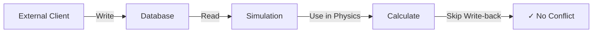

# External Control Components Guide

## Overview

External control components allow external clients (like ground stations, operator interfaces, or test harnesses) to control specific values in a running simulation while maintaining clean separation of authority and preventing timestamp conflicts.

## How It Works

### 1. Declaration (Python Simulation)

Mark any component as external control by adding metadata:

```python
import elodin as el
import jax.numpy as jnp
import typing as ty
from dataclasses import field

# Declare an external control component
FinControlTrim = ty.Annotated[
    jax.Array, 
    el.Component(
        "fin_control_trim",                    # Component name
        el.ComponentType.F64,                  # Data type
        metadata={"external_control": "true"}  # Mark as external control
    )
]

@el.dataclass
class Rocket(el.Archetype):
    # Initialize with default value (used before client connects)
    fin_control_trim: FinControlTrim = field(
        default_factory=lambda: jnp.float64(0.0)
    )
    # ... other components ...
```

### 2. Usage in Simulation

Use the component normally in your physics calculations:

```python
@el.map
def apply_control(fin_deflect: FinDeflect, trim: FinControlTrim) -> FinDeflect:
    # Apply trim to fin deflection
    return jnp.clip(fin_deflect + trim, -40.0, 40.0)
```

### 3. External Control (Rust Client)

Write values from external client:

```rust
use impeller2::types::{ComponentId, Timestamp, LenPacket};

// Send control value
let trim_value = 5.0;  // degrees
let component_id = ComponentId::new("rocket.fin_control_trim");

// Build packet with current timestamp
let timestamp = Timestamp::now();
let mut packet = LenPacket::table(vtable_id, 16);
packet.extend_aligned(&timestamp.0.to_le_bytes());
packet.extend_aligned(&trim_value.to_le_bytes());

client.send(packet).await?;
```

## What Happens Under the Hood

1. **Simulation starts**: Component initialized with default value (0.0)
2. **Before each tick**: `copy_db_to_world` reads latest value from database
3. **During tick**: Simulation uses the value in physics calculations
4. **After tick**: `commit_world_head` skips writing back external control components
5. **External client**: Can write new values at any time without conflicts



## Examples

### Basic Control Component

```python
# Single value control
ThrustOverride = ty.Annotated[
    jax.Array,
    el.Component("thrust_override", el.ComponentType.F64, 
                 metadata={"external_control": "true"})
]
```

### Vector Control Component

```python
# Multi-dimensional control
GuidanceTarget = ty.Annotated[
    jax.Array,
    el.Component(
        "guidance_target",
        el.ComponentType(el.PrimitiveType.F64, (3,)),
        metadata={
            "external_control": "true",
            "element_names": "x,y,z",
            "unit": "meters"
        }
    )
]
```

### Mode Switching Component

```python
# Discrete control modes
FlightMode = ty.Annotated[
    jax.Array,
    el.Component("flight_mode", el.ComponentType.U32,
                 metadata={
                     "external_control": "true",
                     "modes": "0=manual,1=auto,2=hold,3=land"
                 })
]
```

## Best Practices

### ✅ DO

1. **Initialize with safe defaults** - Components should have sensible defaults before external control connects
2. **Validate ranges** - Clamp or validate external values in your physics calculations
3. **Document units** - Include unit information in metadata
4. **Use descriptive names** - Make component purposes clear

### ❌ DON'T

1. **Don't forget initialization** - Uninitialized components will cause simulation errors
2. **Don't write back** - The simulation should never write to external control components
3. **Don't assume connectivity** - Design for graceful operation without external control

## Common Patterns

### Override with Fallback

```python
@el.map
def select_thrust(
    auto_thrust: AutoThrust,
    manual_override: ThrustOverride,  # external_control
    override_enable: OverrideEnable    # external_control
) -> Thrust:
    return jax.lax.select(
        override_enable > 0.5,
        manual_override,
        auto_thrust
    )
```

### Trim Adjustment

```python
@el.map
def apply_trim(
    base_value: BaseControl,
    trim: ControlTrim  # external_control
) -> EffectiveControl:
    return base_value + trim
```

### Bounded Control

```python
@el.map
def safe_control(
    external: ExternalCommand  # external_control
) -> SafeCommand:
    # Apply safety bounds
    return jnp.clip(external, min_safe, max_safe)
```

## Troubleshooting

### Component Not Responding to Control

1. Verify metadata includes `"external_control": "true"`
2. Check component name matches between simulation and client
3. Ensure VTable is registered before sending data
4. Confirm simulation is reading the component

### Time Travel Warnings

If you see time travel warnings, check that:
1. Component metadata has `"external_control": "true"` 
2. You've rebuilt nox-ecs and nox-py after changes
3. The simulation is using the updated libraries

### Values Reset to Default

This happens when:
1. External client disconnects
2. Database is cleared
3. Simulation restarts

Solution: Ensure client maintains connection and resends values after reconnection.

## Performance Considerations

- External control components are read every simulation tick
- Network latency affects control responsiveness
- Use appropriate update rates (don't flood with redundant values)
- Consider batching multiple control updates in single packets

## Security Notes

⚠️ **External control bypasses simulation logic** - ensure proper authentication and validation in production systems.

Consider:
- Network security (TLS, authentication)
- Value validation and sanitization
- Rate limiting
- Audit logging
- Fail-safe defaults

## Summary

External control components provide a clean, scalable way to inject external commands into simulations:

1. **Declare** with `metadata={"external_control": "true"}`
2. **Initialize** with safe defaults
3. **Use** normally in simulation logic
4. **Control** from external clients without conflicts

This pattern enables hardware-in-the-loop testing, operator interfaces, and distributed simulation architectures while maintaining clean separation of concerns and preventing timestamp conflicts.
