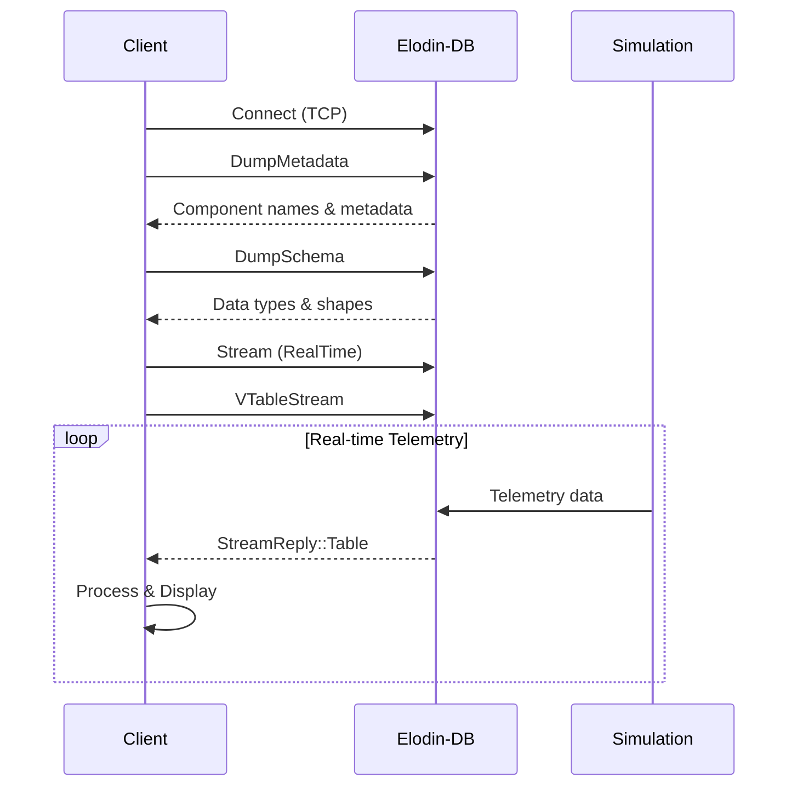

# Rust Client Example for Elodin-DB

A production-ready Rust client that demonstrates dynamic component discovery, schema retrieval, and real-time telemetry streaming from Elodin-DB simulations.

## 🚀 Features

### Core Capabilities
- **TCP Connection**: Robust connection to Elodin-DB server using `impeller2-stellar`
- **Dynamic Discovery**: Automatically discovers all components registered in the database
- **Schema Detection**: Retrieves component schemas with data types and tensor shapes
- **Real-Time Streaming**: Subscribes to telemetry streams with proper packet handling
- **Bidirectional Control**: Send control commands to influence running simulations
- **Type-Safe Protocol**: Uses the impeller2 wire protocol for all communication
- **Smart Categorization**: Automatically groups rocket components by function

### Key Innovation: Zero Configuration Required
Unlike the C/C++ examples which require manual component registration, this Rust client discovers everything automatically:

```rust
// C/C++ approach - manual registration
send_set_component_metadata(sock, "rocket.mach");
send_set_component_metadata(sock, "rocket.thrust");
// ... repeat for each component

// Rust approach - automatic discovery
let components = discover_components(client).await?;
// Client now knows about ALL components and their schemas!
```

## 📋 Prerequisites

- Rust toolchain (1.70 or later)
- Running instance of `elodin-db`
- (Optional) A simulation like `rocket.py` for telemetry data

## 🔨 Building

From the repository root:

```bash
cargo build -p elodin-db-rust-client --release
```

## 🎯 Usage

### Quick Start

1. **Start the Database Server**
```bash
elodin-db run [::]:2240 ~/.elodin/db --config examples/db-config.lua
```

2. **Run a Simulation** (optional but recommended)
```bash
# In another terminal
cd ./examples/rocket/
python main.py
```

3. **Launch the Rust Client**
```bash
./target/release/rust_client
```

### Command Line Options

```bash
./target/release/rust_client --help

Options:
  -H, --host <HOST>    Host address of the Elodin-DB server. Can be specified as 'host' or 'host:port'.
                       If port is included here, it overrides the -p flag.
                       Examples: "127.0.0.1", "[::1]", "localhost:2290", "[::]:2240"
                       [default: 127.0.0.1:2240]
  -p, --port <PORT>    Port of the Elodin-DB server (ignored if port is specified in --host)
                       [default: 2240]
  -v, --verbose        Enable verbose logging
  -h, --help           Print help information
```

Examples:
```bash
# Using combined host:port notation (elodin-db style)
./target/release/rust_client -H [::]:2240
./target/release/rust_client -H localhost:2290
./target/release/rust_client -H 127.0.0.1:2240

# Using separate host and port
./target/release/rust_client -H 127.0.0.1 -p 2240
./target/release/rust_client -H localhost -p 2290

# IPv6 examples
./target/release/rust_client -H [::1]:2240        # IPv6 loopback with port
./target/release/rust_client -H [::]:2240         # IPv6 any address with port
./target/release/rust_client -H [::1] -p 2240     # IPv6 with separate port
```

## 📊 Example Output

### With Active Rocket Simulation

```
🚀 Elodin-DB Rust Client Example
================================

✓ Connected to database!

🔍 Discovering registered components:

📊 Discovered Components:
  Found 20 components registered
  ✓ rocket.mach → f64
  ✓ rocket.thrust → f64
  ✓ rocket.world_pos → f64[7]
  ✓ rocket.world_vel → f64[6]
  ✓ rocket.aero_force → f64[6]
  ✓ rocket.angle_of_attack → f64
  ✓ rocket.dynamic_pressure → f64
  ✓ rocket.center_of_gravity → f64
  ✓ rocket.motor → f64
  ✓ rocket.fin_deflect → f64
  ✓ rocket.fin_control → f64
  ✓ rocket.pitch_pid → f64[3]
  ✓ rocket.pitch_pid_state → f64[3]
  ...

🚀 Rocket Components Summary:
  20 rocket-specific components available

  Aerodynamics:
    • rocket.mach
    • rocket.dynamic_pressure
    • rocket.angle_of_attack
    • rocket.aero_force
    • rocket.aero_coefs
    
  Propulsion:
    • rocket.thrust
    • rocket.motor
    
  Control:
    • rocket.fin_deflect
    • rocket.fin_control
    • rocket.pitch_pid
    • rocket.pitch_pid_state
    
  Position/Motion:
    • rocket.world_pos
    • rocket.world_vel
    • rocket.v_rel_accel
    • rocket.v_rel_accel_filtered

📡 Setting up real-time telemetry stream:
  ✓ Real-time stream subscription active

✨ Setup complete! Listening for telemetry data...
  (Press Ctrl+C to exit)
```

### Telemetry Dashboard View

Once streaming begins, the client displays a real-time dashboard:

```
╔═══════════════════════════════════════════════════════════════════════════════╗
║  🚀 ROCKET TELEMETRY DASHBOARD - RAW VALUES                                   ║
╚═══════════════════════════════════════════════════════════════════════════════╝

📡 Connected | 📦 Packets: 1250 | ⏱️  T: 12500000

🔥 Propulsion
════════════════════════════════════════════════════════════════════════════════
  motor                       :     1.00
  thrust                      : 50000.00                           

🎯 Control
══════════════════════════════════════════════════════════════
  fin_control               :     0.00                           
  fin_deflect              :    -8.64                           
  pitch_pid                : [3 values]                          
  pitch_pid_state          : [3 values]                          

💨 Aerodynamics
══════════════════════════════════════════════════════════════
  aero_coefs               : [6 values]                          
  aero_force               : [6 values]                          
  angle_of_attack          :     4.96                           
  dynamic_pressure         : 35651.28                           
  mach                     :     0.26                           
  wind                     : [   0.00,    0.00,    0.00]         

📍 Position/Motion
══════════════════════════════════════════════════════════════
  center_of_gravity        :     0.00                           
  v_rel_accel              : [   0.00,    0.00,    0.00]         
  v_rel_accel_filtered     : [   0.00,    0.00,    0.00]         
  world_pos                : [7 values]                          
  world_vel                : [  10.00,    5.00,    9.19]         

─────────────────────────────────────────────────────────────────
💡 Press Ctrl+C to exit
```

## 🎮 External Control System

### Overview

This client demonstrates bidirectional communication with simulations, allowing external control of simulation components in real-time. The example sends sinusoidal trim commands to control rocket fin deflection.

### How External Control Works

1. **Component Declaration**: In your simulation (e.g., `rocket.py`), declare components with external control metadata:
   ```python
   FinControlTrim = ty.Annotated[
       jax.Array, 
       el.Component("fin_control_trim", el.ComponentType.F64, 
                    metadata={"external_control": "true"})
   ]
   ```

2. **Simulation Setup**: Run the simulation in real-time mode:
   ```python
   w.run(system, 
         sim_time_step=1/120.0,
         run_time_step=1/120.0)  # Real-time execution
   ```

3. **Client Control**: The Rust client calculates and sends control commands:
   ```rust
   // Calculate sinusoidal trim value (±1° @ 0.25Hz)
   let trim_value = amplitude * (2.0 * PI * frequency * elapsed).sin();
   
   // Build packet with timestamp and value  
   let mut packet = LenPacket::table(vtable_id, 16); // 8 bytes timestamp + 8 bytes f64
   packet.extend_aligned(&timestamp.to_le_bytes());
   packet.extend_aligned(&trim_value.to_le_bytes());
   
   // Send the packet to the database
   let (result, _) = client.send(packet).await;
   ```

### Architecture Components

#### The Data Flow Pipeline
```
External Client → Elodin-DB → Host Buffers → GPU Buffers → Physics Execution
```

Key architectural elements:

1. **Metadata-Based Declaration**: Components marked with `external_control: "true"` are not written back by the simulation
2. **Write Authority**: External clients have exclusive write access to these components
3. **Dirty Flag System**: Modified components are marked dirty for GPU synchronization
4. **Real-Time Streaming**: Uses Impeller2 protocol with VTables for efficient data transmission

### Running the External Control Example

#### 1. Start the Rocket Simulation with External Control
```bash
cd libs/nox-py
python examples/rocket.py run 0.0.0.0:2240
```

The rocket simulation includes a `fin_control_trim` component that accepts external control.

#### 2. Launch the Control Client
```bash
# Using the new combined host:port notation
./target/release/rust_client -H 127.0.0.1:2240

# Or if using a different port
./target/release/rust_client -H localhost:2290
```

The client automatically:
- Discovers the `fin_control_trim` component
- Sends VTable definition for the control data
- Transmits sinusoidal trim commands at 60Hz

#### 3. Observe the Effects
```bash
elodin editor 127.0.0.1:2240
```

You'll see:
- **Trim Control Graph**: Oscillating ±1° sinusoid
- **Rocket 3D View**: The rocket rocking back and forth
- **Fin Deflection**: Combined effect of PID control + external trim

### Implementation Details

The control module (`src/control.rs`) handles:

1. **VTable Definition**: Describes the binary layout of control data
2. **Timestamp Synchronization**: Ensures proper temporal ordering
3. **Rate Control**: Maintains 60Hz update rate for smooth control
4. **Component Discovery**: Uses the same VTable ID as the simulation

### Extending External Control

To add external control to your own simulations:

1. **Define Control Components**:
   ```python
   MyControl = ty.Annotated[
       jax.Array,
       el.Component("my_control", el.ComponentType.F64,
                    metadata={"external_control": "true"})
   ]
   ```

2. **Use in Physics Systems**:
   ```python
   @el.map
   def my_system(control: MyControl) -> Output:
       # Use control value in calculations
       return control * gain
   ```

3. **Send from Client**:
   ```rust
   // Calculate control value
   let control_value = calculate_control();
   
   // Build and send packet with the control value
   let mut packet = LenPacket::table(vtable_id, 16);
   packet.extend_aligned(&Timestamp::now().to_le_bytes());
   packet.extend_aligned(&control_value.to_le_bytes());
   client.send(packet).await?;
   ```

## 🏗️ Architecture

### Project Structure

```
libs/db/examples/rust_client/
├── Cargo.toml           # Dependencies and build configuration
├── README.md            # This documentation
├── src/
│   ├── main.rs         # Entry point and CLI
│   ├── client.rs       # Connection orchestration
│   ├── discovery.rs    # Dynamic component discovery
│   └── processor.rs    # Telemetry processing and display
```

### Key Components

#### 1. **Discovery Module** (`discovery.rs`)
- Queries database using `DumpMetadata` and `DumpSchema` messages
- Builds a complete map of available components
- Extracts data types, tensor shapes, and metadata
- Categorizes components by function

#### 2. **Client Module** (`client.rs`)
- Manages TCP connection via `impeller2-stellar::Client`
- Sets up real-time streaming subscriptions
- Coordinates discovery and processing phases

#### 3. **Processor Module** (`processor.rs`)
- Handles incoming `StreamReply` packets
- Implements the `Decomponentize` trait for data extraction
- Maintains latest telemetry values
- Renders beautiful terminal dashboard with color-coding

#### 4. **Main Module** (`main.rs`)
- Parses command-line arguments
- Initializes logging
- Manages application lifecycle

### Protocol Flow



## 🔧 Dependencies

The client leverages the Elodin ecosystem:

| Crate | Purpose |
|-------|---------|
| `impeller2` | Core protocol types (`ComponentId`, `Schema`, `PrimType`) |
| `impeller2-stellar` | TCP client with async support |
| `impeller2-wkt` | Well-known message types |
| `stellarator` | Async runtime (tokio-based) |
| `postcard` | Efficient serialization |
| `colored` | Terminal output formatting |
| `clap` | Command-line argument parsing |

## 🚦 Current Implementation Status

### ✅ Fully Implemented
- Component discovery from database
- Schema and metadata retrieval
- Real-time stream subscription
- Beautiful terminal dashboard
- Packet counting and basic processing
- Component categorization

### ✅ Real Data Only
- **Telemetry Values**: Shows only actual raw values from packets
- **No Synthetic Data**: Displays real telemetry or nothing
- **VTable Registry**: Automatically maintains registry from incoming VTable messages
- **Smart Display**: 
  - Normal arrays (<20 values): All values displayed
  - Buffer components: Shows "[buffer: N values]" instead of data
  - Very large arrays (>20 values): Summarized as "[N values]"

### 📝 Future Enhancements

To extend the telemetry pipeline:

1. **Enhanced Processing** *(VTable integration complete!)*
   - ✅ Stores VTable definitions from `StreamReply::VTable` messages
   - ✅ Uses VTables to properly decomponentize table packets
   - ✅ Extracts actual telemetry values from binary data

2. **Data Persistence**
   ```rust
   // Add data recording
   let recorder = TelemetryRecorder::new("telemetry.parquet");
   processor.add_sink(recorder);
   ```

3. **Write Support**
   ```rust
   // Send commands back to simulation
   client.send(SetComponentValue {
       component: "rocket.fin_control",
       value: 5.0,
   }).await?;
   ```

4. **Visualization**
   - Real-time plotting with `plotters`
   - Web dashboard with WebSocket streaming
   - Integration with Grafana/InfluxDB

## 🔍 Troubleshooting

### Connection Issues

If the client fails to connect:

1. **Verify the database is running**:
   ```bash
   ps aux | grep elodin-db
   ```

2. **Check port availability**:
   ```bash
   nc -zv localhost 2240
   ```

3. **Enable verbose logging**:
   ```bash
   ./rust_client --verbose
   ```

### No Components Found

If no components are discovered:

1. Ensure a simulation is running and has registered components
2. Check the database has received component registrations:
   ```bash
   elodin-db query "SELECT * FROM components"
   ```

### Display Issues

If the dashboard appears garbled:

1. Ensure your terminal supports ANSI color codes
2. Try a different terminal emulator (iTerm2, Windows Terminal, etc.)
3. Resize terminal to at least 80x30 characters

## 🎓 Learning Resources

### Understanding the Protocol

The client uses three layers of abstraction:

1. **Wire Protocol** (`impeller2`): Binary message format
2. **Transport** (`stellarator`): TCP with async I/O
3. **Messages** (`impeller2-wkt`): Application-level messages

### Extending the Client

To add new functionality:

1. **New Message Types**: Add to `impeller2-wkt`
2. **Custom Processing**: Extend `TelemetryProcessor`
3. **New Displays**: Modify `display_telemetry()`

## 🤝 Comparison with Other Examples

| Feature | C Client | C++ Client | Rust Client |
|---------|----------|------------|-------------|
| Language Safety | Manual memory | RAII | Full ownership |
| Component Discovery | ❌ Manual | ❌ Manual | ✅ Automatic |
| Schema Retrieval | ❌ | ❌ | ✅ |
| Async Support | ❌ | ❌ | ✅ Native |
| Error Handling | Return codes | Exceptions | Result<T, E> |
| Type Safety | Minimal | Templates | Full |
| Dashboard | Basic | Basic | Rich TUI |
