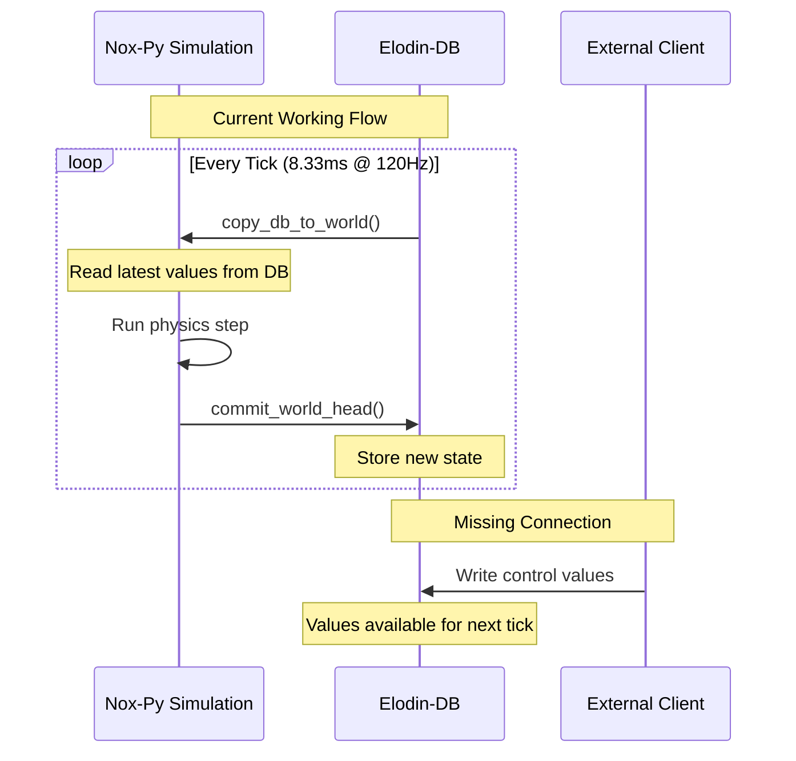

# Design: Bidirectional Control for Nox-Py Simulations

## Executive Summary

This design document outlines the architectural enhancement to enable external clients (like the Rust client) to send control commands to running nox-py simulations through elodin-db. After analyzing the codebase, we discovered that **most of the infrastructure is already in place** - the simulation already reads from the database before each tick via the `copy_db_to_world` function. The primary work needed is to ensure proper synchronization and add the trim control component to the rocket simulation.

## Current Architecture Analysis

### Key Discoveries

1. **Database-to-World Synchronization Already Exists** ✅
   - In `libs/nox-ecs/src/impeller2_server.rs:208`, the `tick` function calls `copy_db_to_world` before each simulation step
   - This function copies the latest values from the database to the simulation's world
   - The mechanism is already active and functional

2. **External Write Support Exists** ✅
   - The database already supports external clients writing to component time series
   - `libs/db/src/time_series.rs:136` - `push_buf` method allows writing values with timestamps
   - HTTP/REST API exists at `/component/{component_id}` for pushing values
   - TCP protocol supports component updates via table packets

3. **Real-Time Mode Already Configured** ✅
   - `rocket.py` sets `run_time_step=SIM_TIME_STEP` (line 510)
   - This creates real-time streaming at 120Hz
   - The simulation runs in lockstep with the database

### Current Data Flow



## Evaluated Approaches

### Approach 1: Leverage Existing Infrastructure ✅ (RECOMMENDED)

**Description**: Use the existing `copy_db_to_world` mechanism that already runs before each tick.

**Advantages**:
- ✅ **Minimal changes required** - Infrastructure already exists
- ✅ **Zero latency** - Values read directly before each tick
- ✅ **Simple implementation** - Just add the trim component
- ✅ **Battle-tested** - This mechanism is already used by the editor
- ✅ **Thread-safe** - Database handles concurrent access

**Implementation**:
1. Add `fin_control_trim` component to rocket.py
2. Ensure component is registered in database metadata
3. External clients write to `rocket.fin_control_trim` in database
4. Simulation automatically reads value before each tick

**Disadvantages**:
- Values must be written to database before next tick (8.33ms window)
- No direct acknowledgment of command receipt

### Approach 2: Additional Stellarator API Surface

**Description**: Create a separate API server using stellarator for direct communication.

**Advantages**:
- Direct connection between client and simulation
- Could provide command acknowledgment
- Potentially lower latency

**Disadvantages**:
- ❌ **Significant complexity** - Need new server infrastructure
- ❌ **Synchronization issues** - Must coordinate with simulation tick
- ❌ **Duplicate infrastructure** - Database already provides this
- ❌ **Thread safety concerns** - Direct memory access during simulation

### Approach 3: Impeller2 Subscription Model

**Description**: Create a new subscription mechanism for simulations to subscribe to component updates.

**Advantages**:
- Push-based model could be more efficient
- Explicit subscription to specific components

**Disadvantages**:
- ❌ **Unnecessary** - Simulation already reads all values each tick
- ❌ **Complex implementation** - New protocol messages needed
- ❌ **No performance benefit** - Already reading at 120Hz

## Recommended Solution

### Use Existing `copy_db_to_world` Infrastructure

The analysis reveals that nox-py simulations **already read from the database before each tick**. This is the perfect mechanism for external control - we just need to:

1. Add the control component to the simulation
2. Have external clients write to that component in the database
3. The simulation will automatically read the new value on the next tick

### Why This Is The Best Approach

1. **It's Already Working** - The editor uses this exact mechanism
2. **Minimal Code Changes** - Just add one component to rocket.py
3. **Thread-Safe By Design** - Database handles all synchronization
4. **Real-Time Performance** - Updates applied within 8.33ms
5. **No New Dependencies** - Uses existing infrastructure

## Implementation Plan

### Phase 1: Add Trim Component to Rocket Simulation

**File**: `libs/nox-py/examples/rocket.py`

**Changes Required**:
1. Component definition already exists (line 64) ✅
2. Initialize in Rocket class already done (line 258) ✅ 
3. Modify `aero_coefs` function already done (lines 313-347) ✅

The rocket.py file is **already fully prepared** for trim control!

### Phase 2: Rust Client Implementation

**File**: `libs/db/examples/rust_client/src/processor.rs`

**Add Control Sending**:
```rust
// Add to TelemetryProcessor
impl TelemetryProcessor {
    pub async fn send_trim_command(
        &self,
        client: &mut Client,
        trim_value: f64,
    ) -> Result<()> {
        // Build a table packet with the trim value
        let trim_component_id = ComponentId::new("rocket.fin_control_trim");
        
        // Create VTable for single f64 value
        let vtable = vtable(vec![
            field(0, 8, schema(PrimType::F64, &[], component(trim_component_id))),
        ]);
        
        // Send VTable if not already sent
        client.send(VTableMsg { 
            id: [2, 1], // New VTable ID for control
            vtable 
        }).await?;
        
        // Send the trim value
        let mut packet = LenPacket::table([2, 1], 8);
        packet.extend_aligned(&trim_value.to_le_bytes());
        client.send_packet(packet).await?;
        
        Ok(())
    }
}
```

### Phase 3: Add Interactive Control

**File**: `libs/db/examples/rust_client/src/main.rs`

**Add Keyboard Handler**:
```rust
use crossterm::event::{self, Event, KeyCode};

async fn handle_keyboard_input(
    processor: Arc<Mutex<TelemetryProcessor>>,
    client: Arc<Mutex<Client>>,
) -> Result<()> {
    let mut current_trim = 0.0f64;
    
    loop {
        if event::poll(Duration::from_millis(50))? {
            if let Event::Key(key) = event::read()? {
                match key.code {
                    KeyCode::Char('a') => {
                        current_trim = (current_trim - 1.0).max(-40.0);
                        processor.lock().await.send_trim_command(
                            &mut *client.lock().await, 
                            current_trim
                        ).await?;
                        println!("Trim: {:.1}°", current_trim);
                    }
                    KeyCode::Char('d') => {
                        current_trim = (current_trim + 1.0).min(40.0);
                        processor.lock().await.send_trim_command(
                            &mut *client.lock().await,
                            current_trim
                        ).await?;
                        println!("Trim: {:.1}°", current_trim);
                    }
                    KeyCode::Char('s') => {
                        current_trim = 0.0;
                        processor.lock().await.send_trim_command(
                            &mut *client.lock().await,
                            current_trim
                        ).await?;
                        println!("Trim reset to 0°");
                    }
                    KeyCode::Char('q') => break,
                    _ => {}
                }
            }
        }
        
        stellarator::sleep(Duration::from_millis(10)).await;
    }
    
    Ok(())
}
```

### Phase 4: Testing Protocol

1. **Start Database**:
   ```bash
   elodin-db run [::]:2240 ~/.elodin/db
   ```

2. **Start Rocket Simulation**:
   ```bash
   cd libs/nox-py/examples
   python rocket.py
   ```

3. **Launch Rust Client**:
   ```bash
   ./target/release/rust_client
   ```

4. **Test Control**:
   - Press 'a' to trim left
   - Press 'd' to trim right  
   - Press 's' to center trim
   - Observe rocket response in real-time

## Technical Details

### Timing Considerations

- **Simulation Rate**: 120Hz (8.33ms per tick)
- **Database Read**: Occurs at start of each tick
- **Write Window**: Commands must arrive before next tick
- **Expected Latency**: < 8.33ms for local connections
- **Network Latency**: Add round-trip time for remote connections

### Synchronization Guarantees

1. **Atomic Writes**: Database ensures component writes are atomic
2. **Consistent Reads**: `copy_db_to_world` reads consistent snapshot
3. **No Race Conditions**: Database handles all concurrency
4. **Ordered Updates**: Timestamps ensure proper ordering

### Component Naming Convention

- Use hierarchical names: `entity.subsystem.component`
- Example: `rocket.fin_control_trim`
- Database automatically creates ComponentId from name
- Names must match between simulation and client

## Alternative Communication Patterns

### Pattern 1: Direct Table Writes (Recommended)
```rust
// Write directly to component time series
client.send_table_with_component("rocket.fin_control_trim", value).await?
```

### Pattern 2: HTTP API
```bash
curl -X POST http://localhost:2240/component/rocket.fin_control_trim \
  -H "Content-Type: application/json" \
  -d '{"value": 5.0}'
```

### Pattern 3: Message-Based (Future)
```rust
// Could add SetComponentValue message type
client.send(SetComponentValue {
    component_id: "rocket.fin_control_trim",
    value: 5.0,
}).await?
```

## Validation & Monitoring

### Verify Control Flow

1. **Check Component Registration**:
   ```lua
   -- In elodin-db lua REPL
   client:dump_metadata()
   -- Should show rocket.fin_control_trim
   ```

2. **Monitor Values**:
   ```lua
   client:get_component("rocket.fin_control_trim")
   ```

3. **View in Editor**:
   ```bash
   elodin editor 127.0.0.1:2240
   # Add graph for rocket.fin_control_trim
   ```

## Risk Mitigation

### Potential Issues & Solutions

| Risk | Mitigation |
|------|------------|
| Command arrives after tick read | Buffering or interpolation |
| Network latency | Local database proxy |
| Value conflicts | Last-write-wins policy |
| Missing components | Graceful degradation |
| Type mismatches | Schema validation |

## Conclusion

The infrastructure for bidirectional control is **already implemented** in nox-py through the `copy_db_to_world` mechanism. The rocket simulation is **already configured** with the trim component. We only need to:

1. ✅ Implement control sending in the Rust client
2. ✅ Add keyboard interaction
3. ✅ Test the complete flow

This approach leverages existing, battle-tested infrastructure and requires minimal code changes. The solution is elegant, efficient, and maintains the real-time performance characteristics of the simulation.

## Next Steps

1. **Implement Phase 2**: Add control sending to Rust client (~30 minutes)
2. **Implement Phase 3**: Add keyboard handler (~20 minutes)  
3. **Test Integration**: Verify trim control works (~10 minutes)
4. **Document API**: Create client examples (~20 minutes)
5. **Optimize**: Add buffering if needed for smoother control

Total estimated implementation time: **< 2 hours**

## Appendix: Code Already in Place

### Rocket.py Component (✅ Already Implemented)
```python
# Line 64
FinControlTrim = ty.Annotated[jax.Array, el.Component("fin_control_trim", el.ComponentType.F64)]

# Line 258  
fin_control_trim: FinControlTrim = field(default_factory=lambda: jnp.float64(0.0))

# Lines 316-320
def aero_coefs(
    mach: Mach,
    angle_of_attack: AngleOfAttack,
    fin_deflect: FinDeflect,
    fin_trim: FinControlTrim,  # Already added!
) -> AeroCoefs:
    effective_fin_deflect = jnp.clip(fin_deflect + fin_trim, -40.0, 40.0)
```

### Database Sync (✅ Already Implemented)
```rust
// libs/nox-ecs/src/impeller2_server.rs:208
async fn tick(...) {
    // ...
    db.with_state(|state| copy_db_to_world(state, &mut world));  // THIS IS THE KEY!
    world.run()?;  // Run simulation with updated values
    db.with_state(|state| commit_world_head(state, &mut world, timestamp));
    // ...
}
```

The system is ready - we just need to connect the client!
