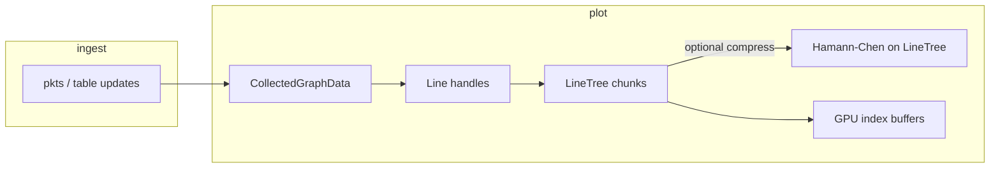

# `hamann-chen-line`

Rust implementation of **Hamann–Chen (1994)** curvature-based polyline simplification: pick `n` vertices that approximate the shape of a long polyline or time series.

## Library API

Add the path dependency (as in this repo) or publish name TBD.

| Function | Input | Role |
|----------|--------|------|
| [`select_polyline2_indices`](src/lib.rs) | `&[Vec2]`, target `n` | Planar polyline |
| [`select_polyline3_indices`](src/lib.rs) | `&[Vec3]`, target `n` | 3D spatial polyline (per-vertex local frame, same curvature idea) |
| [`select_time_value_indices`](src/lib.rs) | `t: &[f32]`, `y: &[f32]`, `n` | Graph / telemetry: polyline in the `(t, y)` plane |
| [`select_trajectory_time_norm_indices`](src/lib.rs) | `t`, positions, `n` | One shared index set from `(t, ‖p‖)` so **X/Y/Z lines stay time-aligned** (not full 3D curvature on each axis separately) |

All return **indices into the original arrays** (sorted, first and last included when possible). Downstream code copies `(t, y)` or `Vec3` by those indices.

## CLI

The package builds a binary with the same name:

```bash
cargo run -p hamann-chen-line -- --help
```

Examples (CSV: comma-separated floats, **no header**; `-` = stdin/stdout):

```bash
# 2D polyline: columns x,y
cargo run -p hamann-chen-line -- -n 80 --kind polyline2 -i path.csv -o out.csv

# Time series: columns t,y
cargo run -p hamann-chen-line -- -n 200 --kind time-value -i series.csv -o reduced.csv

# 3D path: columns x,y,z
cargo run -p hamann-chen-line -- -n 150 --kind polyline3 -i traj.csv -o out.csv

# Trajectory t,x,y,z → indices from (t, ‖p‖)
cargo run -p hamann-chen-line -- -n 150 --kind trajectory-time-norm -i traj4.csv -o out.csv
```

`-n` / `--target` is the desired vertex count (≥ 2).

## Use inside Elodin (Editor)

The Editor does **not** call the CLI; it uses the crate from `libs/elodin-editor` and applies simplification to **live `Line` assets** (chunked time series) when buffers grow large.

### Settings

[`CurveCompressSettings`](../elodin-editor/src/ui/plot/data.rs) is a Bevy `Resource` (default initialized in `PlotPlugin`):

- **`enabled`** — master switch.
- **`compress_after_total_points`** — run simplification once a line’s total point count exceeds this.
- **`compress_to_points`** — target total points after a pass (Hamann–Chen `n`).
- **`keep_recent_fraction`** — e.g. `0.2` keeps roughly the **last 20 %** of samples **uncompressed**; Hamann–Chen runs only on the older prefix so the recent window stays full resolution. `0.0` = compress the whole series (still capped by `compress_to_points`).

At runtime you can override the resource, for example:

```rust
use elodin_editor::ui::plot::CurveCompressSettings;

fn setup(mut q: ResMut<CurveCompressSettings>) {
    q.compress_after_total_points = 50_000;
    q.compress_to_points = 5_000;
    q.keep_recent_fraction = 0.2;
}
```

### Pipeline (telemetry → graph)

Roughly:



1. **Ingest** — graph/table handlers append samples into **`LineTree`** (timestamped `f32` chunks).
2. **Threshold** — when `total_points > compress_after_total_points`, **`maybe_compress_all_graph_lines`** runs.
3. **2D graphs** — each axis is a separate `Line`; **`LineTree::compress_time_value_hamann`** calls `select_time_value_indices` (with optional recent tail preserved via `keep_recent_fraction`).
4. **3D plot (one logical curve)** — three `Line` assets (X, Y, Z) are compressed **jointly**: samples are aligned on the X-axis timestamps; **`select_polyline3_indices`** on `Vec3` built from the three values, then each line is rebuilt with the same index set (same tail behavior).

### Limits (by design today)

- **In-memory series** — simplification rewrites the stored chunks for that line; there is no separate “disk archive vs RAM window” split.
- **Heuristic 3D joint path** — joint mode uses 3D polyline curvature; the `(t, ‖p‖)` variant exists in this crate for aligned multi-axis series when that model fits better.

## Reference

Implementation notes and citation context: [gist / reference port](https://gist.github.com/shanecelis/2e0ffd790e31507fba04dd56f806667a).
