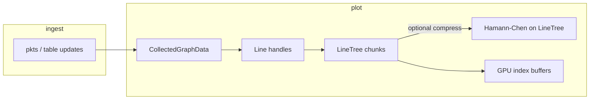

# `hamann-chen-line`

**Hamann–Chen (1994)**-style **curvature-based polyline simplification** in Rust: given a long polyline (or a time series viewed as a polyline in \((t,y)\)), pick about **`m` vertices** so the reduced polyline keeps the visually important bends.

This crate is intentionally **small and deterministic**: it returns **indices into your original arrays**; you copy `(x,y)`, `(t,y)`, or `(x,y,z)` yourself. No allocations of full geometry beyond internal working buffers.

---

## Provenance and reference implementation

The numerical pipeline matches the **curvature sampling → `xbars` / arc-length `ss` / filtered `ki` → cumulative curvature → interval walk → vertex pick** structure from **Hamann–Chen**.

The Rust code is a **direct port** of the algorithm expressed in Shane Celis’s C# file  
[**`PiecewiseLinearCurveApproximation.cs`**](https://gist.github.com/shanecelis/2e0ffd790e31507fba04dd56f806667a) (gist). That gist is the **authoritative reference** for the discrete steps this crate implements.

**Deliberate differences from the C# gist (same math, different numerics):**

- **Inverting cumulative curvature along arc length** — the gist uses Math.NET `LinearSpline` plus `RobustNewtonRaphson`. Here we use **trapezoidal integration** on `s` with respect to `ki`, build a cumulative table, and **linearly interpolate** in `s` at the target cumulative curvature. Same idea, simpler dependencies, stable for `f32`.
- **3D polylines** — each interior vertex is projected into a **local 2D triangle** \((p_{i-1}, p_i, p_{i+1})\); the same 2D curvature machinery runs on that triangle, then the result is folded back into the 3D index picker (see crate rustdoc on `select_polyline3_indices`).

If you need to **diff behaviour** against another port, start from the gist and the paper’s construction, then compare index sets for identical inputs and `m`.

---

## When to use which entry point

| Situation | Function | What it optimizes |
|-----------|----------|-------------------|
| Planar path, columns \((x,y)\) | [`select_polyline2_indices`](src/lib.rs) | Shape in the **\(xy\)** plane. |
| Telemetry / graph, columns \((t,y)\) | [`select_time_value_indices`](src/lib.rs) | Shape in the **\((t,y)\)** plane (time on one axis). |
| Spatial path, columns \((x,y,z)\) | [`select_polyline3_indices`](src/lib.rs) | **3D** curvature via a local 2D frame at each vertex (heavier, geometry-faithful). |
| Many parallel streams **must share one index set** (e.g. X/Y/Z lines with identical timestamps) and you want a **cheap** shared simplification | [`select_trajectory_time_norm_indices`](src/lib.rs) | A **2D** polyline in \((t, \|p\|)\) — keeps axes **time-aligned** but does **not** preserve full 3D turning behaviour. |

**Contract (all functions above):**

- `m` is the **desired** vertex budget (algorithm aims for ≤ `m` indices after dedup).
- Returned indices are **sorted**, typically include **first and last** original indices when `m ≥ 2` and the series is long enough.
- Empty or degenerate input returns an empty vector or a short prefix of indices (see tests).

**Legacy alias:** [`select_point_indices`](src/lib.rs) = `select_polyline2_indices`.

---

## Archive vs view (integration guidance)

The crate itself is **pure**: you hand it indices-in-arrays, it hands you a sorted subset. It has no state, no I/O, no allocation semantics beyond internal scratch buffers.

Consumers that keep a live-growing time series should resist the temptation to **overwrite their dataset** with the output of each pass. That pattern (repeatedly simplifying an already simplified series) compounds decimation over time: quality is **monotonically degrading** and parameter changes (e.g. a larger `m`) can never recover detail that prior passes threw away.

A better pattern, used by the Elodin editor in [`libs/elodin-editor/src/ui/plot/data.rs`](../elodin-editor/src/ui/plot/data.rs):

- **Archive** — append every accepted raw `(timestamp, value)` to a dedicated append-only buffer (`LineTree::raw_timestamps`, `LineTree::raw_values`). The archive is the source of truth and is never touched by HC.
- **View** — the rendered subset (chunks on GPU). Rebuilt from the archive each time the HC pass runs, via `LineTree::rebuild_from_time_value_pairs`.

Properties that fall out:

- **Deterministic / idempotent** — running HC twice on the same archive with the same `m` gives identical indices.
- **Monotone quality** — with a fixed archive, `m_new ≥ m_old` cannot produce a worse view; `m_new < m_old` cannot corrupt the archive.
- **Reversible tuning** — UI sliders for `m`, keep-recent fraction, sample-tail budget, etc. are free to change at runtime; no data is lost when they move.
- **Throttle-safe** — re-rendering the view is a pure function of `(archive, settings)`, so skipping passes (e.g. under UI throttling) is never destructive.

The trade-off is memory: the archive stores every sample. For long-running or high-rate telemetry, cap it (time horizon, sample count, or a fallback to destructive decimation past a certain age).

---

## Algorithm sketch (intuition)

1. **Curvature samples** along the polyline (2D, or 3D via local triangle flattening).
2. **Filter** vertices where curvature is negligible or non-finite (the `xbars` / `ki` idea from the gist).
3. **Arc-length parameter `s`** along the retained vertices; integrate curvature along `s` (trapezoidal rule here).
4. **Pick** `m−2` interior targets spaced in **integrated curvature**, map each target back to an original vertex index (interval walk + nearest-point tie-break, as in the gist’s structure).
5. **Sort, dedup**, force endpoints when possible.

This favours **keeping points where the curve bends**, not uniform resampling in index space.

---

## Using the crate in another Rust project

Path dependency (as in this monorepo):

```toml
hamann-chen-line = { path = "libs/hamann-chen-line" }
```

Then:

```rust
use glam::{Vec2, Vec3};
use hamann_chen_line::{select_polyline2_indices, select_time_value_indices};

let pts: Vec<Vec2> = /* ... */;
let idx = select_polyline2_indices(&pts, 500);
let simplified: Vec<Vec2> = idx.iter().map(|&i| pts[i]).collect();
```

For time series, `times` and `values` must have the same logical length (the function uses `min(len)`).

---

## CLI (optional)

The package also builds a small binary for **CSV experiments** (comma-separated floats, **no header**; `-` = stdin/stdout):

```bash
cargo run -p hamann-chen-line -- --help
```

```bash
# 2D polyline: columns x,y
cargo run -p hamann-chen-line -- -n 80 --kind polyline2 -i path.csv -o out.csv

# Time series: columns t,y
cargo run -p hamann-chen-line -- -n 200 --kind time-value -i series.csv -o reduced.csv

# 3D path: columns x,y,z
cargo run -p hamann-chen-line -- -n 150 --kind polyline3 -i traj.csv -o out.csv

# Trajectory t,x,y,z → one index set from (t, ‖p‖)
cargo run -p hamann-chen-line -- -n 150 --kind trajectory-time-norm -i traj4.csv -o out.csv
```

`-n` / `--target` is the desired vertex count (≥ 2).

---

## Elodin Editor integration

The **Editor does not shell out to this CLI**. It links the library from [`libs/elodin-editor`](../elodin-editor/Cargo.toml) and applies simplification to **live `Line` / `LineTree` telemetry** when series grow large, so graphs and `line_3d` trails stay within **CPU RAM** and **GPU index-buffer** budgets.

### Bevy resource: `CurveCompressSettings`

Defined in [`data.rs`](../elodin-editor/src/ui/plot/data.rs), registered in `PlotPlugin`:

| Field | Role |
|--------|------|
| **`enabled`** | Master switch for Hamann–Chen passes on ingested graph data. |
| **`compress_after_total_points`** | Trigger compression when **total** stored points in a line exceed this. |
| **`compress_to_points`** | Target budget **`m`** for a simplification pass (per line, or joint 3-line path). |
| **`keep_recent_fraction`** | Keep a **suffix** of the newest samples uncompressed (e.g. `0.2` ≈ last 20%); Hamann–Chen runs on the leading prefix only. `0.0` compresses the whole series (still capped by `compress_to_points`). |

**Defaults** (`impl Default` in `data.rs`, tied to `CHUNK_COUNT` × `CHUNK_LEN`):

Let `cap = CHUNK_COUNT * CHUNK_LEN` (currently **1024 × 3072 = 3145728** — max points budget for one `LineTree`).

| Field | Default |
|--------|---------|
| **`enabled`** | `true` |
| **`compress_after_total_points`** | `cap * 3 / 4` → **2359296** |
| **`compress_to_points`** | `cap / 2` → **1572864** |
| **`keep_recent_fraction`** | **0.0** |

If `CHUNK_COUNT` / `CHUNK_LEN` change, these numbers change with them; the formulas above stay the source of truth.

Override at runtime, for example:

```rust
use elodin_editor::ui::plot::CurveCompressSettings;

fn setup(mut q: ResMut<CurveCompressSettings>) {
    q.compress_after_total_points = 50_000;
    q.compress_to_points = 5_000;
    q.keep_recent_fraction = 0.2;
}
```

### Data flow (telemetry → GPU)



1. **Ingest** — handlers append samples into **`LineTree`** (timestamped `f32` chunks).
2. **Threshold** — after each relevant packet, **`maybe_compress_all_graph_lines`** runs if `enabled` and counts exceed **`compress_after_total_points`**.
3. **2D graphs** — each scalar channel is its own `Line`; **`compress_time_value_hamann`** calls **`select_time_value_indices`** (optional **`keep_recent_fraction`** split).
4. **`line_3d`** — three `Line` assets (X, Y, Z). If timestamps **match** across all three, **`try_joint_triline_compress`** builds a **`Vec3`** path and calls **`select_polyline3_indices`**, then **rebuilds all three lines with the same index set** so the 3D trail does not shear apart.

### Editor-only rendering limits (separate from this crate)

Even after in-memory compression, **GPU line strips** use a fixed **`INDEX_BUFFER_LEN`**. The 3D renderer may **increase the index sampling step in lockstep on X/Y/Z** so the strip fits the buffer without clipping the **tail** of the trail. That logic lives in `elodin-editor` (`plot_3d`), not in `hamann-chen-line`.

---

## Design limits (today)

- **In-memory only** — simplification **rewrites** stored chunks for that line; there is no separate on-disk archive vs RAM window.
- **Joint `line_3d` mode** is a **3D polyline** heuristic; for some multi-axis data, [`select_trajectory_time_norm_indices`](src/lib.rs) (2D on \((t,\|p\|)\)) may be a better conceptual fit — it is exposed from this crate for experiments and optional future wiring.
- **Not a Douglas–Peucker implementation** — different error metric and different vertex picks; do not expect identical results to RDP.

---

## Further reading

- **Reference port (C#):** [Shane Celis — `PiecewiseLinearCurveApproximation.cs` gist](https://gist.github.com/shanecelis/2e0ffd790e31507fba04dd56f806667a)  
- **Paper:** Hamann & Chen (1994), *curvature-based vertex sampling* (cite the original publication in academic work).
