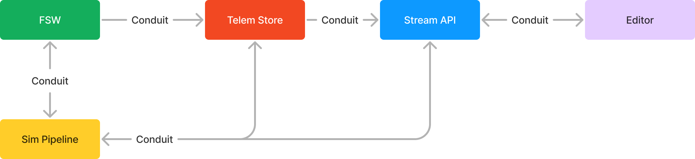

# Impeller2

A high-performance, transport-agnostic pub-sub protocol for real-time telemetry and state synchronization in aerospace systems.

<p align="center">
  
</p>

## Overview

Impeller2 is the core communication protocol that connects all Elodin components:
- **Elodin Editor** - 3D visualization and debugging interface
- **Elodin Simulation** - Physics simulation engine
- **Elodin Database** - Time-series telemetry storage
- **Flight Software** - Embedded systems running on flight computers (e.g., Aleph)

The protocol is designed for aerospace applications where you need to:
- Stream high-frequency sensor data (IMU, GPS, magnetometer, etc.)
- Synchronize simulation state across distributed systems
- Record and replay telemetry for analysis
- Control and monitor hardware-in-the-loop testing

## History

The project has evolved through several iterations:
1. **Conduit** (2023) - Initial implementation as a universal data-exchange protocol
2. **Impeller** (2024) - Renamed and refined for better performance
3. **Impeller2** (2024) - Complete rewrite with improved architecture and zero-copy design


For historical context and a deeper understanding of Impeller2's evolution, review these key pull requests (in chronological order):

- [paracosm#55: Initial protocol design and implementation](https://github.com/elodin-sys/paracosm/pull/55)
- [paracosm#148: Integrate with editor and nox-ecs](https://github.com/elodin-sys/paracosm/pull/148)
- [paracosm#177: Hierarchical component system introduction](https://github.com/elodin-sys/paracosm/pull/177)
- [paracosm#641: Rename to Impeller](https://github.com/elodin-sys/paracosm/pull/641)
- [paracosm#763: Transport abstraction and extensibility](https://github.com/elodin-sys/paracosm/pull/763)
- [paracosm#794: Real-time streaming and batch operations](https://github.com/elodin-sys/paracosm/pull/794)
- [paracosm#913: Protocol stabilization and documentation](https://github.com/elodin-sys/paracosm/pull/913)
- [elodin#88: Removal of Entities](https://github.com/elodin-sys/elodin/pull/88)

These PRs provide a comprehensive view of the protocol's design decisions, major features, and architectural changes over time.


## Core Concepts

### Components and Hierarchical Namespaces

Impeller2 organizes telemetry data using a hierarchical component system:

- **Component**: A specific type of telemetry data (position, velocity, temperature, etc.)
- **ComponentId**: A unique 64-bit identifier derived from the component's name using FNV-1a hashing
- **ComponentPath**: Hierarchical namespacing using dot notation (e.g., "drone.imu.accel", "sensor.temperature")

The system uses dot-separated names to create logical hierarchies without requiring explicit entity definitions:

```rust
// Example: Define a custom component
use impeller2::component::Component;

struct ImuData {
    accel: [f32; 3],
    gyro: [f32; 3],
}

impl Component for ImuData {
    const NAME: &'static str = "drone.imu";  // Hierarchical naming
    // ComponentId automatically derived from NAME
}
```

### Packet Types

Impeller2 defines three fundamental packet types:

#### 1. **Tables** - Bulk Tensor Data
Tables contain n-dimensional arrays (tensors) of telemetry data, organized by component IDs. This is the primary mechanism for high-frequency sensor streaming.

```rust
// Tables are collections of tensors
// Each tensor is identified by ComponentId
// Components use hierarchical names for organization (e.g., "vehicle.imu.accel")
// Data is aligned and zero-copy when possible
```

#### 2. **Messages** - Structured Commands/Events
Messages carry structured data that doesn't fit the tensor model (commands, configuration, metadata).

```rust
use impeller2::types::Msg;

#[derive(Serialize, Deserialize)]
struct SetThrottle {
    value: f32,
}

impl Msg for SetThrottle {
    const ID: PacketId = impeller2::types::msg_id("set_throttle");
}
```

#### 3. **Time Series** - Historical Data
Optimized format for querying and transmitting historical telemetry with timestamps.

### Wire Format

All packets share a common 4-byte header:

```
┌─────────────┬──────────┬──────────┐
│ PacketType  │ PacketId │ RequestId│
│   (1 byte)  │ (2 bytes)│ (1 byte) │
└─────────────┴──────────┴──────────┘
```

- **PacketType**: Msg (0), Table (1), TimeSeries (2), MsgWithTimestamp (3)
- **PacketId**: Identifies the message type or vtable
- **RequestId**: For request-reply correlation

The body format depends on the packet type:
- **Messages**: Postcard-encoded data
- **Tables**: VTable-described tensor layout
- **TimeSeries**: Timestamp array + tensor data

### VTables (Virtual Tables)

VTables describe the memory layout of table packets, enabling zero-copy deserialization:

```rust
use impeller2::vtable::builder::*;

// Build a vtable for component data
// Each field represents a component's tensor data
let vtable = vtable(vec![
    field(0, 6 * 4, schema(PrimType::F32, &[6], component("drone.imu.accel"))),
    field(6 * 4, 4 * 4, schema(PrimType::F32, &[4], component("drone.imu.gyro"))),
]);
```

## Sub-Crates

The Impeller2 ecosystem consists of several specialized crates:

### impeller2 (Core)
The foundation library containing:
- Protocol definitions and packet types
- Component and schema systems
- VTable implementation
- Buffer management utilities

### impeller2-bevy
Integration with the Bevy game engine for the editor:
- ECS synchronization
- Real-time telemetry visualization
- Component adapters for Bevy entities

### impeller2-stellar  
Networking and streaming capabilities:
- TCP/UDP transport implementations
- Async packet streams
- Client/server abstractions

### impeller2-bbq
High-performance lock-free queues based on BBQueue:
- Zero-copy packet passing between threads
- Async producer/consumer interfaces
- Used for editor-database communication

### impeller2-frame
COBS (Consistent Overhead Byte Stuffing) framing:
- Serial protocol support for embedded systems
- Frame synchronization and error recovery

### impeller2-kdl
KDL (Document Language) serialization for configuration:
- Human-readable schematic definitions
- Layout configuration for the editor UI

### impeller2-wkt (Well-Known Types)
Standard message and component definitions:
- Common telemetry types (WorldPos, Quaternion, etc.)
- Control messages (Stream, SetStreamState, etc.)
- Metadata management

## Usage Examples

### Sending Telemetry from Flight Software

```rust
use impeller2::types::{LenPacket, IntoLenPacket};
use impeller2::component::Component;

// Define your telemetry component with hierarchical naming
struct ImuAccel([f32; 3]);
struct ImuGyro([f32; 3]);

impl Component for ImuAccel {
    const NAME: &'static str = "vehicle.imu.accel";
    fn schema() -> Schema<Vec<u64>> {
        Schema::new(PrimType::F32, [3]).unwrap()
    }
}

impl Component for ImuGyro {
    const NAME: &'static str = "vehicle.imu.gyro";
    fn schema() -> Schema<Vec<u64>> {
        Schema::new(PrimType::F32, [3]).unwrap()
    }
}

// Create and send packets
let accel = ImuAccel([0.0, 0.0, 9.81]);
let packet = accel.into_len_packet();
// Send packet over your transport (serial, TCP, etc.)
```

### Receiving in the Editor

```rust
use impeller2_bevy::{PacketRx, PacketTx};
use bevy::prelude::*;

fn receive_telemetry(
    mut packet_rx: ResMut<PacketRx>,
    mut commands: Commands,
) {
    while let Some(packet) = packet_rx.try_recv_pkt() {
        // Packets are automatically deserialized and applied to ECS
        match packet {
            OwnedPacket::Table(table) => {
                // Process tensor data
            }
            OwnedPacket::Msg(msg) => {
                // Handle commands/events
            }
            _ => {}
        }
    }
}
```

### Streaming Historical Data

```rust
use impeller2_stellar::Client;
use impeller2_wkt::{GetTimeSeries, ComponentId};

async fn query_history(client: &mut Client) {
    let request = GetTimeSeries {
        component_id: ComponentId::new("imu.accel"),
        range: start_time..end_time,
        limit: Some(1000),
    };
    
    let time_series = client.request(request).await?;
    // Process historical data
}
```

## Architecture Details

### Zero-Copy Design

Impeller2 minimizes memory copies through:
- **Aligned buffers**: Data is pre-aligned for direct casting
- **View types**: ComponentView provides zero-copy tensor access
- **Shared memory**: BBQueue enables zero-copy IPC

### Transport Independence

The protocol works over any byte stream:
- **Serial**: COBS framing for UART/USB
- **TCP/UDP**: Direct packet transmission
- **Shared Memory**: Lock-free queues for local IPC
- **WebSockets**: For browser-based tools

### Performance Optimizations

- **Batch transmission**: Multiple components per packet
- **Compression**: Optional Zstandard compression
- **Selective subscription**: Clients request specific components
- **Rate limiting**: Configurable streaming frequencies

## Development Guide

### Adding New Components

1. Define your component type:
```rust
use impeller2::component::Component;

struct MyComponent {
    field1: f32,
    field2: [f64; 3],
}

impl Component for MyComponent {
    // Use hierarchical naming to organize components
    const NAME: &'static str = "subsystem.sensor.my_component";
    
    fn schema() -> Schema<Vec<u64>> {
        // Define tensor shape and primitive type
        Schema::new(PrimType::F32, [4]).unwrap()
    }
}
```

2. Register with the editor (if using Bevy):
```rust
app.add_impeller_component::<MyComponent>();
```

### Creating Custom Messages

```rust
use impeller2::types::{Msg, msg_id};
use serde::{Serialize, Deserialize};

#[derive(Serialize, Deserialize)]
struct MyCommand {
    target: String,
    value: f64,
}

impl Msg for MyCommand {
    const ID: PacketId = msg_id("my_command");
}
```

### Implementing a Transport

```rust
use impeller2::types::{Packet, LenPacket};

struct MyTransport {
    // Your transport implementation
}

impl MyTransport {
    async fn send(&mut self, packet: LenPacket) -> Result<()> {
        // Serialize and transmit
        let bytes = packet.as_packet();
        self.write_bytes(bytes).await
    }
    
    async fn receive(&mut self) -> Result<OwnedPacket> {
        // Read and deserialize
        let bytes = self.read_frame().await?;
        OwnedPacket::parse(bytes)
    }
}
```

## Testing

### Unit Tests
```bash
cargo test -p impeller2
```

### Integration Tests
Test the full stack with database and editor:
```bash
cargo test -p impeller2-bevy
cargo test -p impeller2-stellar
```

### Performance Benchmarks
```bash
cargo bench -p impeller2
```

## Design Principles

1. **Deterministic**: No dynamic allocation in hot paths
2. **Efficient**: Zero-copy where possible, minimal overhead
3. **Flexible**: Transport and serialization agnostic
4. **Extensible**: Easy to add new components and messages
5. **Real-time**: Suitable for hard real-time systems

## Common Patterns

### Request-Reply
```rust
// Client sends request with ID
let req = GetSchema { component_id };
let reply = client.request(req).await?;
```

### Pub-Sub Streaming
```rust
// Subscribe to component updates
let stream = Stream {
    behavior: StreamBehavior::RealTime,
    id: stream_id,
};
client.send(stream).await?;
```

### Batch Operations
```rust
// Send multiple components in one packet
// Components are identified by their hierarchical names
let mut packet = LenPacket::table(vtable_id, 1024);
packet.extend_aligned(&accel_data);  // "vehicle.imu.accel"
packet.extend_aligned(&gyro_data);   // "vehicle.imu.gyro"
packet.extend_aligned(&mag_data);    // "vehicle.sensors.mag"
```

## Troubleshooting

### Common Issues

**Alignment Errors**
- Ensure data is properly aligned using `pad_for_alignment()`
- Check that VTable definitions match actual data layout

**Missing VTables**
- VTables must be registered before receiving table packets
- Use `VTableMsg` to transmit VTable definitions

**Transport Disconnections**
- Implement reconnection logic in transport layer
- Use heartbeat messages to detect connection loss

## Contributing

We welcome contributions! Areas of interest:

1. **New transports**: CAN bus, Ethernet AVB, SpaceWire
2. **Compression**: LZ4, Brotli, custom schemes
3. **Language bindings**: Python, C++, Zig
4. **Performance**: SIMD optimizations, GPU acceleration
5. **Tooling**: Protocol analyzers, replay tools

When contributing:
- Follow Rust best practices and idioms
- Add tests for new functionality
- Update documentation and examples
- Consider embedded system constraints

## License

See the repository's LICENSE file for details.